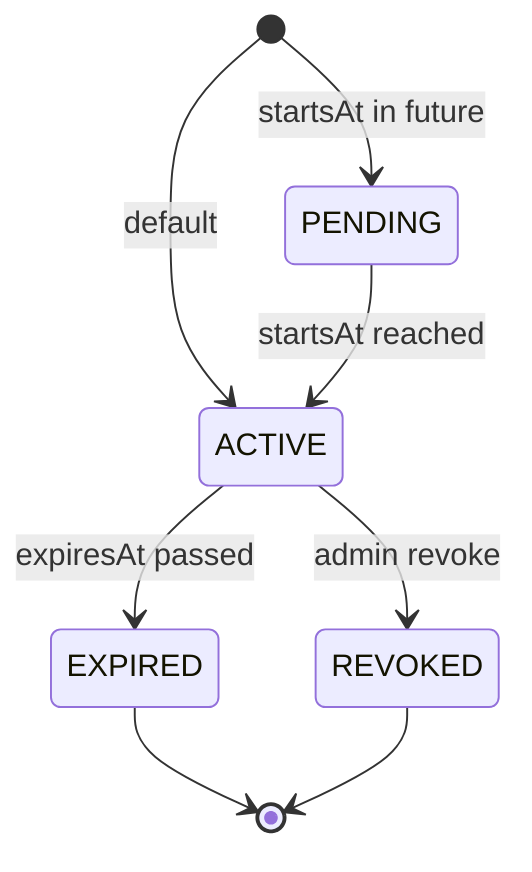

# Entitlement System

> **Module:** `entitlement-module`
> **Last Updated:** 2026-05-19

## Overview

The entitlement system is the **final platform truth for feature access**. It determines what a user, tenant, workspace, or group can access based on a hierarchical decision chain. It combines tier-based policies, overrides, grants, workspace pools, and ABAC rules.

## Implementation Status

| Component | Status |
|-----------|--------|
| `EntitlementService` | ✅ Implemented |
| `EntitlementDecisionService` | ✅ Implemented |
| `EntitlementPolicyService` | ✅ Implemented |
| `AccessDecisionService` | ✅ Implemented |
| `AccessDecisionFeatureFlagService` | ✅ Implemented |
| `QuotaDecisionService` | ✅ Implemented |
| `QuotaPolicyService` | ✅ Implemented |
| `QuotaProfileService` | ✅ Implemented |
| `QuotaUsageService` | ✅ Implemented |
| `WorkspaceEntitlementPoolService` | ✅ Implemented |
| `WorkspaceQuotaAllocationService` | ✅ Implemented |
| `ExportCapabilityPolicy` | ✅ Implemented |
| `ProviderAccessPolicy` | ✅ Implemented |
| `EntitlementGrantController` | ✅ Implemented |
| `EntitlementBundleController` | ✅ Implemented |
| `EntitlementOverrideController` | ✅ Implemented |
| `WorkspaceEntitlementPoolController` | ✅ Implemented |
| Database persistence | ⚠️ Via optional repository beans (graceful fallback to in-memory) |

## Fixed Tier System

| Field | FREE | PRO | TEAM | ENTERPRISE | EXPERIMENTAL |
|-------|------|-----|------|------------|--------------|
| Max Resolution | 1280x720 | 1920x1080 | 3840x2160 | 3840x2160 | 3840x2160 |
| Monthly Render Minutes | 60 | 300 | 1,200 | 6,000 | 999,999 |
| Watermark | Yes | No | No | No | No |
| GPU Allowed | No | No | Yes | Yes | Yes |
| Remote Worker | No | No | Yes | Yes | Yes |
| Max Subtitle Tracks | 2 | 5 | 10 | 20 | 50 |
| Custom Fonts | No | Yes | Yes | Yes | Yes |
| Max Concurrent Jobs | 1 | 3 | 10 | 50 | 100 |
| Effect Packs | basic | basic, pro | basic, pro, team | all | all |
| Export Formats | mp4, webm | +mov | +dash, hls | +cmaf | +cmaf |
| Providers | javacv, mlt, gstreamer | +ofx, gpac | +remote | +remote | +remote |

## Entitlement Scopes

```
GLOBAL, TENANT, WORKSPACE, USER, GROUP, FEATURE, PROVIDER, EXPORT_PRESET, ROUTE, BILLING_METER
```

## Decision Priority Chain

The `EntitlementDecisionService.evaluate()` implements this chain. **First match wins.**

```
1. EntitlementOverride      (tenant-level override, highest priority)
2. WorkspaceMemberGrant     (workspace-scoped member grant)
3. WorkspaceEntitlementPool (workspace pool with remaining quota)
4. EntitlementGrant         (user/group grant from repository)
5. Tier Policy              (EntitlementPolicy.forTier(tenantTier))
6. Default Deny             (no matching policy)
```

Each step gracefully handles null repository beans — if a repository is unavailable, the step is skipped with a warning log.

## Domain Models

### EntitlementPolicy

```java
public record EntitlementPolicy(
    String policyId,
    String tier,
    int maxResolutionWidth,
    int maxResolutionHeight,
    long monthlyRenderMinutes,
    boolean watermark,
    Set<String> allowedProviders,
    boolean gpuAllowed,
    boolean remoteWorkerAllowed,
    int maxSubtitleTracks,
    boolean customFontsAllowed,
    Set<String> effectPacksAllowed,
    Set<String> exportFormats,
    int maxConcurrentJobs,
    Map<String, String> extra
) {}
```

Static factory methods: `freeTier()`, `proTier()`, `teamTier()`, `enterpriseTier()`, `experimentalTier()`, `forTier(String)`.

### ExportCapabilityPolicy

```java
public record ExportCapabilityPolicy(
    String policyId,
    String tier,
    Set<String> allowedFormats,
    Set<String> allowedPresets,
    int maxResolutionWidth,
    int maxResolutionHeight,
    boolean watermarkRequired,
    boolean gpuExportAllowed,
    boolean remoteExportAllowed,
    int maxConcurrentExports
) {}
```

### ProviderAccessPolicy

```java
public record ProviderAccessPolicy(
    String policyId,
    String tier,
    Set<String> allowedProviders,
    boolean gpuAllowed,
    boolean remoteWorkerAllowed,
    Set<String> allowedGpuPresets
) {}
```

### EntitlementGrant

```java
public record EntitlementGrant(
    String grantId,
    String tenantId,
    String workspaceId,
    String subjectType,       // TENANT | WORKSPACE | USER | GROUP
    String subjectId,
    String featureKey,
    String bundleKey,
    String quotaProfileKey,
    String source,
    String reason,
    String grantedBy,
    Instant startsAt,
    Instant expiresAt,
    Instant revokedAt,
    String revokedBy,
    String revokeReason,
    EntitlementGrantStatus status,
    Instant createdAt,
    Instant updatedAt
) {}
```

### EntitlementDecision

```java
public record EntitlementDecision(
    boolean allowed,
    String decision,              // "ALLOW" | "DENY"
    String reasonCode,            // EntitlementDecisionReason name
    String userFriendlyMessage,
    String currentTier,
    List<String> matchedPolicies, // e.g. ["override:abc", "tier:PRO"]
    String matchedGrantId,
    String matchedOverrideId,
    String matchedWorkspacePoolId,
    Long quotaRemaining,
    String recommendedAlternative,
    List<String> upgradeOptions,
    Instant expiresAt,
    boolean requiresReview
) {}
```

## Grant Lifecycle



## Provider Access by Tier

| Tier | Providers |
|------|-----------|
| FREE | javacv, mlt, gstreamer |
| PRO | javacv, ofx, mlt, gstreamer, gpac |
| TEAM+ | javacv, ofx, mlt, gstreamer, gpac, remote-javacv |

## REST API

### User-Facing

| Method | Path | Description |
|--------|------|-------------|
| GET | `/api/v1/entitlements/me/capabilities` | Current user's capabilities |
| POST | `/api/v1/render/export/validate` | Validate export request |
| GET | `/api/v1/entitlements/subjects/{id}` | Get entitlement snapshot |

### Admin

| Method | Path | Description |
|--------|------|-------------|
| POST | `/api/v1/admin/entitlements/grants` | Create grant |
| POST | `/api/v1/admin/entitlements/grants/{id}/revoke` | Revoke grant |
| POST | `/api/v1/admin/entitlements/grants/{id}/extend` | Extend grant |
| POST | `/api/v1/admin/entitlements/overrides` | Create override |
| POST | `/api/v1/admin/entitlements/bundles` | Create bundle |

## Error Codes

| Code | HTTP | Description |
|------|------|-------------|
| `ENTITLEMENT-403-001` | 403 | Feature not available for current tier |
| `ENTITLEMENT-403-002` | 403 | Provider not allowed for current tier |
| `ENTITLEMENT-403-003` | 403 | Export preset not allowed |
| `ENTITLEMENT-403-004` | 403 | Export format not allowed |
| `ENTITLEMENT-404-001` | 404 | Entitlement grant not found |
| `ENTITLEMENT-409-001` | 409 | Entitlement already granted |
| `ENTITLEMENT-422-001` | 422 | Invalid entitlement request |

## Audit Trail

All entitlement operations are audited:
- `grantEntitlement()` → `audit("entitlement.granted", ...)`
- `revokeEntitlement()` → `audit("entitlement.revoked", ...)`
- `extendGrant()` → `audit("entitlement.extended", ...)`

Audit events are recorded via `AuditPort.record()` with actor, action, resource type, resource ID, and payload.
