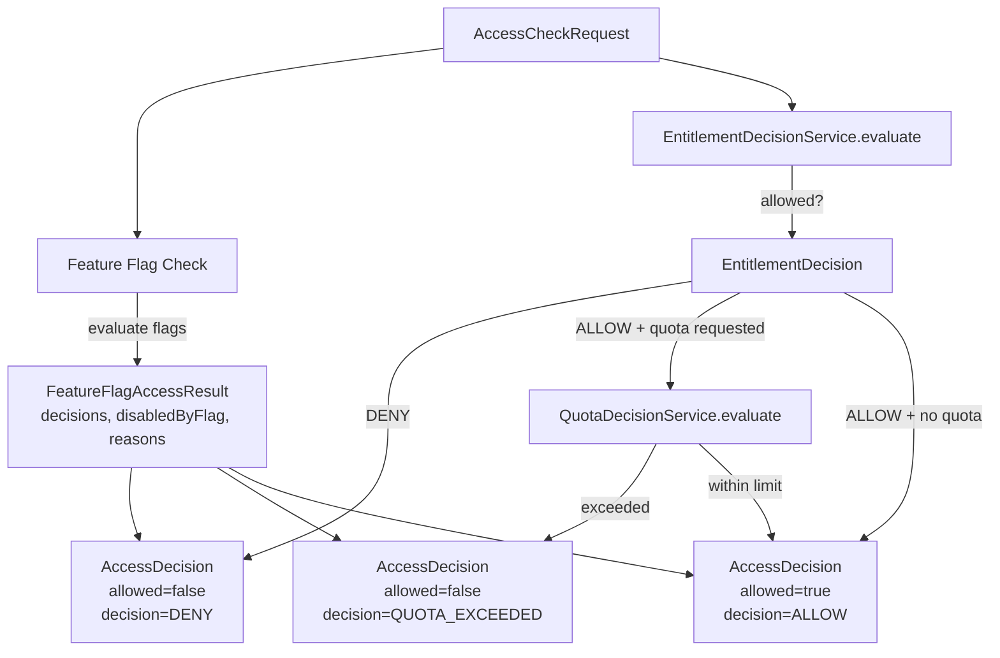

# Access Decision Service

> **Module:** `entitlement-module`
> **Last Updated:** 2026-05-19

## Overview

The `AccessDecisionService` is the central access control orchestrator. It combines Feature Flag evaluation, Entitlement decisions, and Quota checks into a single `AccessDecision` result.

## Implementation Status

| Component | Status |
|-----------|--------|
| `AccessDecisionService` | ✅ Implemented |
| `AccessDecisionFeatureFlagService` | ✅ Implemented |
| `EntitlementDecisionService` | ✅ Implemented |
| `QuotaDecisionService` | ✅ Implemented |
| `AccessDecision` record | ✅ Implemented (17 fields) |
| `NavigationDecisionService` | ✅ Implemented |
| Billing integration in decision chain | ⚠️ Partial (BillingDecisionService exists but not wired into AccessDecisionService) |
| Anomaly check in decision chain | 🔴 Not wired into AccessDecisionService |

## Decision Flow



## AccessDecision Record

```java
public record AccessDecision(
    boolean allowed,                  // Final allow/deny
    String decision,                  // "ALLOW" | "DENY" | "QUOTA_EXCEEDED"
    String reasonCode,                // e.g. "TIER", "TENANT_OVERRIDE", "DEFAULT_DENY"
    String userFriendlyMessage,       // Human-readable message
    String currentTier,               // e.g. "FREE", "PRO", "TEAM", "ENTERPRISE"
    List<String> matchedPolicies,     // e.g. ["override:abc", "tier:PRO"]
    String matchedGrantId,            // Entitlement grant that matched
    String matchedOverrideId,         // Override that matched
    String matchedWorkspacePoolId,    // Workspace pool that matched
    Long quotaRemaining,              // Remaining quota after request
    String recommendedAlternative,    // Suggested alternative feature
    List<String> upgradeOptions,      // Upgrade suggestions
    Instant expiresAt,                // When the entitlement expires
    boolean requiresReview,           // Whether manual review is needed
    List<FeatureFlagDecision> matchedFeatureFlags,  // All FF evaluations
    boolean disabledByFeatureFlag,    // Whether any FF blocked access
    List<String> featureFlagReasons   // Reasons from disabled flags
) {}
```

## AccessCheckRequest

```java
public record AccessCheckRequest(
    String tenantId,
    String workspaceId,
    String userId,
    String subjectType,
    String subjectId,
    String action,
    String resourceType,
    String resourceId,
    String featureKey,
    String requestedPreset,
    String providerKey,
    String requestSource,
    Long requestedQuota,
    Map<String, Object> context
) {}
```

## Entitlement Decision Priority Chain

The `EntitlementDecisionService.evaluate()` implements this chain. **First match wins.**

```
1. EntitlementOverride  (highest priority - tenant-level override)
2. WorkspaceMemberGrant (workspace-scoped member grant)
3. WorkspacePool        (workspace entitlement pool)
4. EntitlementGrant     (user/group grant from repository)
5. Tier Policy          (EntitlementPolicy.forTier)
6. Default Deny         (no matching policy)
```

Each step is tried in order. If a repository is unavailable (null), the step is skipped gracefully with a warning log.

## EntitlementDecisionReason Enum

```java
public enum EntitlementDecisionReason {
    TIER,                    // Matched by tier policy
    TENANT_OVERRIDE,         // Matched by tenant override
    WORKSPACE_OVERRIDE,      // Matched by workspace override
    WORKSPACE_POOL,          // Matched by workspace pool
    WORKSPACE_MEMBER_GRANT,  // Matched by workspace member grant
    USER_GRANT,              // Matched by user grant
    GROUP_GRANT,             // Matched by group grant
    QUOTA_POLICY,            // Matched by quota policy
    EXPIRED,                 // Grant has expired
    REVOKED,                 // Grant was revoked
    ABAC_RULE,               // Matched by ABAC rule
    DEFAULT_DENY             // No matching policy found
}
```

## Quota Decision

```java
public record QuotaDecision(
    String subjectId,
    String quotaCode,
    boolean allowed,
    double limitValue,
    double usedValue
) {}
```

The `QuotaDecisionService` supports:
- `evaluate(subjectId, featureCode, requestedAmount)` — basic quota check
- `evaluateWithProfile(subjectId, featureCode, profile, requestedAmount)` — profile-based quota check
- `recordUsage(subjectId, featureCode, amount)` — record consumption
- `getRemaining(subjectId, featureCode)` — get remaining quota

## Feature Flag Integration

The `AccessDecisionFeatureFlagService` evaluates all active, non-archived feature flags for the request context:

1. Builds a `FeatureFlagContext` from the `AccessCheckRequest`
2. Retrieves all flags for the context via `FeatureFlagService.getFlagsForContext()`
3. Evaluates each flag via `FeatureFlagService.evaluate()`
4. Audits each evaluation via `FeatureFlagAuditService.auditEvaluated()`
5. Returns a `FeatureFlagAccessResult` with all decisions, whether any flag blocked, and reasons

## Navigation Decision

The `NavigationDecisionService` (in `platform-app`) extends access decisions for UI route visibility:

```java
public record RouteVisibilityDecision(
    String routeKey,
    String path,
    String title,
    String menuGroup,
    int order,
    boolean visible,           // Whether the route is visible
    boolean enabled,           // Whether the route is clickable
    String reasonCode,         // e.g. "NAV-403-TIER", "NAV-404-HIDDEN"
    String userFriendlyMessage,
    String requiredTier,
    String requiredPermission,
    String requiredEntitlement,
    List<String> upgradeOptions,
    List<RouteVisibilityDecision> children,
    Map<String, Boolean> matchedFeatureFlags,
    boolean beta,
    boolean rollout,
    boolean disabledByFeatureFlag
) {}
```

Navigation evaluation checks (in order):
1. Source compatibility
2. Required roles
3. Required permissions
4. Required tier
5. Required features
6. Required entitlements
7. Required feature flags
8. Beta flag
9. Rollout flag
10. Navigation policies (HIDE / DISABLE effects)

## Error Codes

| Code | HTTP | Description |
|------|------|-------------|
| `ENTITLEMENT-403-001` | 403 | Feature not available for current tier |
| `ENTITLEMENT-403-002` | 403 | Provider not allowed for current tier |
| `ENTITLEMENT-403-003` | 403 | Export preset not allowed |
| `ENTITLEMENT-403-004` | 403 | Export format not allowed |
| `ENTITLEMENT-404-001` | 404 | Entitlement grant not found |
| `ENTITLEMENT-409-001` | 409 | Entitlement already granted |
| `ENTITLEMENT-422-001` | 422 | Invalid entitlement request |
| `FF-403-001` | 403 | Feature disabled by flag |
| `FF-403-002` | 403 | Feature not available in tier |
| `FF-403-003` | 403 | Navigation disabled by flag |
| `FF-403-004` | 403 | Export disabled by flag |

## Audit Trail

Every access decision produces an audit trail through:
- `FeatureFlagAuditService.auditEvaluated()` — records each flag evaluation
- `EntitlementService.audit()` — records grant/revoke/extend operations
- `AuditPort.record()` — shared audit interface for all decision events

The `AccessDecision` record itself carries the full decision context (`matchedPolicies`, `matchedFeatureFlags`, `featureFlagReasons`) for post-hoc audit analysis.

## Integration Points

| Check | Module | Service | Status |
|-------|--------|---------|--------|
| Feature Flag | `policy-governance-module` | `AccessDecisionFeatureFlagService` | ✅ Wired |
| Entitlement | `entitlement-module` | `EntitlementDecisionService` | ✅ Wired |
| Quota | `entitlement-module` | `QuotaDecisionService` | ✅ Wired |
| Billing | `billing-module` | `BillingDecisionService` | ⚠️ Standalone, not wired into AccessDecisionService |
| ABAC Policy | `policy-governance-module` | `PolicyEvaluationService` | ⚠️ Standalone, not wired into AccessDecisionService |
| Anomaly | `audit-compliance-module` | `AnomalyDetectionService` | 🔴 Not wired into AccessDecisionService |
