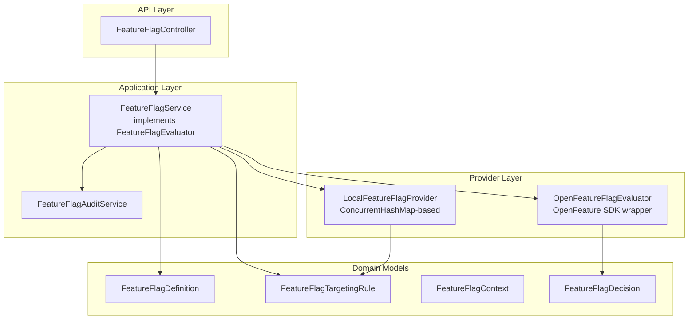

# Feature Flag Governance

> **Module:** `policy-governance-module`
> **Last Updated:** 2026-05-19

## Overview

The feature flag system provides on/off signals for features, UI elements, experiments, and gradual rollouts. It supports both a local in-memory provider and the OpenFeature standard SDK.

## Implementation Status

| Component | Status |
|-----------|--------|
| `FeatureFlagService` | ✅ Implemented |
| `LocalFeatureFlagProvider` | ✅ Implemented |
| `OpenFeatureFlagEvaluator` | ✅ Implemented |
| `FeatureFlagAuditService` | ✅ Implemented |
| `FeatureFlagController` | ✅ Implemented |
| `OpenFeatureContextMapper` | ✅ Implemented |
| `OpenFeatureFlagsConfiguration` | ✅ Implemented |
| Remote provider (Unleash/LaunchDarkly) | ⚠️ Configurable via `app.features.unleash.*` but not configured by default |
| State persistence | 🔧 In-memory only (lost on restart) |

## Architecture



## Key Design Decisions

1. **Feature Flag ≠ Entitlement**: Feature flags provide on/off signals. Entitlements define product capabilities per tier. Both feed into `AccessDecisionService`.

2. **LocalFeatureFlagProvider as Default**: OpenFeature remote provider is opt-in. Local provider supports percentage rollout, tenant/workspace/user/role/group/tier/region targeting, and time windows.

3. **Decision Flow**: Feature flags are evaluated as part of `AccessDecisionService.check()` → `AccessDecisionFeatureFlagService.evaluateForAccessDecision()`.

## Feature Flag Domain Models

### FeatureFlagDefinition

```java
public record FeatureFlagDefinition(
    String flagKey,                          // Unique identifier
    String name,                             // Display name
    String description,                      // Description
    FeatureFlagType flagType,                // BOOLEAN | STRING | NUMBER | JSON
    Object defaultValue,                     // Default value when no rule matches
    List<FeatureFlagVariant> variants,       // A/B test variants
    List<FeatureFlagTargetingRule> targetingRules,  // Ordered targeting rules
    boolean enabled,                         // Master on/off switch
    String owner,                            // Team or person
    List<String> tags,                       // e.g. ["ui", "beta"]
    Instant createdAt,
    Instant updatedAt,
    boolean archived                         // Soft delete
) {}
```

### FeatureFlagTargetingRule

```java
public record FeatureFlagTargetingRule(
    String ruleId,
    String flagKey,
    Integer priority,          // Lower = evaluated first
    boolean enabled,
    String tenantId,           // Match specific tenant
    String workspaceId,        // Match specific workspace
    String userId,             // Match specific user
    String role,               // Match specific role
    String group,              // Match specific group
    String tier,               // Match specific tier
    Double percentage,         // 0-100 percentage rollout
    String region,             // Match specific region
    String requestSource,      // Match request source
    String environment,        // Match environment
    Instant startAt,           // Time window start
    Instant endAt              // Time window end
) {}
```

### FeatureFlagContext

```java
public record FeatureFlagContext(
    String tenantId,
    String workspaceId,
    String userId,
    List<String> roles,
    List<String> groups,
    String tier,
    String requestSource,
    String environment,
    String region,
    String riskLevel,
    Map<String, Object> attributes
) {}
```

### FeatureFlagDecision

```java
public record FeatureFlagDecision(
    String flagKey,
    boolean enabled,
    String variant,                    // "enabled" | "disabled" | custom variant key
    String reasonCode,                 // "RULE_MATCHED" | "NO_MATCHING_RULE" | "FLAG_DISABLED" | "FLAG_ARCHIVED" | "FLAG_NOT_DEFINED" | "ERROR"
    FeatureFlagProviderType providerType,  // LOCAL | OPENFEATURE
    String matchedRule,                // ID of matched rule
    String tenantId,
    String workspaceId,
    String userId,
    Instant evaluatedAt,
    Map<String, Object> details
) {}
```

## Local Evaluation Logic

The `LocalFeatureFlagProvider.evaluate()` follows this algorithm:

1. If flag is not found, disabled, or archived → return default value with appropriate reason
2. Load active targeting rules sorted by priority
3. For each rule:
   - Skip if expired (outside startAt/endAt window)
   - Check all conditions (tenant, workspace, user, role, group, tier, region, requestSource, environment)
   - If percentage is set, compute hash-based rollout
   - If all conditions match → return rule result
4. If no rule matches → return default value with "NO_MATCHING_RULE"

## REST API

| Method | Path | Description |
|--------|------|-------------|
| GET | `/api/v1/feature-flags` | List all flags |
| POST | `/api/v1/feature-flags` | Create flag |
| GET | `/api/v1/feature-flags/{id}` | Get flag details |
| PUT | `/api/v1/feature-flags/{id}` | Update flag |
| DELETE | `/api/v1/feature-flags/{id}` | Delete flag |
| POST | `/api/v1/feature-flags/{id}/evaluate` | Evaluate flag |
| GET | `/api/v1/feature-flags/{id}/audit` | Audit log |

## Audit Events (15+ types)

| Event | Trigger | Method |
|-------|---------|--------|
| `FLAG_CREATED` | New flag created | `auditFlagCreated()` |
| `FLAG_UPDATED` | Flag modified | `auditFlagUpdated()` |
| `FLAG_ENABLED` | Flag enabled | `auditFlagEnabled()` |
| `FLAG_DISABLED` | Flag disabled | `auditFlagDisabled()` |
| `FLAG_ARCHIVED` | Flag archived | `auditFlagArchived()` |
| `FLAG_EVALUATED` | Flag evaluated | `auditEvaluated()` |
| `FLAG_EVALUATION_FAILED` | Evaluation error | `auditEvaluationFailed()` |
| `RULE_CREATED` | Targeting rule added | `auditRuleCreated()` |
| `RULE_UPDATED` | Targeting rule modified | `auditRuleUpdated()` |
| `RULE_DELETED` | Targeting rule removed | `auditRuleDeleted()` |
| `ROLLOUT_CHANGED` | Percentage changed | `auditRolloutChanged()` |
| `VARIANT_CHANGED` | Variant changed | `auditVariantChanged()` |
| `POLICY_EVALUATED_WITH_FEATURE_FLAG` | Policy + FF evaluation | `auditPolicyEvaluatedWithFeatureFlag()` |
| `ACCESS_DENIED_BY_FEATURE_FLAG` | Access denied by FF | `auditAccessDeniedByFeatureFlag()` |
| `NAVIGATION_DISABLED_BY_FEATURE_FLAG` | Nav disabled by FF | `auditNavigationDisabledByFeatureFlag()` |

Audit events are stored in-memory (capped at 10,000 events) and forwarded to `AuditPort` for persistent audit recording.

## Error Codes (13 FF- codes)

| Code | HTTP | Description |
|------|------|-------------|
| `FF-404-001` | 404 | Feature flag not found |
| `FF-404-002` | 404 | Feature flag variant not found |
| `FF-403-001` | 403 | Feature disabled by flag |
| `FF-403-002` | 403 | Feature not available in tier |
| `FF-403-003` | 403 | Navigation disabled by flag |
| `FF-403-004` | 403 | Export disabled by flag |
| `FF-403-005` | 403 | Extension runtime flag disabled |
| `FF-403-006` | 403 | GraphQL feature disabled |
| `FF-403-007` | 403 | Error code feature disabled |
| `FF-409-001` | 409 | Feature flag already exists |
| `FF-422-001` | 422 | Invalid flag configuration |
| `FF-500-001` | 500 | OpenFeature evaluation error |
| `FF-EVAL-OPENFEATURE-001` | 500 | OpenFeature SDK exception |

## OpenFeature Integration

- `OpenFeatureFlagEvaluator` wraps the OpenFeature Java SDK
- Supports boolean, string, number, and JSON flag types
- Falls back to default value on SDK errors
- `OpenFeatureContextMapper` maps `FeatureFlagContext` to OpenFeature `EvaluationContext`
- Remote provider (LaunchDarkly, flagd, Unleash) can be configured via `app.features.unleash.*`

## Notification-Related Feature Flags

The following feature flags control notification center features. These flags are evaluated in the `NotificationEventDefinition.featureFlagKey` field and in the navigation/entitlement decision chain.

### Feature Flag List

| Flag Key | Description | Default | Category |
|----------|-------------|---------|----------|
| `notification.center.enabled` | Master switch for the entire notification center | `true` | SYSTEM |
| `notification.inApp.enabled` | Enable in-app notification inbox | `true` | SYSTEM |
| `notification.email.enabled` | Enable email notification delivery | `true` | SYSTEM |
| `notification.sms.enabled` | Enable SMS notification delivery | `false` | SYSTEM |
| `notification.webhook.enabled` | Enable webhook notification delivery | `false` | SYSTEM |
| `notification.push.enabled` | Enable push notification delivery | `false` | SYSTEM |
| `notification.novu.enabled` | Use Novu provider instead of local providers | `false` | SYSTEM |
| `notification.digest.enabled` | Enable digest mode (hourly/daily/weekly) | `false` | SYSTEM |
| `notification.quietHours.enabled` | Enable quiet hours configuration | `true` | SYSTEM |
| `notification.admin.enabled` | Enable notification admin pages | `true` (admin only) | SYSTEM |

### Event-Level Gating

Each `NotificationEventDefinition` can optionally reference a `featureFlagKey`. If the referenced flag is disabled, the event is not delivered even if the user is subscribed. This allows fine-grained control over individual event types without modifying the event definition itself.

### Navigation Gating

Notification-related routes are gated by feature flags via the navigation system:

| Route | Required Flag | Behavior When Disabled |
|-------|---------------|------------------------|
| `/me/notifications` | `notification.center.enabled` | Route hidden from sidebar |
| `/me/notification-settings` | `notification.center.enabled` | Route hidden from sidebar |
| `/admin/notifications` | `notification.admin.enabled` | Route hidden from admin nav |
| `/admin/notifications/overview` | `notification.admin.enabled` | Forbidden page shown |
| `/admin/notifications/events` | `notification.admin.enabled` | Forbidden page shown |
| `/admin/notifications/deliveries` | `notification.admin.enabled` | Forbidden page shown |

### Error Codes for Notification Feature Flags

When a notification feature is disabled by a flag, the following error codes apply:

| Code | HTTP | Description |
|------|------|-------------|
| `FF-403-001` | 403 | Feature disabled by flag |
| `FF-403-003` | 403 | Navigation disabled by flag |
| `NOTIFICATION-403-002` | 403 | Notification access denied |

## 🔴 Production Blocker

Remote provider not configured; state not persisted across restarts. All feature flags are stored in-memory via `ConcurrentHashMap`. A restart loses all flag definitions and targeting rules.
