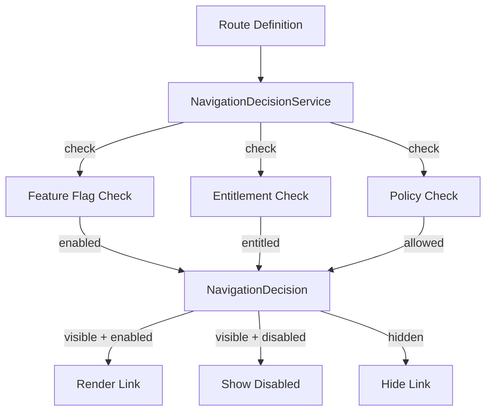

# Configurable Navigation

> **Module:** `policy-governance-module`
> **Last Updated:** 2026-05-18

## Overview

The configurable navigation system allows dynamic control of UI route visibility and accessibility based on feature flags, entitlements, and policies.

## Architecture



## Route Definition

```java
public record RouteDefinition(
    String routeId,
    String path,
    String label,
    String requiredFeatureFlag,
    String requiredEntitlement,
    String requiredRole,
    boolean betaOnly
) {}
```

## Navigation Decision

```java
public record NavigationDecision(
    boolean visible,
    boolean enabled,
    String disabledReason,
    String upgradePrompt
) {}
```

## V16 Migration

The `V16__navigation.sql` migration adds tables for:
- Route definitions
- Navigation policies
- Route-feature flag mappings
