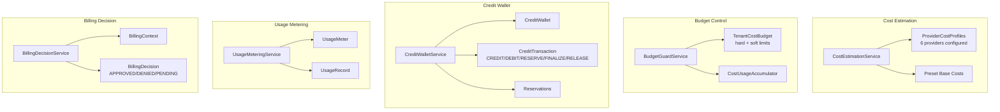

# Cost Control

> **Module:** `billing-module`
> **Last Updated:** 2026-05-19

## Overview

The cost control system provides metering, budgeting, cost estimation, cost reservations, and credit wallet management for render operations.

## Implementation Status

| Component | Status |
|-----------|--------|
| `CostEstimationService` | ✅ Implemented |
| `BudgetGuardService` | ✅ Implemented |
| `CostReservationService` | ✅ Implemented |
| `CreditWalletService` | ✅ Implemented |
| `UsageMeteringService` | ✅ Implemented |
| `BillingDecisionService` | ✅ Implemented |
| `BillingDecisionService` integrated into `AccessDecisionService` | 🔴 Not wired |
| `BudgetGuardService` integrated into `EntitlementPolicyService` | ⚠️ Wired via optional `BudgetGuardPort` |

## Architecture



## Cost Estimation

The `CostEstimationService` estimates render job costs based on:

- **Provider cost profiles** (6 providers): javacv, ofx, gpac, mlt, gstreamer, remote-javacv
- **Preset multipliers**: e.g. `default_1080p` = 1.0x, `4k_2160p` = 3.5x, `preview_720p` = 0.3x
- **Compute cost**: `hours * cpuCostPerHour * multiplier` (or `gpuCostPerHour` for GPU)
- **Storage cost**: `storageCostPerGbMonth * 0.001 * multiplier`
- **API call cost**: fixed per-provider fee

Default provider profiles:

| Provider | CPU/hr | GPU/hr | Storage/GB/mo | API Call |
|----------|--------|--------|---------------|----------|
| javacv | $0.05 | $0.00 | $0.02 | $0.08 |
| ofx | $0.08 | $0.00 | $0.02 | $0.08 |
| gpac | $0.03 | $0.00 | $0.02 | $0.12 |
| mlt | $0.04 | $0.00 | $0.02 | $0.08 |
| gstreamer | $0.04 | $0.00 | $0.02 | $0.08 |
| remote-javacv | $0.06 | $0.25 | $0.02 | $0.08 |

## Budget Guard

The `BudgetGuardService` manages per-tenant cost budgets:

```java
public record BudgetCheckResult(
    boolean allowed,
    boolean warning,
    double currentSpend,
    double budgetLimit,
    double remainingBudget,
    String message
) {}
```

Budget states:
- **No budget configured** → allow (no limits)
- **Under soft limit (80%)** → allow
- **Over soft limit** → allow with warning
- **Hard limit exceeded** → deny

## Cost Reservation

The `CreditWalletService` supports a reservation pattern:
1. `reserve(walletId, amount, ...)` → creates a reservation, returns `reservationId`
2. `finalize(walletId, reservationId, actualAmount, ...)` → debits actual amount, releases reservation
3. `release(walletId, reservationId, ...)` → releases reservation without debiting

## Credit Wallet

```java
public record CreditWallet(
    String walletId,
    String tenantId,
    String workspaceId,
    String userId,
    long balanceMinor,      // Balance in minor currency units (cents)
    String currencyCode,
    String status,          // ACTIVE | SUSPENDED | CLOSED
    Instant createdAt,
    Instant updatedAt
) {}
```

Transaction types: `CREDIT`, `DEBIT`, `RESERVE`, `FINALIZE`, `RELEASE`

## Usage Metering

The `UsageMeteringService` records usage with idempotency support:
- Duplicate `idempotencyKey` → returns existing record (no double-counting)
- Per-tenant and per-meter queries
- Active meter registry

## Billing Decision

The `BillingDecisionService` produces billing decisions:

```java
public record BillingDecision(
    String decisionId,
    String action,
    String tenantId,
    String userId,
    String pricingModel,
    long estimatedAmountMinor,
    String currencyCode,
    boolean useCredits,
    Map<String, Object> details,
    String status           // APPROVED | DENIED | PENDING
) {}
```

## Anomaly Detection Rules

| Rule ID | Type | Severity | Description |
|---------|------|----------|-------------|
| CST-001 | COST_ANOMALY | HIGH | Cost > 2x estimated |
| SLA-001 | SLA_BREACH | CRITICAL | Exceeded SLA time |
| RJB-001 | MISSING_FIELD | HIGH | Completed without artifact |
| RJB-002 | INVALID_STATE | MEDIUM | Stuck > 30min |
| RJB-003 | DUPLICATE | LOW | Same project+profile+timeline |
| PMT-001 | SENSITIVE_DATA | CRITICAL | Sensitive data in record |
| PMT-002 | OUTPUT_MISMATCH | HIGH | Output format mismatch |
| PMT-003 | LOGIC_CONFLICT | HIGH | Risk level escalated |

## Graduated Mitigation

| Severity | Action |
|----------|--------|
| CRITICAL | Block + Sentry alert |
| HIGH | Warn + require confirmation |
| MEDIUM | Log warning |
| LOW | Log info |

## Error Codes

| Code | HTTP | Description |
|------|------|-------------|
| `BILLING-403-001` | 403 | Budget limit exceeded |
| `BILLING-403-002` | 403 | Insufficient credit balance |
| `BILLING-404-001` | 404 | Wallet not found |
| `BILLING-409-001` | 409 | Duplicate transaction (idempotency key) |
| `BILLING-422-001` | 422 | Invalid billing request |
