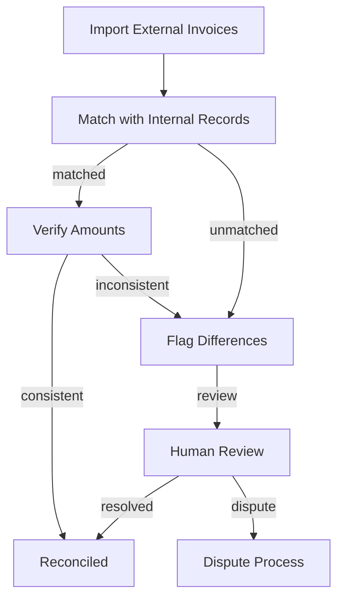

# Reconciliation

> **Module:** `billing-module`
> **Last Updated:** 2026-05-18

## Overview

The reconciliation system matches internal billing records with external payment provider records to ensure consistency.

## Reconciliation Flow

## Reconciliation Checks

| Check | Description |
|-------|-------------|
| Amount match | Internal amount = External amount |
| Status match | Internal status = External status |
| Timing match | Transaction dates align |
| Currency match | Same currency used |

## Difference Types

| Type | Description | Action |
|------|-------------|--------|
| Amount mismatch | Internal ≠ External amount | Flag for review |
| Missing internal | External record not found | Create internal record |
| Missing external | Internal record not found | Investigate |
| Status mismatch | Status differs | Update internal status |

## 🔧 Stub Implementation

`NoopKillBillBillingEngine` returns projected state only. Real Kill Bill integration is pending.
