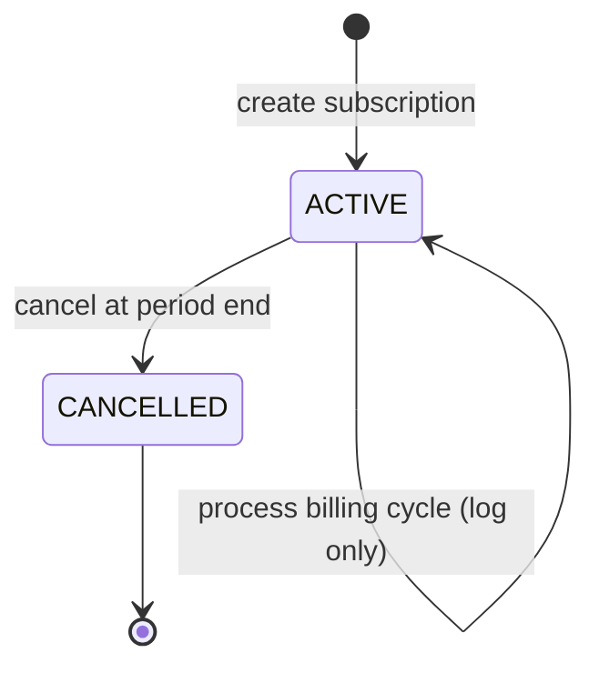
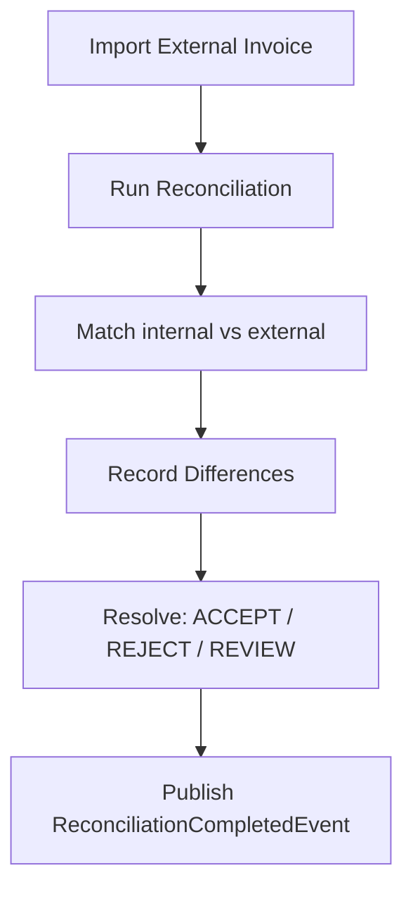

# Billing Models

> **Module:** `billing-module`, `quota-billing-module`
> **Last Updated:** 2026-05-19

## Overview

The billing engine provides pricing models, subscription lifecycle, rating, reconciliation, and credit wallet management.

## Implementation Status

| Component | Status |
|-----------|--------|
| `PricingRuleService` | ✅ Implemented |
| `RatingEngine` | ✅ Implemented |
| `SubscriptionBillingService` | ✅ Implemented |
| `BillingLedgerService` | ✅ Implemented |
| `BillingProjectionService` | ✅ Implemented |
| `ReconciliationService` | ✅ Implemented |
| `CreditWalletService` | ✅ Implemented |
| `BillingDecisionService` | ✅ Implemented |
| `CostEstimationService` | ✅ Implemented |
| `BudgetGuardService` | ✅ Implemented |
| `CostReservationService` | ✅ Implemented |
| `UsageMeteringService` | ✅ Implemented |
| `BillingEngine` SPI | ✅ Interface defined |
| `NoopKillBillBillingEngine` | 🔧 Stub (returns projected state only) |
| Payment processing | 🔧 No-op (no real payment provider) |
| Subscription billing cycle | 🔧 Logs only, does not actually charge |

## Pricing Models

| Model | Description | Status |
|-------|-------------|--------|
| Per-minute | Charge per render minute | ✅ |
| Per-job | Fixed cost per job | ✅ |
| Subscription | Monthly/annual plan | ✅ |
| Usage-based | Tiered usage pricing | ✅ |
| Custom pricing | Tenant-specific overrides | ✅ |
| Credit wallet | Prepaid credits | ✅ |
| Enterprise | Custom contract pricing | ✅ |

## Rating Engine

The `RatingEngine` converts usage records into rated amounts:

```java
public record RatedUsageRecord(
    String ratedUsageId,
    String usageRecordId,
    String pricingRuleId,
    long ratedAmountMinor,
    String currencyCode,
    Map<String, Object> details,
    Instant ratedAt
) {}
```

Supports:
- **Flat rate**: `quantity * unitPriceMinor`
- **Tiered pricing**: progressive tiers with flat fees per tier

## Pricing Rule Service

The `PricingRuleService` manages:
- **PricingRule**: base pricing with optional tiered rates
- **CustomPricingRule**: tenant/workspace-level overrides with discount percentage
- **DiscountPolicy**: percentage or fixed-amount discounts with conditions

```java
public record PricingRule(
    String ruleId,
    String ruleKey,
    String name,
    String description,
    PricingModel pricingModel,    // USAGE_BASED | PER_JOB | SUBSCRIPTION | CUSTOM
    String meterKey,
    long unitPriceMinor,
    String currencyCode,
    List<PricingTier> tiers,      // Optional tiered rates
    String status,
    Instant effectiveFrom,
    Instant effectiveTo,
    Instant createdAt,
    Instant updatedAt
) {}
```

### Pricing Preview

`PricingRuleService.previewPricing()` computes the full pricing breakdown:
1. Find active pricing rule for the meter key
2. Calculate base amount (flat or tiered)
3. Apply tenant custom pricing override if any
4. Apply discount policy if conditions match
5. Return `PricingPreviewResult` with full breakdown

## Subscription Lifecycle



The `SubscriptionBillingService`:
- Creates plans with `billingInterval`, `basePriceMinor`, `includedQuota`
- Creates subscriptions with period tracking
- Supports `changePlan()` and `cancelAtPeriodEnd()`
- `processBillingCycle()` logs but does not actually charge (🔧 Stub)

```java
public record SubscriptionPlan(
    String planId,
    String planKey,
    String name,
    String description,
    String billingInterval,       // MONTHLY | ANNUAL
    long basePriceMinor,
    String currencyCode,
    Map<String, Long> includedQuota,
    String status,
    Instant createdAt,
    Instant updatedAt
) {}

public record SubscriptionContract(
    String contractId,
    String tenantId,
    String userId,
    String planKey,
    Instant periodStartAt,
    Instant periodEndAt,
    String lifecycleState,        // ACTIVE | CANCELLED
    long basePriceMinor,
    String currencyCode,
    Map<String, Long> includedQuota,
    Map<String, Long> includedQuotaUsed
) {}
```

## Credit Wallet

| Feature | Status | Notes |
|---------|--------|-------|
| Wallet creation | ✅ | Per tenant |
| Credit (top-up) | ✅ | In-memory only (no real payment) |
| Debit | ✅ | Balance check before debit |
| Reservation | ✅ | Reserve → Finalize/Release pattern |
| Transaction history | ✅ | All transactions recorded chronologically |
| Admin management | ✅ | Admin can adjust balances |

## Reconciliation

The `ReconciliationService` reconciles internal cost records with external invoices:



Reconciliation process:
1. Import external invoices (CSV/JSON simulation)
2. Run reconciliation for a period
3. Match internal `CostLedgerEntry` with external `ThirdPartyInvoiceImport`
4. Record `ReconciliationDifference` for unmatched records
5. Resolve differences (ACCEPTED / REJECTED / NEEDS_REVIEW)
6. Publish `ReconciliationCompletedEvent`

## Billing Engine SPI

```java
public interface BillingEngine {
    // SPI for external billing system integration (e.g., Kill Bill)
}
```

Current implementation: `NoopKillBillBillingEngine` — returns projected state only.

## V17 Migration

`V17__billing_models.sql` adds tables for:
- Flexible billing configurations
- Custom pricing rules
- Subscription enhancements

## 🔧 Stub Implementation Notes

- `NoopKillBillBillingEngine` — returns projected state only
- `NoopStripePaymentProvider` — no-op payment processing
- Subscription billing cycle logs but does not actually charge
- All billing state is in-memory via `ConcurrentHashMap`

## Error Codes

| Code | HTTP | Description |
|------|------|-------------|
| `BILLING-403-001` | 403 | Budget limit exceeded |
| `BILLING-403-002` | 403 | Insufficient credit balance |
| `BILLING-404-001` | 404 | Wallet not found |
| `BILLING-404-002` | 404 | Subscription not found |
| `BILLING-409-001` | 409 | Duplicate transaction |
| `BILLING-422-001` | 422 | Invalid billing request |
| `BILLING-500-001` | 500 | Billing engine error |
