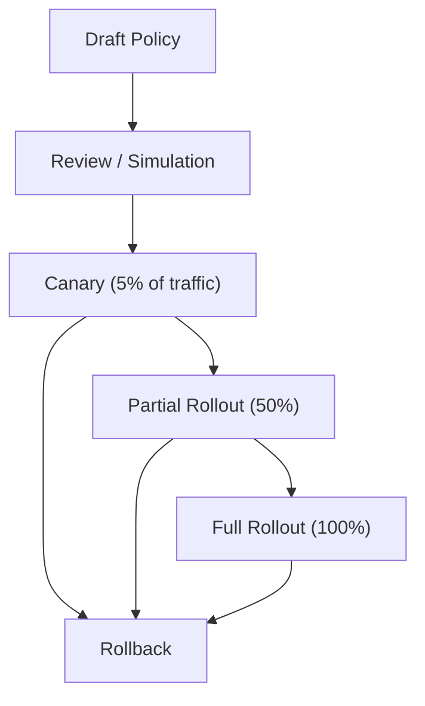

# Future Extension Directions

> **Last Updated:** 2026-05-19

## Overview

This document describes planned integration paths for external policy engines (Casbin, OpenFGA) and other future extensions to the ABAC/access decision system.

## Current Architecture

The platform currently implements a custom ABAC system:

```
PolicyEvaluationService  → Custom rule matching with FeatureFlag conditions
AccessDecisionService    → Orchestrates FF + Entitlement + Quota
EntitlementDecisionService → Tier-based + grants + overrides
NavigationDecisionService  → Route visibility with tier/role/FF checks
```

All policy state is stored in-memory via `ConcurrentHashMap`. There is no external policy engine integration.

## Casbin Integration 📋

### Purpose

Casbin provides a standardized, configuration-driven policy engine supporting RBAC, ABAC, and various access models. It can serve as:

1. **RBAC layer**: Replace the current manual role/permission checks with Casbin's RBAC model
2. **Light ABAC**: For simple attribute-based rules (e.g., `user.tier == "ENTERPRISE"`)
3. **Policy administration**: Non-developers can manage policies via Casbin's configuration files or admin APIs

### Integration Point

```java
@Service
public class CasbinPolicyBridge {

    private final Enforcer casbinEnforcer;
    private final PolicyEvaluationService existingPolicyService;

    public PolicyDecision evaluateWithCasbin(PolicyContext context) {
        // 1. Evaluate via Casbin for RBAC/light ABAC
        boolean casbinAllowed = casbinEnforcer.enforce(
            context.userId(), context.role(), context.resourceType(), context.action());

        if (!casbinAllowed) {
            return new PolicyDecision(PolicyEffect.DENY,
                "Denied by Casbin policy", "casbin-deny");
        }

        // 2. Fall through to existing ABAC for complex attribute conditions
        return existingPolicyService.evaluate(context);
    }
}
```

### Casbin Model Configuration Example

```ini
[request_definition]
r = sub, dom, obj, act

[policy_definition]
p = sub, dom, obj, act, eft

[role_definition]
g = _, _, _

[policy_effect]
e = some(where (p.eft == allow)) && !some(where (p.eft == deny))

[matchers]
m = g(r.sub, p.sub, r.dom) && r.dom == p.dom && r.obj == p.obj && r.act == p.act
```

### Benefits
- Standardized policy language (CONF format)
- Policy persistence via database adapters (JDBC, JPA)
- Admin API for runtime policy management
- Community support and documentation

### Migration Path
1. Deploy Casbin alongside existing `PolicyEvaluationService`
2. Configure Casbin with current RBAC rules
3. Route RBAC checks through Casbin first
4. Keep complex ABAC conditions in `PolicyEvaluationService`
5. Gradually migrate ABAC rules to Casbin's ABAC model

## OpenFGA Integration 📋

### Purpose

OpenFGA (by Okta) provides fine-grained authorization based on Google's Zanzibar paper. It supports complex resource relationships:

```
user:alice   → viewer → document:report1
team:eng     → member → user:alice
document:report1 → parent → folder:engineering
```

Use cases in this platform:
- **Extension marketplace**: `user → publisher → extension → version`
- **Workspace hierarchy**: `user → member → workspace → project → render_job`
- **Shared resources**: `user → viewer → project` (project sharing between workspaces)
- **Multi-tenant isolation**: `tenant → owns → workspace → contains → resource`

### Integration Point

```java
@Service
public class OpenFGAPolicyBridge {

    private final Client fgaClient;
    private final PolicyEvaluationService existingPolicyService;

    public boolean checkResourceAccess(String userId, String relation, String objectType, String objectId) {
        try {
            CheckResponse response = fgaClient.check(CheckRequest.builder()
                .user("user:" + userId)
                .relation(relation)
                .object(objectType + ":" + objectId)
                .build()).get();

            return response.getAllowed();
        } catch (Exception e) {
            // Fall back to existing ABAC
            return fallbackToExistingABAC(userId, relation, objectType, objectId);
        }
    }
}
```

### OpenFGA Model Example

```yaml
type user
type tenant
  relations
    define owner: [user]
    define admin: [user]
    define member: [user]
type workspace
  relations
    define tenant: [tenant]
    define owner: [user]
    define editor: [user]
    define viewer: [user]
    define member: [user] or editor or viewer
type project
  relations
    define workspace: [workspace]
    define owner: [user]
    define editor: [user]
    define viewer: [user]
    define can_view: [user] or viewer or editor or owner
    define can_edit: [user] or editor or owner
    define can_delete: [user] or owner
type render_job
  relations
    define project: [project]
    define owner: [user]
    define can_view: [user] or owner from project or can_view from project
    define can_cancel: [user] or owner from project
```

### Benefits
- Fine-grained resource-level authorization
- Relationship-based access control (ReBAC)
- Scalable (based on Google's Zanzibar)
- Audit trail of relationship changes

### Migration Path
1. Deploy OpenFGA service alongside the platform
2. Define the authorization model (types, relations)
3. Seed initial relationship tuples from existing data
4. Add OpenFGA checks for resource-level operations
5. Keep tier/entitlement checks in existing services (OpenFGA complements, not replaces)

## Unified Decision Chain 📋

The future unified decision chain:

```
Authentication
  → RBAC (Casbin)                    📋 Future
  → ABAC (PolicyEvaluationService)    ✅ Current
  → Feature Flag (FeatureFlagService) ✅ Current
  → Entitlement (EntitlementDecision) ✅ Current
  → Quota (QuotaDecisionService)      ✅ Current
  → Billing (BillingDecisionService)  ✅ Current
  → Resource Relations (OpenFGA)      📋 Future
  → AccessDecision (final result)
```

## Strategy Pattern for Policy Evaluation 📋

To support multiple policy engines, introduce a strategy interface:

```java
public interface PolicyEvaluationStrategy {
    PolicyDecision evaluate(PolicyContext context);
    int priority();  // Evaluation order
}

@Component
public class CasbinEvaluationStrategy implements PolicyEvaluationStrategy { ... }

@Component
public class CustomABACEvaluationStrategy implements PolicyEvaluationStrategy { ... }

@Component
public class CompositePolicyEvaluator {
    private final List<PolicyEvaluationStrategy> strategies;

    public PolicyDecision evaluate(PolicyContext context) {
        for (PolicyEvaluationStrategy strategy : strategies.stream()
                .sorted(Comparator.comparingInt(PolicyEvaluationStrategy::priority))
                .toList()) {
            PolicyDecision decision = strategy.evaluate(context);
            if (decision.effect() == PolicyEffect.DENY) {
                return decision;  // First DENY wins
            }
        }
        return new PolicyDecision(PolicyEffect.ALLOW, "All policies passed", "composite");
    }
}
```

## Policy Version Control and Gradual Rollout 📋

### Current State

`PolicyVersion` record exists but is not actively used:
```java
public record PolicyVersion(String id, String policyId, int version, String content) {}
```

### Future Enhancement



Implementation approach:
1. Store policy versions with status (DRAFT, CANARY, ACTIVE, ROLLED_BACK)
2. Add percentage-based routing to `PolicyEvaluationService`
3. Track evaluation metrics per version
4. Add admin UI for version management and rollback

## Policy Audit Enhancement 📋

### Current State

Audit events are recorded in-memory (capped at 10,000) and forwarded to `AuditPort`.

### Future Enhancement

- Persistent audit log storage (database table)
- Audit log query API with filtering (by user, tenant, time range, decision)
- Audit log export (CSV/JSON)
- Real-time audit stream (WebSocket/SSE)
- Decision explanation API: given an `AccessDecision`, return the full chain of evaluations
