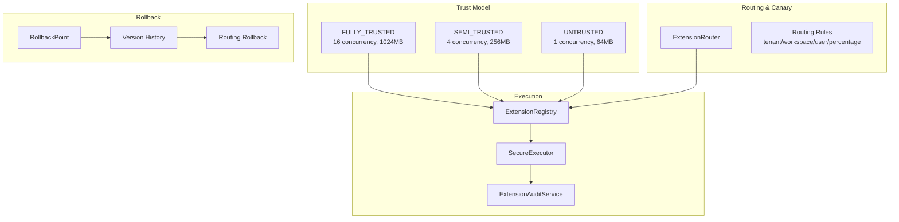

# Dynamic Extension Platform

> **Module:** `extension-module`
> **Last Updated:** 2026-05-18

## Overview

The dynamic extension platform enables runtime plugin loading with trust-based resource control, canary routing, rollback, and comprehensive audit.

## Architecture



## Trust Levels

| Level | Concurrency | Memory | CPU | Timeout | Sandbox | Use Case |
|-------|------------|--------|-----|---------|---------|----------|
| FULLY_TRUSTED | 16 | 1024MB | 100% | 120s | Optional | PF4J plugins, internal |
| SEMI_TRUSTED | 4 | 256MB | 50% | 30s | Required | Third-party, scripts |
| UNTRUSTED | 1 | 64MB | 25% | 10s | Strict | User scripts |

## Routing & Canary Release

```java
// Route 10% of tenant-1 traffic to v2.0.0
router.createRule("canary-10%", "ext-1", "1.0.0", "2.0.0",
    "tenant-1", null, null, 100, 10, "admin");
```

## Resource Limits

| Limit | Default | Description |
|-------|---------|-------------|
| maxConcurrency | 4 | Max parallel executions |
| maxMemoryMb | 256 | Memory ceiling |
| maxCpuPercent | 50 | CPU share |
| maxQueueSize | 100 | Max queued requests |
| maxInputBytes | 10MB | Max input payload |
| maxOutputBytes | 4MB | Max output payload |
| timeoutMs | 30s | Execution timeout |

## Rollback

```java
// Create rollback point before upgrade
POST /api/v1/extensions/{key}/rollback-point?createdBy=admin

// Rollback to previous version
POST /api/v1/extensions/{key}/rollback
{ "targetVersion": "1.0.0", "rolledBackBy": "admin" }

// Rollback routing rules
router.rollbackRules("ext-1", "admin");
```

## Audit Events (15+ types)

| Event | Trigger |
|-------|---------|
| EXTENSION_REGISTERED | New extension |
| EXTENSION_UNLOADED | Extension removed |
| EXTENSION_UPGRADE | Version upgrade |
| EXTENSION_ROLLED_BACK | Version rollback |
| EXTENSION_EXECUTION_STARTED | Execution begins |
| EXTENSION_EXECUTION_COMPLETED | Execution succeeds |
| EXTENSION_EXECUTION_TIMEOUT | Execution times out |
| EXTENSION_EXECUTION_FAILED | Execution fails |
| ROUTING_RULE_CREATED | New rule |
| ROUTING_RULE_UPDATED | Rule changed |
| ROUTING_RULE_DELETED | Rule removed |
| RESOURCE_LIMIT_EXCEEDED | Quota breached |
| SECURITY_VIOLATION | Blocked operation |

## CLI Tool Execution

The extension module supports configuration-driven CLI tool execution:

```yaml
app:
  cli-tools:
    executables:
      ffmpeg: /usr/bin/ffmpeg
      ffprobe: /usr/bin/ffprobe
    tools:
      probe:
        executableKey: ffprobe
        args: ["-v", "quiet", "-print_format", "json", "{input}"]
        timeoutMillis: 30000
```

## Security

- Executable allowlist enforcement
- Path traversal protection
- Null byte injection prevention
- Output size limiting (4MB)
- No shell concatenation (List<String> args)
- No `ProcessBuilder` in business code

## ⚠️ Apache Commons Exec

Apache Commons Exec is still present in the extension module for CLI tool execution. The JavaCV migration removed FFmpeg CLI from the render pipeline, but the extension module retains Commons Exec for non-video tools.
