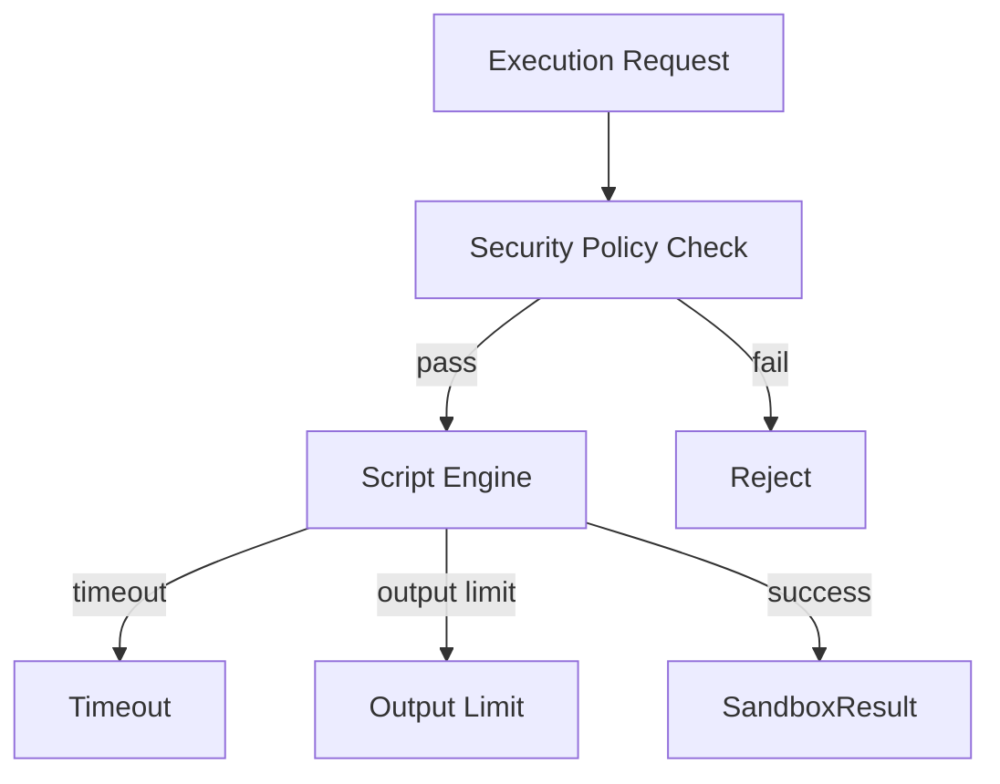

# Sandbox Runtime

> **Module:** `sandbox-runtime-module`
> **Last Updated:** 2026-05-18

## Overview

The sandbox runtime provides isolated execution environments for untrusted scripts. It is disabled by default and must be explicitly enabled.

## Supported Languages

| Language | Engine | Status |
|----------|--------|--------|
| Groovy | javax.script (Groovy) | ✅ If on classpath |
| JavaScript | Nashorn / GraalJS | ✅ If on classpath |
| Python | GraalVM Python / Jython | ✅ If on classpath |
| Wasm | Wasmtime / Wasmer | 📋 Future |

## Security Policy

The `DefaultSandboxSecurityPolicy` blocks:

| Category | Blocked Classes |
|----------|----------------|
| Process | `Runtime.getRuntime`, `ProcessBuilder` |
| File | `java.io.File`, `java.nio.file.*` |
| Network | `Socket`, `ServerSocket`, `URL` |
| Reflection | `ClassLoader`, `reflect.*`, `Unsafe` |
| System | `System.setProperty`, `System.getenv` |

## Execution Model



## REST API

| Method | Path | Description |
|--------|------|-------------|
| GET | `/api/v1/sandbox/runtime/overview` | Module status |
| POST | `/api/v1/sandbox/execute` | Execute script |

## Configuration

```yaml
app:
  sandbox:
    enabled: false  # Must be explicitly enabled
    default-timeout-millis: 10000
    max-output-bytes: 4194304  # 4MB
    allowed-languages:
      - groovy
      - javascript
```

## ⚠️ Disabled by Default

The sandbox runtime is intentionally disabled until script/plugin governance matures. Enabling it requires:
1. Explicit configuration (`app.sandbox.enabled: true`)
2. Security review of allowed scripts
3. Resource limit configuration
