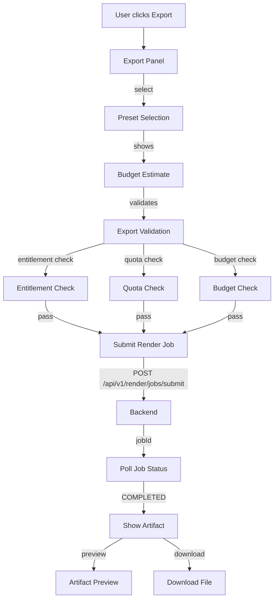
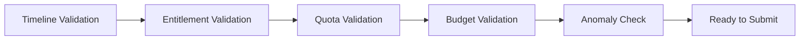

# Export Flow

> **Module:** `frontend/src/components/export/`
> **Last Updated:** 2026-05-18

## Export Panel

The export panel allows users to configure render settings and submit render jobs.



## Export Presets

| Preset | Resolution | Format | Tier |
|--------|-----------|--------|------|
| `free_720p_watermarked` | 720p | MP4 | FREE |
| `default_720p` | 720p | MP4 | FREE+ |
| `default_1080p` | 1080p | MP4 | PRO+ |
| `social_1080p` | 1080p | MP4 | PRO+ |
| `social_720p` | 720p | MP4 | PRO+ |
| `mobile_480p` | 480p | MP4 | FREE+ |
| `4k_2160p` | 4K | MP4 | TEAM+ |
| `pro_1080p` | 1080p | MP4 | PRO+ |
| `team_4k` | 4K | MP4 | TEAM+ |

## Validation Chain



## Render Job Polling

```typescript
// Polling flow
const pollJobStatus = async (jobId: string) => {
  const response = await fetch(`/api/v1/render/jobs/${jobId}`);
  const job = await response.json();

  if (job.status === 'COMPLETED') {
    showArtifact(job.artifact);
  } else if (job.status === 'FAILED') {
    showError(job.errorCode, job.errorMessage);
  } else {
    setTimeout(() => pollJobStatus(jobId), 2000);
  }
};
```

## Error Handling

| Error Code | Description | UI Action |
|------------|-------------|-----------|
| `RENDER-409-001` | Quota exceeded | Show upgrade suggestion |
| `ENTITLEMENT-403-001` | Feature not available | Show tier upgrade |
| `RENDER-500-001` | Render failed | Show retry button |
| `AI-500-001` | AI generation failed | Show retry button |
