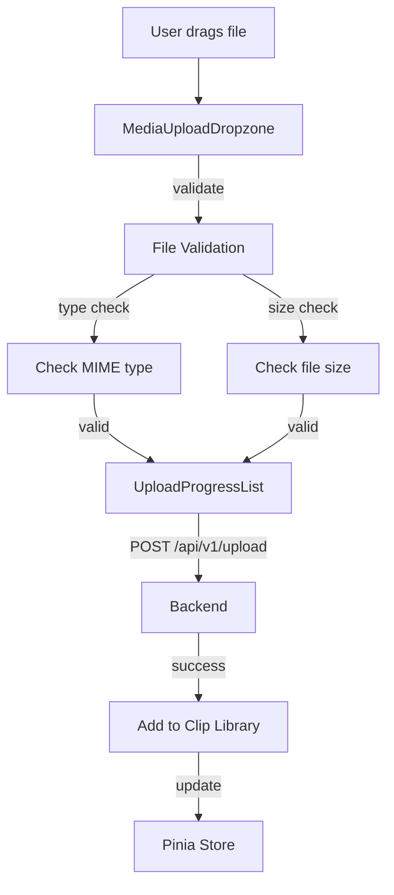
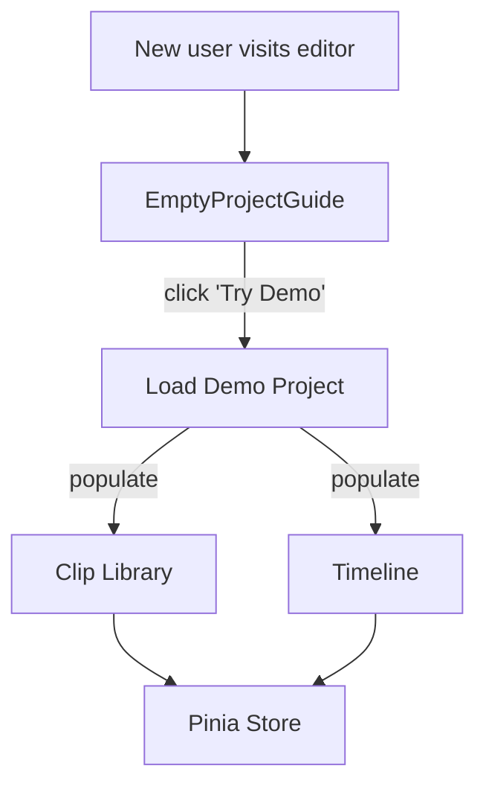

# Upload & Demo Project

> **Module:** `frontend/src/components/`
> **Last Updated:** 2026-05-18

## Upload Workflow

## Demo Project

The demo project provides a pre-populated project for new users:

## Upload Component

| Component | Purpose | Status |
|-----------|---------|--------|
| `MediaUploadDropzone` | Drag-and-drop file upload | ✅ |
| `UploadProgressList` | Upload progress display | ✅ |
| `EmptyProjectGuide` | Empty state with upload/demo | ✅ |

## Supported File Types

| Type | Extensions |
|------|-----------|
| Video | `.mp4`, `.webm`, `.mov`, `.ogg` |
| Audio | `.mp3`, `.wav`, `.aac` |
| Image | `.jpg`, `.png`, `.gif`, `.webp` |
| Subtitle | `.srt`, `.ass`, `.vtt` |
| Font | `.ttf`, `.otf`, `.woff`, `.woff2` |

## Upload Limits

| Limit | Value |
|-------|-------|
| Max file size | Configurable (default 500MB) |
| Max concurrent uploads | 3 |
| Allowed types | Configurable whitelist |
