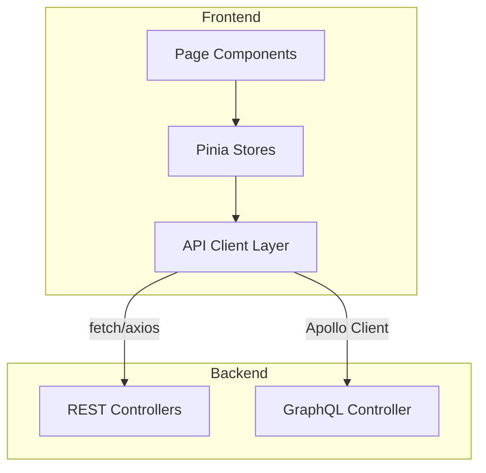

# Frontend API Usage

> **Module:** `frontend/src/api/`, `frontend/src/graphql/`
> **Last Updated:** 2026-05-18

## API Client Layer

The frontend communicates with the backend via REST and GraphQL APIs.



## REST API Client

```typescript
// Example: Render job submission
const submitRenderJob = async (request: SubmitRenderJobRequest) => {
  const response = await fetch('/api/v1/render/jobs/submit', {
    method: 'POST',
    headers: { 'Content-Type': 'application/json' },
    body: JSON.stringify(request),
  });
  return response.json() as Promise<{ jobId: string; status: string }>;
};
```

## GraphQL Client

```typescript
// Example: Apollo Client query
const GET_PROJECTS = gql`
  query GetProjects($tenantId: String!) {
    projects(tenantId: $tenantId) {
      id
      name
      status
      createdAt
    }
  }
`;

const { data } = useQuery(GET_PROJECTS, { variables: { tenantId } });
```

## API Modules

| Module | REST Endpoints | GraphQL Queries |
|--------|---------------|-----------------|
| Render | `/api/v1/render/*` | `renderJob`, `renderJobs` |
| Projects | `/api/v1/projects/*` | `project`, `projects` |
| Entitlements | `/api/v1/entitlements/*` | `entitlement`, `capabilities` |
| Feature Flags | `/api/v1/feature-flags/*` | `featureFlag`, `featureFlags` |
| Analytics | `/api/v1/analytics/nlq/*` | `analyticsQuery` |
| Prompts | `/api/v1/prompts/*` | `prompt`, `prompts` |
| Extensions | `/api/v1/extensions/*` | `extension`, `extensions` |
| Notifications | `/api/v1/notifications/*` | `notification`, `notifications` |

## Error Handling

```typescript
// Global error handler
const handleApiError = (error: ApiError) => {
  const { errorCode, message, details } = error;

  // Look up i18n message
  const i18nMessage = t(`errors.${errorCode}`, message);

  // Show error state
  showError({
    code: errorCode,
    message: i18nMessage,
    details,
  });
};
```

## Authentication

```typescript
// API key authentication (current)
const apiClient = axios.create({
  baseURL: '/api/v1',
  headers: {
    'X-API-Key': apiKey,
    'X-Tenant-ID': tenantId,
  },
});
```
