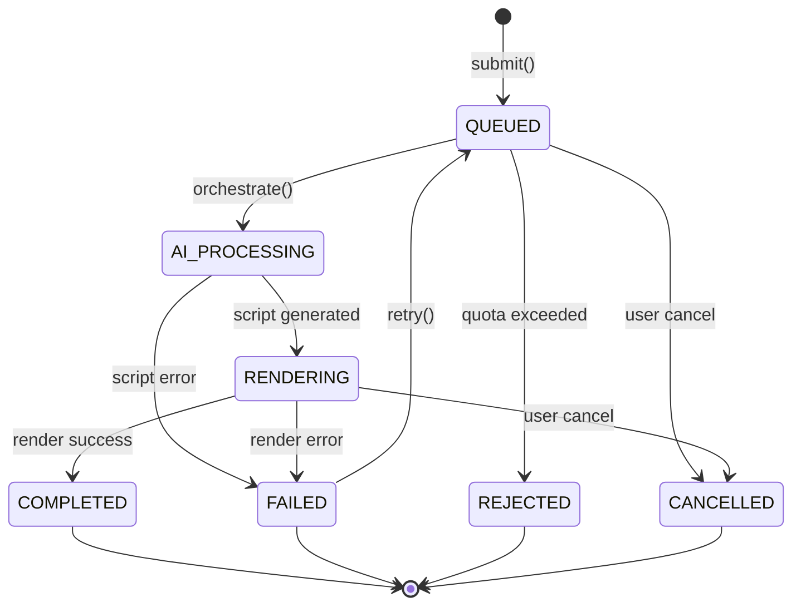
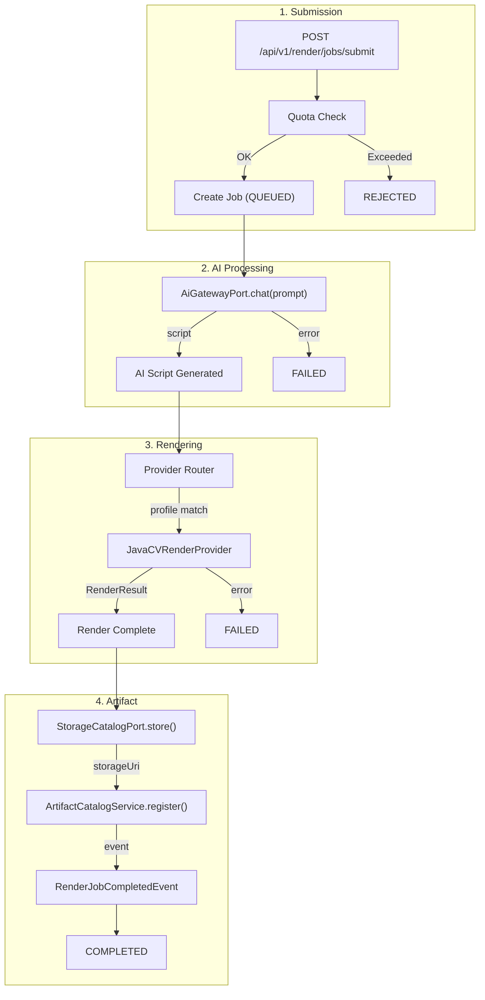

# Render Pipeline

> **Module:** `render-module`
> **Last Updated:** 2026-05-20  
> **Target architecture:** [10-server-nle-layered-architecture.md](./10-server-nle-layered-architecture.md)

## Overview

The render pipeline is a multi-stage video processing system. It manages the full lifecycle of a render job from submission through AI script generation, provider rendering, to artifact storage.

## Job Lifecycle State Machine

## Pipeline Stages

## Render Providers

| Provider | Type | Capabilities | Status |
|----------|------|-------------|--------|
| JavaCV | Transcode | Clipping, transcoding, subtitles, watermarks | ✅ Primary |
| OFX | Effects | Effects, transitions, filters | ✅ |
| GPAC | Packaging | DASH/HLS, CMAF, MP4 faststart | ✅ |
| MLT | Render | XML generation, melt command | ✅ |
| GStreamer | Render | Pipeline processing, subtitle overlay | ✅ |
| FFMPEG | Transcode | Universal transcoding | ✅ |
| Natron | Compositing | NatronRenderer / OFX POC | ⚠️ POC |
| Bento4 | Packaging | MP4 fragment, DASH, CENC (planned) | 📋 |
| Shotstack | Cloud render | JSON timeline API (planned) | 📋 |

See [08-pipeline-tools-shotstack-natron-popcornfx-bento4.md](./08-pipeline-tools-shotstack-natron-popcornfx-bento4.md) for selection rationale.

## Supported Profiles

| Profile | Resolution | Use Case |
|---------|-----------|----------|
| `default_1080p` | 1920x1080 | Standard HD |
| `default_720p` | 1280x720 | Web HD |
| `social_1080p` | 1920x1080 | Social media |
| `social_720p` | 1280x720 | Social media (light) |
| `mobile_480p` | 854x480 | Mobile |
| `4k_2160p` | 3840x2160 | 4K |
| `free_720p_watermarked` | 1280x720 | Free tier |
| `pro_1080p` | 1920x1080 | Pro tier |
| `team_4k` | 3840x2160 | Team tier |

## GPU Presets

| Preset | Encoder | Tier Access |
|--------|---------|-------------|
| GPU_H264 | NVENC H.264 | TEAM+ |
| GPU_H265 | NVENC HEVC | TEAM+ |
| GPU_VP9 | VAAPI VP9 | TEAM+ |

## Error Codes

| Code | HTTP | Description |
|------|------|-------------|
| RENDER-500-001 | 500 | General render failure |
| RENDER-409-001 | 409 | Quota exceeded |
| RENDER-404-001 | 404 | Job not found |

## Current Limitations

| Limitation | Status | Notes |
|------------|--------|-------|
| Multi-track compositing | ❌ Not supported | Only first track processed |
| Complex transitions | ❌ Not supported | Basic fades only |
| Full subtitle burn-in | ⚠️ Partial | Framework in place |
| GPU acceleration | ❌ Not supported | CPU-only |
| Remote workers | ❌ Not supported | All rendering in-process |
| H.265 encoding | ❌ Not supported | Not yet implemented |
| HDR video | ❌ Not supported | Not yet implemented |
