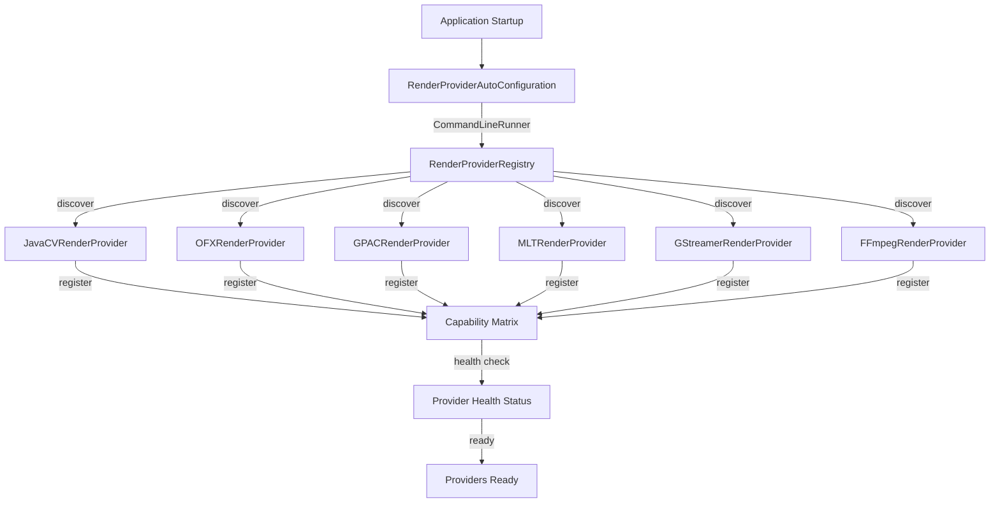

# Provider Registration

> **Module:** `render-module`
> **Last Updated:** 2026-05-18

## How Providers Are Registered

Render providers are registered at application startup via `RenderProviderAutoConfiguration` using Spring Boot's auto-configuration mechanism.



## Provider Interface

```java
public interface RenderProvider {
    String getProviderKey();
    Set<String> getCapabilities();
    boolean supportsProfile(String profile);
    RenderResult render(String jobId, String aiScript, String profile);
    HealthStatus checkHealth();
}
```

## Adding a New Provider

1. Create a class implementing `RenderProvider`
2. Annotate with `@Component`
3. Implement required methods
4. The provider will be auto-discovered at startup

```java
@Component
public class MyCustomRenderProvider implements RenderProvider {
    @Override
    public String getProviderKey() { return "my-custom"; }

    @Override
    public Set<String> getCapabilities() {
        return Set.of("transcode", "watermark");
    }

    @Override
    public boolean supportsProfile(String profile) {
        return profile.startsWith("custom_");
    }

    @Override
    public RenderResult render(String jobId, String aiScript, String profile) {
        // Implementation
    }

    @Override
    public HealthStatus checkHealth() {
        return HealthStatus.HEALTHY;
    }
}
```

## Provider Capability Matrix

| Provider | Transcode | Effects | Packaging | Subtitles | Watermark | GPU |
|----------|-----------|---------|-----------|-----------|-----------|-----|
| JavaCV | ✅ | ❌ | ❌ | ✅ | ✅ | ❌ |
| OFX | ❌ | ✅ | ❌ | ❌ | ❌ | ❌ |
| GPAC | ❌ | ❌ | ✅ | ❌ | ❌ | ❌ |
| MLT | ✅ | ❌ | ❌ | ❌ | ❌ | ❌ |
| GStreamer | ✅ | ❌ | ❌ | ✅ | ❌ | ❌ |
| FFMPEG | ✅ | ❌ | ❌ | ❌ | ❌ | ❌ |

## Provider Selection

The `RenderProviderRouter` selects a provider based on:

1. **Profile matching** — Which provider supports the requested profile
2. **Capability matching** — Which provider has the required capabilities
3. **Health status** — Only healthy providers are selected
4. **Tier access** — User's entitlement tier determines available providers

## Health Checks

Each provider implements `checkHealth()` which is called:
- At startup (one-shot validation)
- Before each render job
- Via the registry for status queries

## Deprecated Wrappers

The following deprecated wrapper classes exist for backward compatibility:

| Deprecated Class | Canonical Replacement |
|-----------------|----------------------|
| `FfmpegRenderProvider` | `FFmpegRenderProvider` |
| `GpacRenderProvider` | `GPACRenderProvider` |
| `MeltCommandFactory` | `MLTCommandFactory` |

See `12-review/02-technical-debt.md` for removal criteria.
