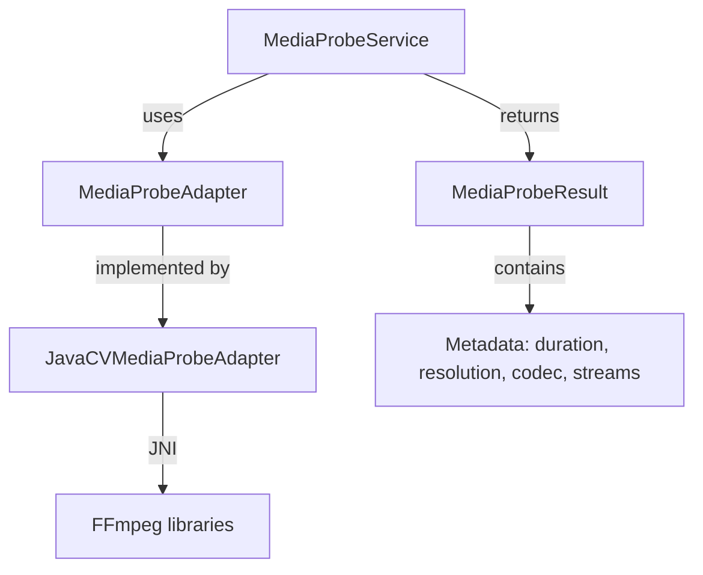

# Media Probe Service

> **Module:** `render-module`
> **Last Updated:** 2026-05-18

## Overview

The media probe service extracts metadata from media files (duration, resolution, codec, streams). It uses an adapter pattern to support multiple probe implementations.

## Architecture



## Adapter Interface

```java
public interface MediaProbeAdapter {
    MediaProbeResult probe(String storageUri);
}
```

## Current Implementation

| Component | Status | Notes |
|-----------|--------|-------|
| `MediaProbeService` | ✅ | Main entry point |
| `MediaProbeAdapter` | ✅ | Interface |
| `JavaCVMediaProbeAdapter` | ✅ | Primary implementation (replaced FFprobe) |
| `MediaProbeResult` | ✅ | Typed result DTO |
| `MediaValidationReport` | ⚠️ Deprecated | Old type, kept for backward compatibility |
| `FFmpegProbeService` | ⚠️ Deprecated | Replaced by JavaCVMediaProbeAdapter |

## Migration Notes

- `FFmpegProbeService` was replaced by `JavaCVMediaProbeAdapter` which uses JavaCV JNI bindings instead of shelling out to FFprobe
- `MediaValidationReport` is deprecated in favor of `MediaProbeResult`
- `MediaProbeService.probeLegacy()` returns `MediaValidationReport` for backward compatibility
