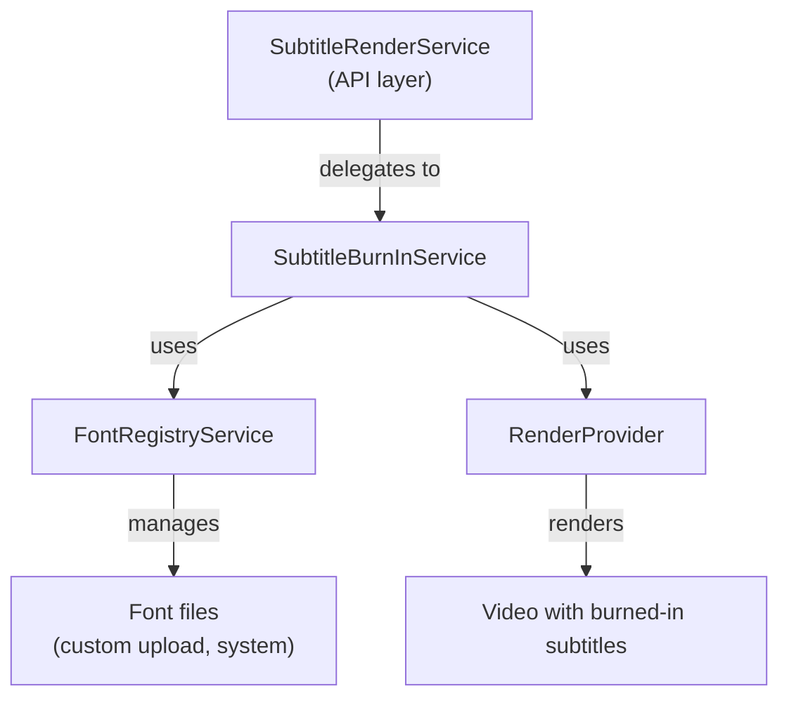

# Subtitle Burn-in Service

> **Module:** `render-module`
> **Last Updated:** 2026-05-18

## Overview

The subtitle burn-in service renders subtitle text onto video frames. It supports multiple subtitle formats and font management.

## Architecture

## Components

| Component | Purpose | Status |
|-----------|---------|--------|
| `SubtitleRenderService` | API-layer separation | ✅ |
| `SubtitleBurnInService` | Core burn-in logic | ✅ |
| `FontRegistryService` | Font management | ✅ |
| `SubtitleTrack` / `SubtitleCue` | Domain records | ✅ (not used by burn-in service) |

## Supported Formats

| Format | Status |
|--------|--------|
| SRT | ✅ |
| ASS/SSA | ✅ |
| VTT | ✅ |

## Font Management

| Feature | Status | Notes |
|---------|--------|-------|
| Custom font upload | ✅ | Users can upload fonts |
| Font embedding | ✅ | Fonts embedded in output |
| Font subset generation | 🔧 Placeholder | Copies original font (not true subset) |
| Multi-language fonts | ✅ | CJK, Latin, etc. |

## Known Limitations

- `SubtitleBurnInService` is a concrete `@Service` (no adapter interface)
- Subtitle tracks passed as `List<Map<String, Object>>` (no typed DTO)
- Font subset generation is a placeholder
- `SubtitleTrack` and `SubtitleCue` records exist in domain but are not used by burn-in service

See `12-review/02-technical-debt.md` for details.
