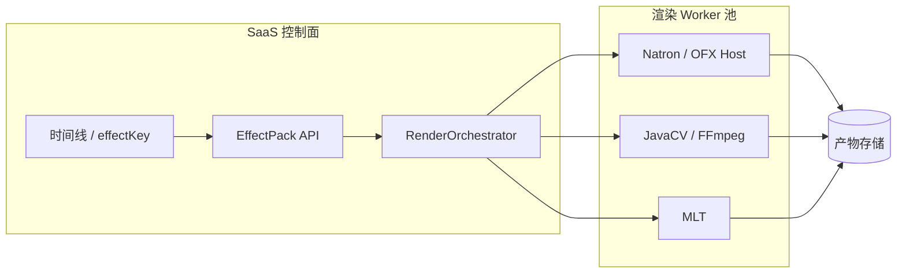

# VFX / 合成生态技术选型

> **Module:** `render-module`, `effect-pack`  
> **Last Updated:** 2026-05-20  
> **Related:** [03-provider-roadmap.md](./03-provider-roadmap.md), [01-render-pipeline.md](./01-render-pipeline.md), [08-pipeline-tools-shotstack-natron-popcornfx-bento4.md](./08-pipeline-tools-shotstack-natron-popcornfx-bento4.md), [../../platform/docs/effect-pack-schema.md](../../platform/docs/effect-pack-schema.md)

本文档说明主流剪辑/合成/特效宿主与本平台的关系，并回答：**为更好使用特效，是否应集成 Natron 或 TuttleOFX / Sam？**

---

## 1. 结论摘要（可直接用于决策）

| 问题 | 建议 |
|------|------|
| **集成 Natron 是否合理？** | **合理，但定位为「专用合成 Worker」**，而非嵌入 Web 编辑器。适合 PRO/TEAM 档位的**离线节点合成、OFX 插件批渲染**；通过 `NatronRenderer` CLI / Python 脚本在隔离容器中调用。 |
| **集成 TuttleOFX / Sam 是否合理？** | **作为长期 OFX Host 参考有价值，短期不作为主力**。TuttleOFX 含 Host 库 + 插件 + **Sam 命令行工具**；项目近年几乎无活跃维护（末次主要发布约 2017，仓库长期低活跃）。更适合**研读 OpenFX Host 实现**，而非生产依赖。 |
| **更契合本平台的路线** | 维持 **`effectKey` + `providerMappings` 抽象**；短期用 **FFmpeg filtergraph / MLT** 覆盖 80% 特效；中期在 **独立 render-worker** 中接入 **真实 OpenFX Host**（自研薄 Host、或 subprocess 调用 Natron）；商业插件仅作**可选 Worker 镜像**而非 SaaS 运行时硬依赖。 |
| **DaVinci / Nuke / Flame** | **工作流与能力标杆**，通过 OTIO、脚本、交付规范对接；**不把完整桌面应用嵌入**平台 JVM。 |
| **Olive / Oak 系列** | **交互与架构参考**（非线编 + 节点合成 UI）；与现有 FFmpeg/MLT 路线重叠，**不宜**作为服务端特效引擎。 |
| **Shotstack / Bento4 / PopcornFX** | 见 **[08-pipeline-tools-shotstack-natron-popcornfx-bento4.md](./08-pipeline-tools-shotstack-natron-popcornfx-bento4.md)**：云渲染 API、MP4/DRM 打包、粒子资产叠加；**NatronRenderer 已实现 POC**。 |

---

## 2. 本平台现状（选型前提）

当前 `OFXRenderProvider` 名称体现 OpenFX **语义兼容**，实现上主要为 **JavaCV + FFmpeg filtergraph / Java2D 模拟**，并非加载 `.ofx` 插件的真实 Host（见归档说明 `docs/archive/ofx-provider.md`）。

已落地的特效体系：

- **契约层：** `effectKey`、`EffectPack` DB/API、`providerMappings` 分级路由（`EffectProviderRouter`）
- **执行层：** `EffectFilterGraphBuilder`（FFmpeg）、`MltProjectXmlBuilder`（MLT）、`OFXRenderProvider`（内置效果链）
- **治理层：** `EffectEntitlementPort`、档位与特效包权益

因此「用好特效」分两层：

1. **产品层：** 统一 effectKey、参数 schema、预览与权益（已基本具备）
2. **引擎层：** 真实 OFX / 节点合成 / GPU（仍待 Worker 级集成）

---

## 3. 工具逐一说明

### 3.1 DaVinci Resolve / Fusion

| 维度 | 说明 |
|------|------|
| **定位** | 一体化调色 + 剪辑 + **Fusion 节点合成**；行业事实标准之一。 |
| **特效能力** | Fusion 节点图、粒子、3D、跟踪；Resolve 内置大量调色/降噪；支持部分 OFX。 |
| **授权** | 免费版功能受限；Studio 商业授权。 |
| **自动化** | Python API（Resolve Scripting）、命令行渲染、项目交换；与 OTIO/EDL 等可组合。 |
| **与本平台** | **参考 UX 与节点逻辑**；企业场景可做「导出到 Resolve 精修」或 **专用 Worker 节点**（需许可与无头环境）。**不适合**作为多租户 SaaS 默认内嵌运行时。 |
| **集成复杂度** | 🔴 高（许可、GPU、无头、版本锁定） |

### 3.2 Natron / NatronRenderer

| 维度 | 说明 |
|------|------|
| **定位** | 开源 **节点式合成器**（类 Nuke / Fusion），GPL-2.0。 |
| **NatronRenderer** | 无头 CLI（`-b` 批处理、`-i`/`-w` 节点、Python 脚本），**管线集成的是 Renderer 而非桌面 GUI**。 |
| **特效能力** | 原生 **OpenFX 1.4** Host；32-bit float、OpenColorIO；社区与商业 OFX 插件生态。 |
| **无头渲染** | **NatronRenderer**、`-b` 后台模式、Python 脚本驱动 Write 节点——适合 **渲染农场 / Worker**。 |
| **维护状态** | 2.5.x 仍有发布；活跃度低于商业软件，但比 TuttleOFX 更适合「拿来当合成引擎」。 |
| **与本平台** | **推荐且已 POC**：`NatronRenderProvider`、`natron_poc_*` profile、Worker 队列；详见 [07-natron-worker-poc.md](./07-natron-worker-poc.md) 与 [08](./08-pipeline-tools-shotstack-natron-popcornfx-bento4.md#3-natronrenderer)。 |
| **集成复杂度** | 🟡 中–高（子进程、依赖包、GPU 镜像、项目模板治理） |

### 3.7 Shotstack（云渲染 API）

| 维度 | 说明 |
|------|------|
| **定位** | 托管 **JSON 时间线 → 成片** 的 REST API，类似「代码化剪映云」。 |
| **与本平台** | **条件性集成（P3）**：作可选 `RenderProvider`，适合模板化社媒导出；**不替代** FFmpeg/MLT/Natron 主路径。 |
| **详情** | [08-pipeline-tools-shotstack-natron-popcornfx-bento4.md §5](./08-pipeline-tools-shotstack-natron-popcornfx-bento4.md#5-shotstack) |

### 3.8 Bento4（MP4 / DASH / DRM）

| 维度 | 说明 |
|------|------|
| **定位** | MP4 结构工具集：`mp4fragment`、`mp4dash`、`mp4encrypt` 等。 |
| **与本平台** | **推荐集成（P2）**：补强 **CENC/DRM** 与 fMP4；与现有 **GPAC** 打包并存、按场景路由。 |
| **详情** | [08-pipeline-tools-shotstack-natron-popcornfx-bento4.md §4](./08-pipeline-tools-shotstack-natron-popcornfx-bento4.md#4-bento4) |

### 3.9 PopcornFX（粒子 / 实时 VFX）

| 维度 | 说明 |
|------|------|
| **定位** | 实时粒子系统；成片侧以 **烘焙资产叠加** 为主。 |
| **与本平台** | **条件性（P4）**：`EffectPack` + FFmpeg overlay；非默认特效引擎。 |
| **详情** | [08-pipeline-tools-shotstack-natron-popcornfx-bento4.md §6](./08-pipeline-tools-shotstack-natron-popcornfx-bento4.md#6-popcornfx) |

### 3.3 Nuke（The Foundry）

| 维度 | 说明 |
|------|------|
| **定位** | 影视/VFX **节点合成**标杆，Python 深度可编程。 |
| **特效能力** | 键控、3D、深度合成；OFX；大量工作室内部工具链围绕 Nuke。 |
| **授权** | **商业订阅**，按席位/渲染节点计费。 |
| **与本平台** | **高端交付通道**：OTIO/脚本/渲染队列对接，非默认 Provider。适合 TEAM/ENTERPRISE「导出到 Nuke」或托管渲染农场。 |
| **集成复杂度** | 🔴 很高（许可、nuke -t、渲染节点授权） |

### 3.4 Autodesk Flame

| 维度 | 说明 |
|------|------|
| **定位** | 广播/高端 finishing：**剪辑 + 合成 + 调色** 一体，Linux 工作站传统强项。 |
| **特效能力** | Action 合成、批处理、高级调色；偏广播与时效工作流。 |
| **授权** | 商业订阅，硬件/GPU 要求高。 |
| **与本平台** | **流程参考**（finishing 环节）；集成方式类似 Nuke/Resolve——**交换项目与渲染任务**，不嵌入 JVM。 |
| **集成复杂度** | 🔴 很高 |

### 3.5 TuttleOFX / Sam

| 维度 | 说明 |
|------|------|
| **定位** | 开源 **OpenFX 图像处理框架**（C++），组成部分通常包括：Tuttle **Host 库**、插件库、示例插件、**Sam（命令行工具）**。 |
| **特效能力** | 以**图像处理管线**与 OFX 插件加载为主；Sam 用于批处理/命令行驱动 Host。 |
| **维护状态** | ⚠️ **长期低活跃**（近年几乎无持续提交；末个稳定标签较早）。生产依赖风险高。 |
| **与本平台** | **技术参考书 + 备选 Host 原型**：若自研 C++ OFX Host，可借鉴其 Host/插件加载结构；**不建议**把 Sam 作为 2026 默认生产路径。若只需 CLI 批处理，**NatronRenderer 或 FFmpeg/MLT 更现实**。 |
| **集成复杂度** | 🔴 高（构建链老旧、依赖、安全补丁） |

### 3.6 Olive / Oak 系列

| 维度 | 说明 |
|------|------|
| **Olive** | 开源 **非线编**（C++），0.2 重写中；GPU（OpenGL）、OpenColorIO、节点合成方向；**极不稳定/alpha**。 |
| **Oak** | 社区维护的 **Olive 分支**（[OakVideoEditorCommunity/oak](https://github.com/OakVideoEditorCommunity/oak)），同样偏桌面 NLE；OFX 支持仍在完善中。 |
| **相关分支** | 如 **Amber**（Olive 0.1 + Qt6/FFmpeg 现代化）等，均属「剪辑器实验生态」，非专用合成农场。 |
| **与本平台** | **前端交互与工程结构参考**（时间线、预览、节点面板）；**服务端特效**应继续走 FFmpeg/MLT/OFX Worker，**不** fork Olive/Oak 进后端。 |
| **集成复杂度** | 🟡 桌面应用级；与 SaaS 后端目标不一致 |

---

## 4. Natron vs TuttleOFX / Sam 对比

| 维度 | Natron | TuttleOFX / Sam |
|------|--------|------------------|
| **主要用途** | 节点合成 + OFX Host + 农场渲染 | OFX Host 库 + 图像插件 + CLI 批处理 |
| **与 effectKey 模型** | 通过「合成子图模板」映射一组 effectKey | 通过 Sam 管线映射，需自建映射层 |
| **无头/Worker** | ✅ NatronRenderer、脚本 | ⚠️ Sam 具备 CLI 意图，但生态陈旧 |
| **插件生态** | 活跃于开源合成场景 | 偏学术/历史插件 |
| **维护与风险** | 中等，可用 | 高，生产不推荐 |
| **许可** | GPL（Worker 隔离需注意传染范围） | 开源（具体以仓库为准） |
| **推荐优先级** | **P2：合成 Worker 候选** | **P4：研究/备选 Host** |

**结论：** 若目标是「**很好使用 OFX 商业/开源插件**」，应优先规划 **真实 OFX Host + Natron 类合成 Worker**；TuttleOFX/Sam 更适合**阅读实现、验证 Host 行为**，而非替代 Natron。

---

## 5. 与本平台架构的衔接方式

| 集成模式 | 说明 | 适用工具 |
|----------|------|----------|
| **A. 内置 filtergraph** | `EffectFilterGraphBuilder`、MLT XML | FFmpeg、MLT（当前） |
| **B. 子进程 Worker** | 平台下发 JSON/OTIO 快照 → Worker 调 CLI | NatronRenderer、ffmpeg、melt |
| **C. 真实 OFX Host** | C++/JNI 侧载 `.ofx`，Java 仅调度 | 自研 Host、或 Natron 内部 Host |
| **D. 桌面交换** | 导出工程/OTIO，用户在专业软件精修 | Resolve、Nuke、Flame |
| **E. 嵌入桌面 NLE** | 在浏览器内嵌 Olive 等 | ❌ 不推荐 |

**原则：** 控制面只暴露 `effectKey` 与参数；Worker 可替换，避免业务模块依赖某一厂商 GUI。

---

## 6. 分阶段路线图建议

| 阶段 | 目标 | 动作 |
|------|------|------|
| **Now** | 稳定 80% 常见特效 | 扩展 FFmpeg/MLT 映射；完善 `providerMappings` 与 E2E |
| **P1** | 真实 OFX 试点 | **NatronRenderer** POC 深化（见 [07](./07-natron-worker-poc.md)） |
| **P2** | 插件 + 交付 | OFX 白名单；**Bento4** 打包/DRM Provider；Natron GPU Worker |
| **P3** | 云与高端交付 | 可选 **Shotstack** Provider；OTIO + Resolve/Nuke 出站（TEAM+） |
| **P4** | 品牌特效资产 | **PopcornFX** 导出规范 + overlay effectKey |
| **Research** | Host 自研 | 参考 TuttleOFX Host 源码；评估 OpenFX SDK 直接集成 |

---

## 7. 与 Provider Roadmap 的对应

在 [03-provider-roadmap.md](./03-provider-roadmap.md) Stage 4「Custom effect plugins」中，建议细化为：

1. **Tier-1：** FFmpeg / MLT（已实现路径）
2. **Tier-2：** NatronRenderer Worker（OFX / 节点合成，**POC 已启动**）
3. **Tier-2b：** Bento4（MP4 分片、DASH/HLS、CENC/DRM，规划）
4. **Tier-3：** Shotstack 云渲染（可选）、企业出站（Resolve / Nuke / Flame）
5. **Tier-4：** PopcornFX 资产叠加（模板粒子）
6. **不纳入默认范围：** TuttleOFX/Sam 生产依赖、Olive/Oak 服务端嵌入

---

## 8. 风险与合规清单

- **GPL（Natron）**：Worker 容器隔离、源码提供策略需法务评审。
- **商业 OFX 插件**：Neat Video、Sapphire 等需**按渲染节点**授权，纳入 `EffectEntitlement`。
- **GPU 与确定性**：OFX 插件可能非确定性；需重试、版本锁定、快照输入哈希。
- **安全**：`.ofx` 为原生库，必须在**沙箱 Worker** 中加载，禁止在 `platform-app` JVM 内直接 `dlopen`。

---

## 9. 参考链接

| 项目 | 链接 |
|------|------|
| OpenFX 标准 | https://openeffects.org/ |
| Natron | https://natrongithub.github.io/ |
| Natron CLI | https://natron.readthedocs.io/en/master/devel/natronexecution.html |
| Shotstack / Bento4 / PopcornFX | [08-pipeline-tools-shotstack-natron-popcornfx-bento4.md](./08-pipeline-tools-shotstack-natron-popcornfx-bento4.md) |
| TuttleOFX | https://github.com/tuttleofx/TuttleOFX |
| Olive | https://github.com/olive-editor/olive |
| Oak (Olive 分支) | https://github.com/OakVideoEditorCommunity/oak |
| DaVinci Resolve 脚本 | Blackmagic 官方开发者文档 |
| Nuke | https://www.foundry.com/products/nuke |
| Flame | https://www.autodesk.com/products/flame |

---

*本文档随 `render-module` 与特效包实现演进更新；实现状态以代码与 `docs/archive/ofx-provider.md` 为准。*
