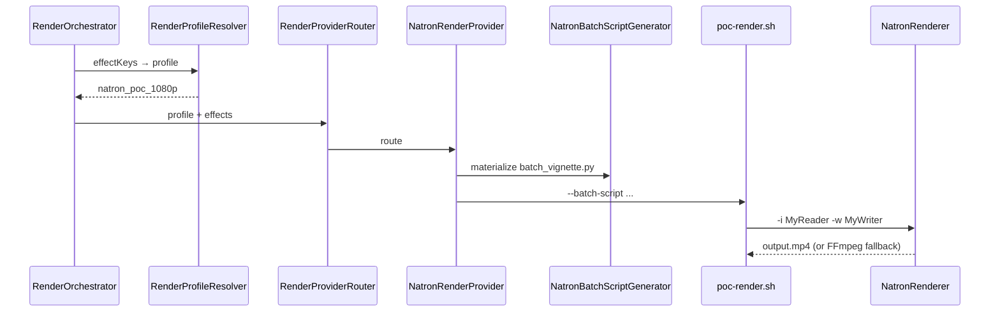

# Natron Worker POC

> **Effect key:** `video.natron_vignette`  
> **Profiles:** `natron_poc_1080p`, `natron_poc_720p` (auto-selected when Natron enabled)  
> **Last Updated:** 2026-05-20

## Status

| Phase | Status | Description |
|-------|--------|-------------|
| **1** | ✅ | Dockerfile, `poc-render.sh`, FFmpeg vignette fallback |
| **2** | ✅ | Python batch script + `NatronRenderer -i/-w` |
| **Auto profile** | ✅ | `RenderProfileResolver` upgrades `default_1080p` → `natron_poc_*` |
| **3** | ✅ | Entitlement `natron` provider + `natron-core` pack; in-process worker queue |
| **4** | 📋 | Multi-effect graphs, OTIO handoff |

## Architecture



## Enable on a worker

```bash
./gradlew :platform-app:bootRun --args='--spring.profiles.active=dev,natron-worker'
```

```yaml
render.providers.natron:
  enabled: true
  fallback-to-ffmpeg: false   # use NatronRenderer when installed
  auto-select-profile: true
```

See `platform/platform-app/src/main/resources/application-natron-worker.yml`.

## Timeline contract

```json
{
  "tracks": [{
    "type": "VIDEO",
    "clips": [{
      "media_reference": "file:///data/in/clip.mp4",
      "effects": [{
        "effectKey": "video.natron_vignette",
        "parameters": { "intensity": 0.6 }
      }]
    }]
  }]
}
```

### Auto profile selection

When `render.providers.natron.enabled=true` and the timeline contains `video.natron_vignette`:

| Requested profile | Resolved profile |
|-------------------|------------------|
| `default_1080p` | `natron_poc_1080p` |
| `social_720p` / `default_720p` | `natron_poc_720p` |
| `natron_poc_*` | unchanged |

Implemented in `RenderProfileResolver`; applied in `RenderOrchestratorService` at submit (inline timeline JSON) and execute (snapshot/script).

You may still pass `natron_poc_1080p` explicitly.

## Phase 2: batch script + NatronRenderer

Per job, Java writes:

`{storage}/artifacts/{jobId}/natron/batch_vignette.py`

from template `natron/templates/video.natron_vignette/batch_vignette.py` with absolute input/output paths.

`poc-render.sh` invokes:

```bash
NatronRenderer -b \
  -i MyReader /absolute/input.mp4 \
  -w MyWriter /absolute/output.mp4 \
  /path/to/batch_vignette.py
```

On failure (or `fallback-to-ffmpeg: true`), FFmpeg vignette is used.

## Docker

```bash
docker compose -f platform/infra/natron/docker-compose.poc.yml build
```

| Env | Default | Purpose |
|-----|---------|---------|
| `NATRON_POC_SCRIPT` | `/app/bin/natron-poc-render.sh` | Wrapper script |
| `NATRON_POC_FALLBACK` | `true` | Skip NatronRenderer |
| `NATRON_RENDERER_BIN` | `NatronRenderer` | Headless binary on PATH |

Install Natron in a derived image to run Phase 2 without fallback.

## Code map

| Component | Path |
|-----------|------|
| Provider | `NatronRenderProvider.java` |
| Batch generator | `NatronBatchScriptGenerator.java` |
| Profile resolver | `RenderProfileResolver.java` |
| Template | `resources/natron/templates/video.natron_vignette/batch_vignette.py` |
| Wrapper | `resources/natron/poc-render.sh` |

## Related

- [06-vfx-compositing-ecosystem-selection.md](./06-vfx-compositing-ecosystem-selection.md)
- [03-provider-roadmap.md](./03-provider-roadmap.md)
