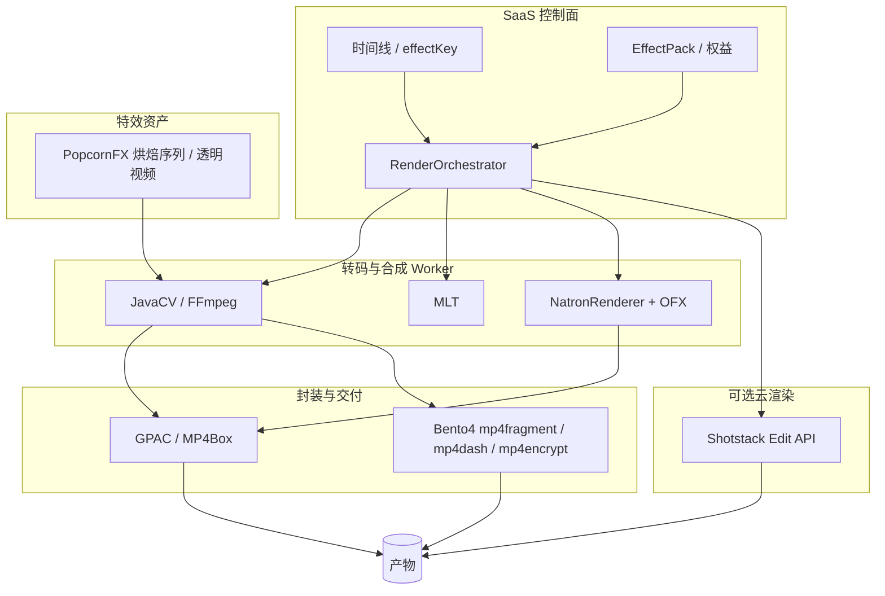

# 管线工具选型：Shotstack / NatronRenderer / PopcornFX / Bento4

> **Module:** `render-module`, `effect-pack`, 产物交付  
> **Last Updated:** 2026-05-20  
> **Related:** [10-server-nle-layered-architecture.md](./10-server-nle-layered-architecture.md), [06-vfx-compositing-ecosystem-selection.md](./06-vfx-compositing-ecosystem-selection.md), [07-natron-worker-poc.md](./07-natron-worker-poc.md), [03-provider-roadmap.md](./03-provider-roadmap.md), [01-render-pipeline.md](./01-render-pipeline.md)

本文档回答：**Shotstack、NatronRenderer、PopcornFX、Bento4 在本平台音视频剪辑/渲染管线中能否使用、承担什么角色、是否值得集成、以及推荐实现顺序。**

---

## 1. 总览结论

| 工具 | 管线角色 | 能否用上 | 值得集成 | 优先级 | 平台现状 |
|------|----------|----------|----------|--------|----------|
| **NatronRenderer** | 无头节点合成 / OFX 批渲染 Worker | ✅ | **是** | **P2** | ✅ 多 effectKey、队列消费、`finishRenderPhase` |
| **Bento4** | MP4 结构化处理、分片、fMP4、DASH/HLS 打包、CENC/DRM | ✅ | **是**（与 GPAC 分工） | **P2** | ✅ `Bento4PackagingProvider`（`render.providers.bento4.enabled`） |
| **Shotstack** | 云端 JSON 时间线 → 成片 API | ✅ | **条件性** | **P3** | ✅ `ShotstackRenderProvider`（需 API Key） |
| **PopcornFX** | 实时粒子/VFX 资产与烘焙 | ⚠️ 间接 | **条件性** | **P4** | ✅ `video.particle_overlay` + [09-popcornfx-asset-overlay.md](./09-popcornfx-asset-overlay.md) |

**推荐实现顺序：** NatronRenderer（深化 POC）→ Bento4（打包/DRM 补强）→ Shotstack（可选云渲染通道）→ PopcornFX（模板化资产叠加，非 Host 嵌入）。

---

## 2. 在本平台架构中的位置

**原则（与 [06-vfx-compositing-ecosystem-selection.md](./06-vfx-compositing-ecosystem-selection.md) 一致）：**

- 业务只认 `effectKey`、时间线快照、产物 URI；不绑定某一厂商 GUI。
- 原生/CLI 工具均在 **隔离 Worker 子进程** 中执行，禁止在 `platform-app` JVM 内 `dlopen` OFX 或未知原生库。
- 控制面通过 `RenderProvider` / `PackagingProvider` / `providerMappings` 路由。

---

## 3. NatronRenderer

### 3.1 是什么

| 维度 | 说明 |
|------|------|
| **产品** | [Natron](https://natrongithub.github.io/) 开源节点合成器（类 Nuke/Fusion） |
| **NatronRenderer** | 无头 CLI：`NatronRenderer -b` 批处理、`-i`/`-w` 指定 Reader/Writer 节点，Python 脚本驱动节点图 |
| **许可** | GPL-2.0；Worker 容器隔离 + 源码合规需法务评审 |
| **能力** | 真实 **OpenFX 1.4 Host**、OpenColorIO、32-bit float 合成 |

### 3.2 在剪辑管线中的用途

| 阶段 | 用法 |
|------|------|
| **特效/合成** | 时间线含 `providerMappings → natron` 的 effectKey → 生成 Natron 批处理脚本 → Worker 输出中间片或成片 |
| **OFX 插件** | 商业/开源 `.ofx` 在 Natron 内加载；平台侧做白名单与 `EffectEntitlement` |
| **不适合** | 嵌入 Web 非线编、实时预览（延迟高、无 GUI） |

### 3.3 集成结论

| 项 | 结论 |
|----|------|
| **能否用上** | ✅ 已通过子进程 POC 验证 |
| **值得集成** | **是** — 平台要走向真实 OFX/节点合成时的首选开源 Worker |
| **实现** | `NatronRenderProvider`、`RenderProfileResolver` 自动选 `natron_poc_*`、`RenderWorkerQueueService` 入队；见 [07-natron-worker-poc.md](./07-natron-worker-poc.md) |
| **下一步** | 多 effectKey 模板、真实 Natron 镜像（非仅 FFmpeg fallback）、GPU Worker、插件治理 |

---

## 4. Bento4

### 4.1 是什么

| 维度 | 说明 |
|------|------|
| **产品** | [Bento4](https://bento4.com/) — C++ **MP4 / ISOBMFF / DASH / CMAF** 工具集与 SDK |
| **典型 CLI** | `mp4info`、`mp4fragment`、`mp4dash`（DASH/HLS 打包）、`mp4encrypt`（CENC）、`mp4edit` 等 |
| **许可** | 开源（GPL 与 Apache 组件并存，以仓库为准）；商用需核对具体模块 |
| **能力** | 精确 MP4 结构读写、**fMP4 分片**、MPEG-DASH MPD、Common Encryption (CENC)、多 DRM 体系适配 |

### 4.2 在剪辑管线中的用途

| 阶段 | 用法 | 与现有栈关系 |
|------|------|----------------|
| **Probe / 校验** | `mp4info` 解析轨道、是否 fragmented、codec | 现有 `MediaProbeService` 以 JavaCV/FFmpeg 为主；Bento4 可作 **MP4 结构二次校验** |
| **后处理** | `mp4fragment` 生成 fMP4；修复 moov/分片边界 | FFmpeg `+faststart`、GPAC `MP4Box` 已覆盖部分场景 |
| **打包交付** | `mp4dash` 产出 DASH MPD + 分片，可选 `--hls` | 与 **GPAC** `GPACPackagingProvider` **重叠但可互补** |
| **DRM** | `mp4encrypt` + CENC | GPAC 路径较弱时 **Bento4 更值得优先集成** |
| **不适合** | 转码、滤镜、多轨剪辑、OFX 特效 | 不是剪辑引擎 |

### 4.3 与 GPAC 的分工建议

| 场景 | 优先 |
|------|------|
| 常规 HLS/DASH/CMAF、faststart | **GPAC**（已接入） |
| CENC / 多 DRM、PIFF、严格 fMP4 分片规范 | **Bento4** |
| 双栈验证（同一 mezzanine 两套 manifest 对照） | GPAC + Bento4 并行 QA |

### 4.4 集成结论

| 项 | 结论 |
|----|------|
| **能否用上** | ✅ 子进程调用 CLI/SDK |
| **值得集成** | **是** — 尤其面向 **流媒体交付 + DRM** 的产品档位 |
| **建议实现** | 新增 `render.providers.bento4`：`Bento4PackagingProvider`（`mp4dash`/`mp4fragment`）、可选 `Bento4ProbeAdapter`；由 `MultiProviderPipelineService` 在 `format=dash|hls` 且 `drm=true` 时路由 |
| **配置示例** | `bento4.mp4dash-bin`、`bento4.mp4fragment-bin`、`enabled=false` 默认关闭 |

---

## 5. Shotstack

### 5.1 是什么

| 维度 | 说明 |
|------|------|
| **产品** | [Shotstack](https://shotstack.io/) — **云端**视频编辑与渲染 API |
| **模型** | JSON **Edit**（`timeline` + `output`）→ REST 提交渲染 → 轮询 `queued → rendering → done` |
| **能力** | 多轨 clip、trim、转场、字幕、模板化社交短片；托管编码与 CDN 回传 |
| **许可** | **商业 SaaS**（按渲染时长/计划计费）；API Key |

### 5.2 在剪辑管线中的用途

| 阶段 | 用法 |
|------|------|
| **成片渲染** | 将平台时间线 **映射为 Shotstack JSON**（或维护 Shotstack 模板 ID）→ 异步渲染 → 拉回 `renderUrl` 登记产物 |
| **适合产品** | 大量 **模板化** 输出（营销短视频、多尺寸社媒、出海低运维） |
| **不适合** | 像素级时间线双向同步、本地 OFX、离线农场完全自控、强数据驻留隔离且无云端 |

### 5.3 与自建 Worker 对比

| 维度 | Shotstack | 自建（FFmpeg/MLT/Natron） |
|------|-----------|---------------------------|
| 运维 | 低 | 高（镜像、队列、GPU） |
| 成本 | 按量付费 | 基础设施 + 人力 |
| 定制 OFX/Natron | ❌ | ✅ |
| 供应商锁定 | 有 | 无 |
| 数据出境 | 需评估 | 可控 |

### 5.4 集成结论

| 项 | 结论 |
|----|------|
| **能否用上** | ✅ 作为 **外部 RenderProvider** |
| **值得集成** | **条件性** — 若产品明确需要「零运维模板云渲染」或快速验证社媒导出 |
| **建议实现** | `ShotstackRenderProvider` + `ShotstackTimelineMapper`（内部 OTIO/快照 → Shotstack JSON）；profile 如 `shotstack_social_1080p`；`TEAM+` 档位 + API Key 由 `secrets-config` 注入 |
| **不建议默认** | 替代主路径 JavaCV/MLT；宜为 **可选出站 Provider** |

---

## 6. PopcornFX

### 6.1 是什么

| 维度 | 说明 |
|------|------|
| **产品** | [PopcornFX](https://www.popcornfx.com/) — **实时粒子与 VFX** 系统（编辑器 + 运行时） |
| **管线** | 作者 `.pkfx` → **烘焙**（编辑器 / CLI / Asset Baker）→ 引擎运行时模拟与绘制 |
| **视频相关** | 官方定位偏 **游戏/实时引擎**；成片通常依赖 **烘焙输出**（序列帧、透明 ProRes/WebM）或引擎离线路径，而非通用「农场 CLI 一键成片」 |
| **许可** | 商业授权（Studio/引擎插件）；需单独台账 |

### 6.2 在剪辑管线中的用途

| 阶段 | 用法 |
|------|------|
| **资产生产** | VFX 团队在 PopcornFX Editor 制作品牌粒子（片头、庆祝、体育特效） |
| **平台集成** | 导入 **预渲染透明视频或图像序列** → 时间线 `effectKey`（如 `video.overlay_particle`）→ **FFmpeg/MLT 叠加** |
| **深度集成** | 仅在确有「服务端粒子烘焙农场」需求时，评估 PopcornFX **命令行烘焙** + 自定义 Worker（成本高、许可复杂） |
| **不适合** | 作为默认 SaaS 特效引擎替代 Natron/OFX；嵌入浏览器实时模拟 |

### 6.3 集成结论

| 项 | 结论 |
|----|------|
| **能否用上** | ⚠️ **间接可用**（资产叠加为主） |
| **值得集成** | **条件性** — 品牌粒子包、体育/活动类客户；优先级低于 Natron/Bento4 |
| **建议实现** | **P4**：`EffectPack` 登记 PopcornFX 导出资产 + FFmpeg overlay；可选 `popcornfx` provider 仅调度烘焙 CLI（若客户合同允许） |
| **不推荐** | 在 JVM 内嵌 PopcornFX 运行时 |

---

## 7. 与 effectKey / Provider 路由对照

| 能力类型 | effectKey 示例 | 推荐 Provider | 工具 |
|----------|----------------|---------------|------|
| 转码/裁剪/水印 | `video.scale`, `video.watermark` | `javacv`, `ffmpeg` | FFmpeg |
| 滤镜/简单特效 | `video.blur` | `ffmpeg`, `mlt` | FFmpeg / MLT |
| OFX/节点合成 | `video.natron_vignette` | `natron` | **NatronRenderer** |
| 流媒体打包 | `video.dash`, `video.hls` | `gpac` | GPAC |
| DRM 打包 | `video.dash_drm`（待定义） | `bento4`（规划） | **Bento4** |
| 模板云渲染 | `video.shotstack_template`（待定义） | `shotstack`（规划） | **Shotstack** |
| 品牌粒子叠加 | `video.particle_overlay`（待定义） | `javacv` + 资产 | **PopcornFX 导出资产** |

---

## 8. 分阶段实现清单（研发 backlog）

| 阶段 | 工具 | 交付物 |
|------|------|--------|
| **Now** | NatronRenderer | 巩固 POC：真实镜像、队列消费、E2E、权益 |
| **P2** | Bento4 | `Bento4PackagingProvider`、`mp4dash`/`mp4encrypt` 路由、运维镜像 |
| **P3** | Shotstack | `ShotstackRenderProvider`、时间线映射器、Webhook/轮询、计费对接 |
| **P4** | PopcornFX | 资产规范文档、`EffectPack` 模板、overlay effectKey |

---

## 9. 风险与合规

| 工具 | 风险 |
|------|------|
| NatronRenderer | GPL 传染范围、OFX 原生库沙箱 |
| Bento4 | GPL/Apache 混用模块、DRM 密钥管理 |
| Shotstack | 数据出境、API 依赖、渲染单价 |
| PopcornFX | 商业许可、烘焙算力、非标准离线管线 |

---

## 10. 参考链接

| 工具 | 链接 |
|------|------|
| Natron / NatronRenderer | https://natron.readthedocs.io/en/master/devel/natronexecution.html |
| Bento4 | https://bento4.com/documentation |
| Bento4 GitHub | https://github.com/axiomatic-systems/Bento4 |
| Shotstack Docs | https://shotstack.io/docs/guide/getting-started/core-concepts/ |
| PopcornFX Docs | https://www.popcornfx.com/docs/popcornfx-v2/popcornfx-overview/ |
| 本平台 Natron POC | [07-natron-worker-poc.md](./07-natron-worker-poc.md) |

---

*实现状态以 `render-module` 代码为准；本文档随 Provider 注册与路线图更新。*
