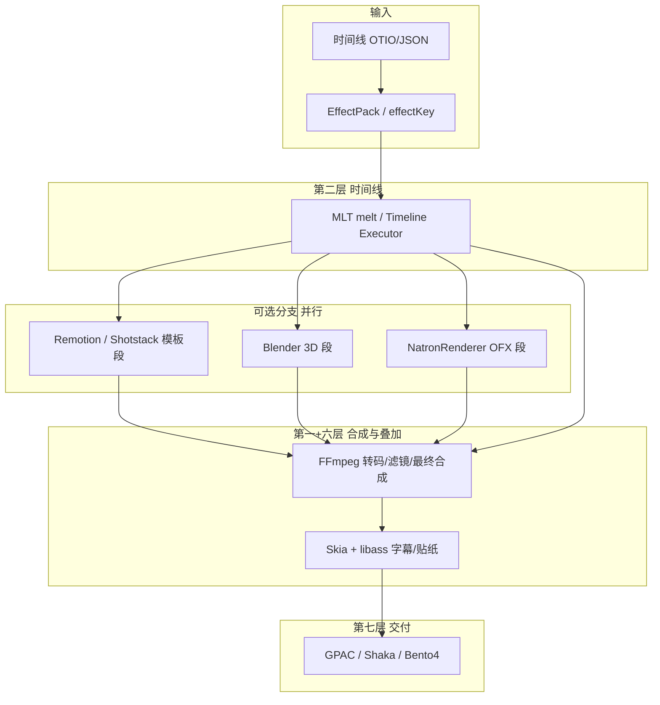
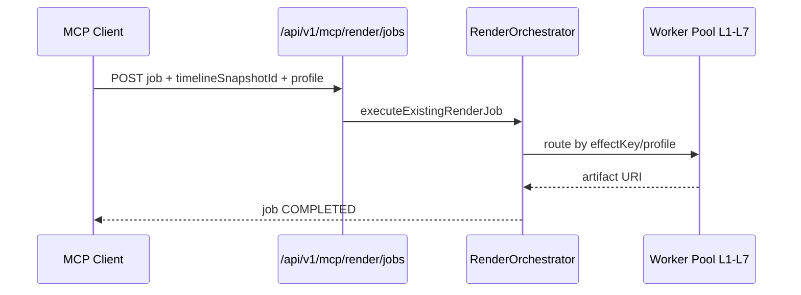

# 可扩展服务端 NLE 分层架构

> **Module:** `render-module`, `platform-app`, MCP/OpenAPI  
> **Last Updated:** 2026-05-20  
> **Related:** [12-server-nle-standards-and-architecture.md](./12-server-nle-standards-and-architecture.md)（行业标准 + 全量架构）, [01-render-pipeline.md](./01-render-pipeline.md), [03-provider-roadmap.md](./03-provider-roadmap.md), [06-vfx-compositing-ecosystem-selection.md](./06-vfx-compositing-ecosystem-selection.md), [08-pipeline-tools-shotstack-natron-popcornfx-bento4.md](./08-pipeline-tools-shotstack-natron-popcornfx-bento4.md)

本文评估你提出的 **七层服务端 NLE 栈** 是否合适，映射到本平台现状，并给出各工具的使用场景、能力与 **MCP 支持**说明。文末补充可选第八类工具与集成优先级。

---

## 1. 结论：设计是否合适？

**总体评价：合适，建议作为目标架构（Target Architecture）采纳**，并做三处澄清：

| 建议 | 说明 |
|------|------|
| **分层职责清晰** | 编码/时间线/模板/3D/OFX/2D 叠加/打包 解耦，符合 `RenderProvider` + `PackagingProvider` 扩展模型。 |
| **执行顺序是 DAG，不是严格 1→7 串行** | 实际为「时间线编排 → 多段并行/串行 Worker → 最终合成 → 叠加 → 打包」；见 §2。 |
| **第三层拆成两支** | **Remotion**（自建 Node/React 模板）与 **Shotstack**（托管 JSON API）同属「模板成片」，宜并列可选，勿与 MLT 主路径互斥。 |

**不推荐**：在 `platform-app` JVM 内嵌 Blender/Natron/Skia 原生库；一律 **子进程 / 独立 Worker 容器**。

---

## 2. 推荐管线（逻辑顺序）

| 你提出的层 | 在管线中的位置 | 本平台对应 |
|------------|----------------|----------|
| **L1 FFmpeg** | 全程 + **最终合成/编码** | `FFmpegRenderProvider`、`JavaCVRenderProvider`（JNI FFmpeg）、`EffectFilterGraphBuilder` |
| **L2 MLT / Executor** | **多轨编排主引擎** | `MltRenderProvider`、`MltProjectXmlBuilder`、`MultiProviderPipelineService`、`EditorTimelineConverter` |
| **L3 Remotion** | 模板分支成片后 **并入** 时间线 | ✅ `RemotionRenderProvider` + Worker 队列 |
| **L3 Shotstack** | 托管 JSON 时间线 API | ✅ `ShotstackRenderProvider` |
| **L4 Blender** | 3D/片头 **片段** 渲染后并入 | ✅ `BlenderRenderProvider` + Worker 队列 |
| **L5 NatronRenderer** | OFX/节点合成 **片段** | ✅ `NatronRenderProvider`（POC） |
| **L6 Skia + libass** | 合成后 **字幕/贴纸/矢量** | ✅ `LibassOverlayRenderProvider` + `SkiaStickerOverlayProvider` |
| **L7 GPAC/Shaka/Bento4** | **仅打包**，不剪辑 | ✅ 三件套 + `packaging.packager` 路由 |

---

## 3. 七层逐一说明（场景 / 功能 / 集成 / MCP）

### 第一层：FFmpeg

| 维度 | 说明 |
|------|------|
| **定位** | 通用音视频 **解码/编码/滤镜/复用**，管线「地基」。 |
| **适用场景** | 转码、裁剪、缩放、水印、简单调色、音轨混音、`-vf` 滤镜链、最终 `mux`、缩略图、probe（配合 ffprobe）。 |
| **不适用** | 复杂多轨非线编（无时间线语义）、节点式 OFX、3D、React 模板。 |
| **本平台** | ✅ `ffmpeg`、`javacv`（主路径）、`EffectFilterGraphBuilder` |
| **集成方式** | `RenderProvider` + `ProcessToolRunner` CLI；JavaCV 用于 JNI 减少 shell。 |
| **MCP** | ✅ 间接：`POST /api/v1/mcp/render/jobs` 提交任务 → 编排器路由到 `javacv`/`ffmpeg` profile；无单独 `ffmpeg_*` MCP tool。 |
| **许可** | LGPL/GPL 组件需合规审查（动态链接 JavaCV 已普遍使用）。 |

---

### 第二层：MLT 或自研 Timeline Executor

| 维度 | 说明 |
|------|------|
| **定位** | **多轨时间线**：clip 裁剪、轨道叠加、基础转场、XML/命令行驱动 `melt`。 |
| **适用场景** | 标准 NLE 导出、多轨视频+音频、dissolve/wipe（MLT 服务）、社媒时长裁切。 |
| **自研 Executor** | `MultiProviderPipelineService.planPipeline()` + OTIO/`TimelineSpec` 已是「执行计划器」；可与 MLT **并存**（计划器选 melt 或 FFmpeg 分段）。 |
| **本平台** | ✅ `mlt`；⚠️ 多轨合成仍部分受限（见 [01-render-pipeline.md](./01-render-pipeline.md) Limitations） |
| **MCP** | ✅ 同渲染任务 API；profile 含默认/社媒档时走 MLT 或 javacv。 |
| **许可** | LGPL（MLT）；GPL（melt）— Worker 隔离。 |

**与第一层关系**：MLT 内部常用 FFmpeg 做 codec；对外仍是一层「时间线语义」，一层「原子滤镜」。

---

### 第三层：Remotion

| 维度 | 说明 |
|------|------|
| **定位** | **React 组件 → 视频**；Web 风格动效、数据驱动图表、模板化短视频（代码即模板）。 |
| **适用场景** | 图文快闪、动态字幕排版、组件化片头、与前端设计系统共享 TS/React；批量 JSON props 渲染。 |
| **不适用** | 传统多轨剪辑、长片、重度 OFX/3D。 |
| **本平台** | 📋 规划 `RemotionRenderProvider`：`npx remotion render` 子进程；产物 mp4 作为时间线 **clip 素材** 并入 L2/L1。 |
| **与 Shotstack** | Shotstack = **托管** JSON 时间线 API（已文档化，见 [08](./08-pipeline-tools-shotstack-natron-popcornfx-bento4.md)）；Remotion = **自建**渲染，数据不出域。 |
| **MCP** | ✅ 提交 `profile=remotion_*` 或时间线含 `video.remotion_template` effectKey（规划）；MCP 不暴露 Remotion CLI 参数，走任务契约。 |
| **许可** | 开源核心 + 商业条款视用途；Node 运行时镜像。 |

---

### 第四层：Blender

| 维度 | 说明 |
|------|------|
| **定位** | **3D 场景、片头、复杂摄像机/灯光/动画**；VSE 也可做简单剪辑（一般不如 MLT 轻）。 |
| **适用场景** | 品牌 3D 片头、产品展示、几何动效、Cycles/Eevee 输出 EXR/PNG 序列或 mp4。 |
| **不适用** | 高并发轻量转码、实时预览、纯 2D 社媒切片。 |
| **本平台** | 📋 规划 `BlenderRenderProvider`：`blender -b scene.blend -o //out`；仅渲染 **片段**，不入主 JVM。 |
| **MCP** | ✅ 任务级；可选扩展 `effectKey=video.blender_intro` + 资产 `blend` 文件 URI。 |
| **许可** | GPL — **必须独立 Worker 镜像** + 源码合规。 |

---

### 第五层：NatronRenderer

| 维度 | 说明 |
|------|------|
| **定位** | **节点合成 + OpenFX 1.4**；无头 `NatronRenderer -b`。 |
| **适用场景** | 键控、调色节点、商业 OFX 插件批渲染、合成中间片再交 FFmpeg。 |
| **本平台** | ✅ POC：`NatronRenderProvider`、`natron_poc_*` profile、Worker 队列；见 [07-natron-worker-poc.md](./07-natron-worker-poc.md) |
| **MCP** | ✅ `video.natron_*` effectKey → 自动 profile；`/api/v1/mcp/render/jobs` + `X-API-Key` + `X-Tenant-ID`。 |
| **许可** | GPL-2.0 — Worker 隔离。 |

**层序说明**：放在 L4 之后、L6 之前合理（OFX 针对 **视频段**）；与 Blender 可并行，由时间线标记使用哪条分支。

---

### 第六层：Skia + libass

| 维度 | 说明 |
|------|------|
| **定位** | **高质量 2D**：矢量贴纸、复杂排版字幕、ASS/SSA 样式；Skia 栅格化，libass 专门字幕栅格。 |
| **适用场景** | 多语言字幕、卡拉 OK、描边/阴影、贴纸/角标、动态文字（Skia 动画需逐帧或预渲染序列）。 |
| **不适用** | 整片转码（仍交 FFmpeg）、3D、OFX。 |
| **本平台** | ⚠️ 今：`SubtitleRenderService`、`text.subtitle_burn_in`（多走 FFmpeg drawtext）；📋 `SkiaLibassOverlayProvider`：生成 ASS + `ffmpeg -vf ass=` 或 PNG 序列 overlay。 |
| **MCP** | ✅ 时间线 `text.*` / `video.sticker_*` effectKey（规划）；权益与字体白名单在 `EffectEntitlement`。 |
| **许可** | Skia BSD；libass ISC — 友好。 |

**层序说明**：放在 **最终合成之后、打包之前**（或最后一遍 FFmpeg 带 `ass`/`overlay`）最稳妥；与 L1 有交集但职责应分离：**L1 管像素管线，L6 管文字/矢量**。

---

### 第七层：GPAC / Shaka Packager / Bento4

| 维度 | 说明 |
|------|------|
| **定位** | **流媒体打包**：fMP4、DASH MPD、HLS、CMAF、DRM（CENC）。 |
| **适用场景** | 点播/直播分发、多码率 ladder、faststart、加密。 |
| **工具分工** | **GPAC**（MP4Box）：通用 DASH/HLS/CMAF，已接入；**Bento4**：fMP4/MPD/CENC 精细控制；**Shaka Packager**：Google 出品，DASH/HLS 工业级，与 FFmpeg 切片配合好。 |
| **本平台** | ✅ `GPACPackagingProvider`；✅ `Bento4PackagingProvider`（`dash_drm`）；📋 Shaka |
| **MCP** | ✅ 任务 `outputFormat=dash|hls|cmaf|dash_drm`；无独立 packaging MCP tool。 |
| **许可** | GPAC 自定义许可；Bento4 混合 GPL/Apache；Shaka BSD |

**原则**：**不参与剪辑**；输入必须是 **已定稿的 mezzanine MP4**。

---

## 4. MCP Server 支持总览

本平台 MCP 指：**对外 API 与 Web 共用同一编排契约**，MCP 客户端用 **API Key** 访问镜像路径。

| 能力 | Web (`/api/v1/...`) | MCP (`/api/v1/mcp/...`) | 说明 |
|------|---------------------|-------------------------|------|
| 创建/查询渲染任务 | JWT + `X-Tenant-ID` | `X-API-Key` + `X-Tenant-ID` | `RenderController` 双路径 |
| 时间线快照 | ✅ | ✅（同一服务） | `timeline-snapshots` |
| 特效包 / effectKey | ✅ | ✅ | 编排器解析脚本 |
| 权益校验 | ✅ | ✅ | `EffectEntitlementPort` |
| Natron 队列快照 | ✅ | ✅ | `GET .../render/worker-queue/natron` |
| 按工具拆分的 MCP Tool | ❌ | ❌ | 未来可做 `render_probe`、`package_dash` 等细粒度 tool |
| Playwright MCP | — | 开发用 | 见 `development/agent/mcp/`，非渲染管线 |

**MCP 设计原则**：Agent **只操作业务对象**（Job、Snapshot、Profile），不直接调 FFmpeg/Natron CLI，避免绕过配额、权益与审计。

---

## 5. 补充工具（建议纳入选型）

| 工具 | 建议层 | 场景 | 本平台 | MCP |
|------|--------|------|--------|-----|
| **JavaCV** | L1 | FFmpeg JNI 封装，probe/转码 | ✅ 主 Provider | 间接 |
| **GStreamer** | L1/L2 | 管线式滤镜、硬件插件 | ✅ `gstreamer` | 间接 |
| **Shotstack** | L3 并列 | 云模板 JSON 成片 | ✅ Provider（需 Key） | 间接 |
| **PopcornFX** | 资产 | 粒子预烘焙叠加 | ✅ overlay effectKey | 间接 |
| **Shaka Packager** | L7 | DASH/HLS，常与 FFmpeg 分片联用 | 📋 | 间接 |
| **ImageMagick / Sharp** | L6 辅助 | 静态图、缩略图、简单贴纸 | 📋 | 可选 |
| **VapourSynth** | L1/L5 之间 | 脚本化视频处理 | 研究 | — |
| **CDK / MoviePy** | L2 辅助 | 轻量脚本剪辑（Python） | 不推荐生产 | — |

---

## 6. 与 `effectKey` / Profile 映射（目标）

| 层 | profile 前缀示例 | effectKey 示例 |
|----|------------------|----------------|
| L1 | `default_*`, `social_*` | `video.scale`, `video.watermark` |
| L2 | `mlt_*` | `video.cross_dissolve`, 多轨由时间线表达 |
| L3 | `remotion_*`, `shotstack_*` | `video.remotion_template`, `video.shotstack_template` |
| L4 | `blender_*` | `video.blender_intro` |
| L5 | `natron_*` | `video.natron_vignette`, `video.natron_color_grade` |
| L6 | `subtitle_*` | `text.subtitle_burn_in`, `video.particle_overlay`, `video.sticker_*` |
| L7 | `gpac_*`, `dash_*`, `dash_drm` | `video.dash`, `video.hls`, `video.dash_drm` |

编排器根据 **时间线 + effectKey + 档位** 生成 **RenderPlan**（扩展 `MultiProviderPipelineService` 或 Temporal 工作流）。

---

## 7. 分阶段集成路线图

| 阶段 | 层 | 动作 |
|------|-----|------|
| **Now** | L1/L2/L5/L7 部分 | FFmpeg/JavaCV/MLT/Natron POC/GPAC/Bento4 |
| **P1** | L2 | 强化多轨、`Timeline Executor` 与 MLT 对齐 |
| **P2** | L6 | libass 正式路径（ASS 生成 + FFmpeg burn）；Skia 贴纸 POC |
| **P3** | L3 | Remotion Worker；与 Shotstack 二选一或并存 |
| **P4** | L4 | Blender 片头 Worker + blend 资产管理 |
| **P5** | L7 | Shaka Packager；DRM 策略统一 |
| **MCP+** | 全层 | 细粒度 MCP tools（probe/package）、RenderPlan 查询 |

---

## 8. 风险与约束

- **GPL 族**（MLT、Natron、Blender）：独立镜像 + 合规。
- **Remotion/Node**：CI 镜像体积、Chromium 依赖。
- **层间像素格式**：统一 **yuv420p / 分辨率 / 帧率** 契约，避免重复转码。
- **MCP 安全**：API Key 绑定 tenant；禁止 Agent 任意执行 shell。

---

## 9. 参考

| 项目 | 链接 |
|------|------|
| FFmpeg | https://ffmpeg.org/ |
| MLT | https://www.mltframework.org/ |
| Remotion | https://www.remotion.dev/ |
| Blender | https://www.blender.org/ |
| Natron | https://natrongithub.github.io/ |
| Skia | https://skia.org/ |
| libass | https://github.com/libass/libass |
| GPAC | https://gpac.io/ |
| Shaka Packager | https://github.com/shaka-project/shaka-packager |
| Bento4 | https://bento4.com/ |
| OpenAPI/MCP | [../archive/openapi-mcp-integration.md](../archive/openapi-mcp-integration.md) |

---

*本文档为架构目标说明；实现状态以 `render-module` 与 [03-provider-roadmap.md](./03-provider-roadmap.md) 为准。*
