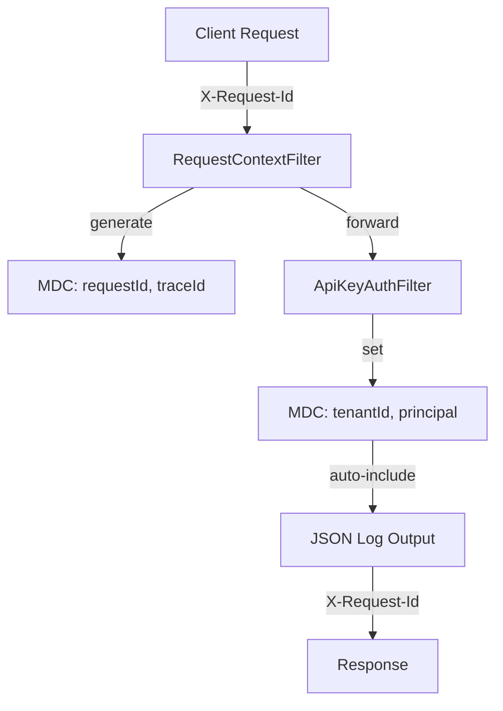

# Observability

> **Module:** `observability-module`
> **Last Updated:** 2026-05-18

## Overview

The observability system provides structured logging, metrics, health checks, and distributed tracing for the platform.

## Structured Logging

All log output uses JSON format with MDC fields:

| Field | Source | Example |
|-------|--------|---------|
| `traceId` | `TraceCorrelationFilter` | `abc123def456` |
| `requestId` | `RequestContextFilter` | `req_789xyz` |
| `tenantId` | `ApiKeyAuthFilter` → `TenantContext` | `ten_abc123` |
| `projectId` | Request path / body | `prj_def456` |
| `principal` | `ApiKeyAuthFilter` | `service-account-1` |

## Request Correlation Flow



## Metrics (Micrometer)

| Metric Name | Type | Description | Module |
|-------------|------|-------------|--------|
| `render.jobs.created` | Counter | Jobs submitted | render-module |
| `render.jobs.completed` | Counter | Jobs completed | render-module |
| `render.jobs.failed` | Counter | Jobs failed | render-module |
| `outbox.events.processed` | Counter | Events dispatched | outbox-event-module |
| `outbox.events.failed` | Counter | Events failed | outbox-event-module |
| `notifications.sent` | Counter | Notifications delivered | notification-module |
| `notifications.failed` | Counter | Notifications failed | notification-module |

## Metrics Endpoints

| Endpoint | Purpose |
|----------|---------|
| `GET /actuator/metrics` | All metrics |
| `GET /actuator/metrics/render.jobs.created` | Specific metric |
| `GET /actuator/prometheus` | Prometheus scrape |

## Health Checks

| Endpoint | Purpose |
|----------|---------|
| `GET /actuator/health` | Overall health |
| `GET /actuator/health/liveness` | K8s liveness probe |
| `GET /actuator/health/readiness` | K8s readiness probe |
| `GET /actuator/info` | Application info |

## Custom Health Indicators

| Indicator | Checks | Module |
|-----------|--------|--------|
| `DataSourceHealthIndicator` | Database connectivity | datasource-module |
| `OutboxHealthIndicator` | Outbox dispatch status | outbox-event-module |

## OpenTelemetry (Planned)

| Feature | Status |
|---------|--------|
| OTel dependency | 📋 Not yet added |
| Trace correlation | ✅ Via MDC |
| Structured logging | ✅ JSON format ready |
| OTel config | 📋 Planned |

## Module Overview Endpoint

```
GET /api/v1/observability/overview
```

Returns:
```json
{
  "module": "observability-module",
  "status": "active",
  "traceCorrelation": "enabled",
  "structuredLogging": "json",
  "otel": "prepared"
}
```
