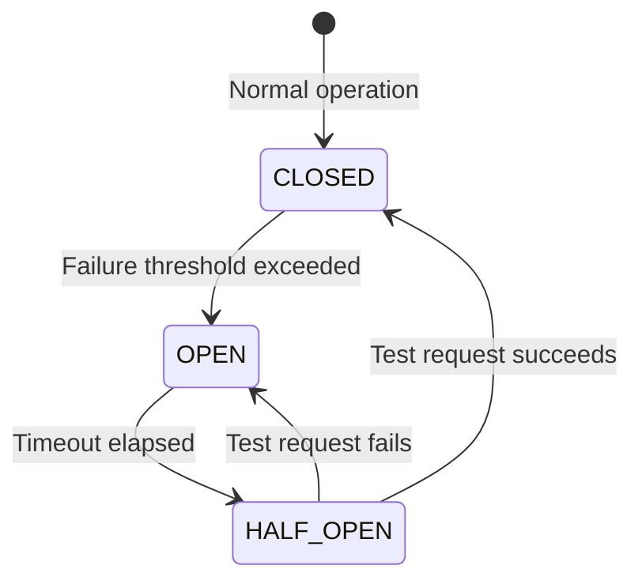

# Third-Party Service Monitoring

> **Module:** `observability-module`
> **Last Updated:** 2026-05-18

## Overview

The platform monitors third-party service health including render providers, payment gateways, notification services, and external APIs.

## Monitored Services

| Service | Type | Monitoring |
|---------|------|------------|
| PostgreSQL | Database | Connection pool health |
| Temporal Server | Workflow | gRPC health check |
| Object Storage | Storage | Upload/download success rate |
| Sentry | Monitoring | SDK health |
| OpenReplay | Feedback | SDK health |
| Payment providers | Payment | Transaction success rate |
| Notification providers | Notification | Delivery success rate |
| AI providers | AI | Response latency, error rate |

## Circuit Breaker

Each external service has a circuit breaker:

## SLA Metrics

| Metric | Target | Alert Threshold |
|--------|--------|-----------------|
| Render success rate | > 99% | < 95% |
| API response time (p99) | < 500ms | > 1000ms |
| Notification delivery | > 99.9% | < 99% |
| Payment success rate | > 99.5% | < 99% |
| AI response time (p95) | < 2s | > 5s |
