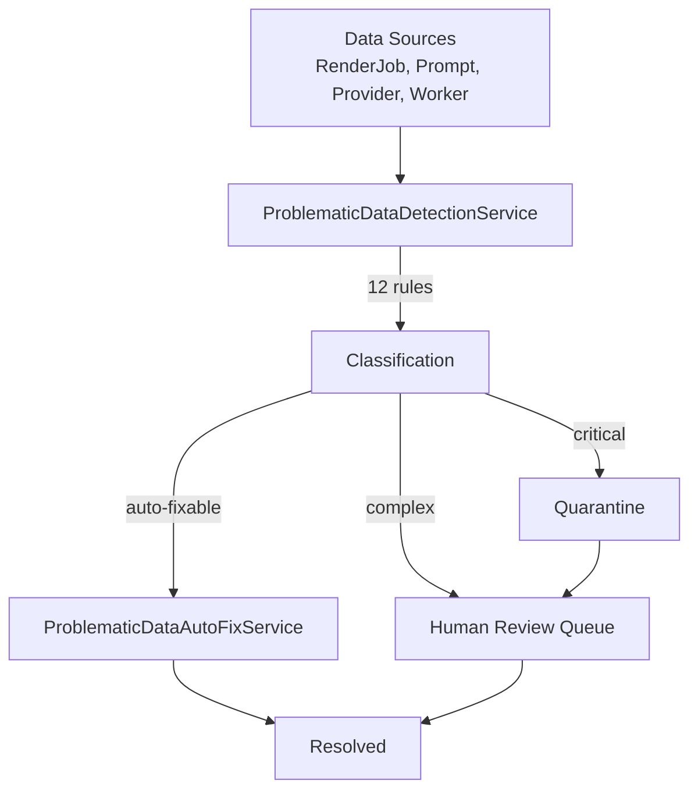

# Problematic Data Handling

> **Module:** `audit-compliance-module`
> **Last Updated:** 2026-05-18

## Overview

The problematic data detection and handling system automatically identifies bug-caused data issues and behavior anomalies. It provides a unified pipeline: detection → isolation → auto-fix → human review → resolution.

## Architecture

## Detection Rules

### RenderJob Rules

| Rule ID | Type | Severity | Auto-Fix | Description |
|---------|------|----------|----------|-------------|
| RJB-001 | MISSING_FIELD | HIGH | No | Completed without output artifact |
| RJB-002 | INVALID_STATE | MEDIUM | Yes | Stuck in non-terminal state >30min |
| RJB-003 | DUPLICATE | LOW | Yes | Same project+profile+timeline |
| SLA-001 | SLA_BREACH | CRITICAL | No | Exceeded SLA time limit |
| CST-001 | COST_ANOMALY | HIGH | No | Cost > 2x estimated |

### PromptExecution Rules

| Rule ID | Type | Severity | Auto-Fix | Description |
|---------|------|----------|----------|-------------|
| PMT-001 | MISSING_FIELD | CRITICAL | No | Sensitive data in execution record |
| PMT-002 | OUTPUT_MISMATCH | HIGH | No | Output doesn't match expected format |
| PMT-003 | LOGIC_CONFLICT | HIGH | No | Risk level escalated post-execution |

### Provider/Worker Rules

| Rule ID | Type | Severity | Auto-Fix | Description |
|---------|------|----------|----------|-------------|
| PRV-001 | ERROR_RATE_SPIKE | HIGH | No | Error rate > 20% |
| WRK-001 | PERFORMANCE_ANOMALY | MEDIUM | Yes | Stale heartbeat > 5min |

## Auto-Fix Capabilities

| Issue | Fix Action |
|-------|------------|
| Missing fields | Fill with default values |
| Format errors | Convert to expected format |
| Duplicate entries | Mark as duplicate, retain original |
| Stuck jobs | Reset to QUEUED for retry |
| Stale worker heartbeat | Mark offline, redistribute jobs |

## Quarantine Strategy

| Severity | Action |
|----------|--------|
| CRITICAL | Immediate quarantine + Sentry alert |
| HIGH | Quarantine + notification |
| MEDIUM | Mark for review |
| LOW | Log and auto-fix |

## Database Tables (V12)

| Table | Purpose |
|-------|---------|
| `problematic_data_record` | Main detection records |
| `quarantined_render_jobs` | Quarantined render jobs |
| `quarantined_prompt_executions` | Quarantined prompt executions |
| `quarantined_provider_workers` | Quarantined provider/worker data |
| `problematic_data_rule_config` | Detection rule configuration |
