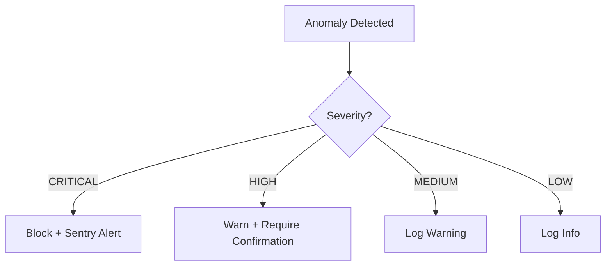

# Anomaly Detection

> **Module:** `audit-compliance-module`
> **Last Updated:** 2026-05-18

## Overview

The anomaly detection system identifies unusual patterns in platform behavior including cost spikes, usage anomalies, and performance degradation.

## Detection Rules

| Rule ID | Category | Severity | Description |
|---------|----------|----------|-------------|
| CST-001 | Cost | HIGH | Cost > 2x estimated |
| SLA-001 | Performance | CRITICAL | Exceeded SLA time limit |
| PRV-001 | Provider | HIGH | Error rate > 20% |
| WRK-001 | Worker | MEDIUM | Stale heartbeat > 5min |
| USA-001 | Usage | HIGH | Usage > 3x daily average |
| USA-002 | Usage | MEDIUM | Unusual time-of-day pattern |
| USA-003 | Usage | LOW | New tenant spike |
| USA-004 | Usage | MEDIUM | Geographic anomaly |

## Graduated Mitigation

## UX Guard

The UX guard provides graduated user-facing responses:

| Level | User Experience |
|-------|----------------|
| Normal | Full access |
| Warning | Warning banner, can proceed |
| Restricted | Limited features, upgrade prompt |
| Blocked | Operation blocked, contact support |

## Integration

- Anomaly events published via Outbox
- Audit trail for all anomaly detections
- Sentry alerts for critical anomalies
- Admin dashboard for anomaly review
