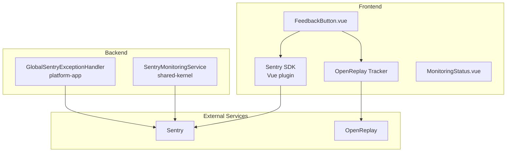

# Feedback & Monitoring

> **Module:** `shared-kernel`, `platform-app`, `frontend/`
> **Last Updated:** 2026-05-18

## Overview

The platform integrates **Sentry** (error monitoring + session replay) and **OpenReplay** (user feedback + session replay) for comprehensive observability.

## Architecture

## Frontend Integration

### Sentry

| Feature | Implementation |
|---------|---------------|
| Init | `initSentry()` in `frontend/src/utils/sentry.ts` |
| User context | `setSentryUser()` |
| Exception capture | `captureSentryException()` |
| Session replay | Automatic |
| Data sanitization | Headers, body, stack trace |

**Environment Variables:**
- `VITE_SENTRY_DSN` — Sentry DSN
- `VITE_SENTRY_ENVIRONMENT` — Environment name

### OpenReplay

| Feature | Implementation |
|---------|---------------|
| Init | `initOpenReplay()` in `frontend/src/utils/openreplay.ts` |
| User metadata | `setOpenReplayUser()` |
| Feedback | `submitOpenReplayFeedback()` |
| Session recording | Automatic |
| Data sanitization | Text, input, network |

**Environment Variables:**
- `VITE_OPENREPLAY_PROJECT_KEY` — Project key
- `VITE_OPENREPLAY_INGEST` — Ingest endpoint

## Backend Integration

### SentryMonitoringService

| Method | Purpose |
|--------|---------|
| `captureException()` | Exception with context |
| `captureMessage()` | Message with level |
| `setUserContext()` | User context |
| `setTag()` | Event tags |
| `captureRenderPipelineException()` | Render context |
| `captureProviderException()` | Provider context |
| `capturePromptExecutionException()` | Prompt context |

### GlobalSentryExceptionHandler

- Catches all unhandled exceptions
- Sends to Sentry with module context
- Returns structured `ProblemDetail` responses
- Works without Sentry (Optional dependency)

## Data Desensitization

| Service | Sanitization |
|---------|-------------|
| Sentry | Headers: `authorization`, `cookie`, `x-api-key` → `[REDACTED]` |
| Sentry | Body: API keys, passwords → `[REDACTED]` |
| OpenReplay | Text input sanitization |
| OpenReplay | Network request sanitization |

## Error Codes

| Code | Description |
|------|-------------|
| MONITORING-500-001 | Monitoring service error |
| MONITORING-503-001 | Session replay unavailable |
| FEEDBACK-400-001 | Invalid feedback |
| FEEDBACK-500-001 | Feedback submission failed |
