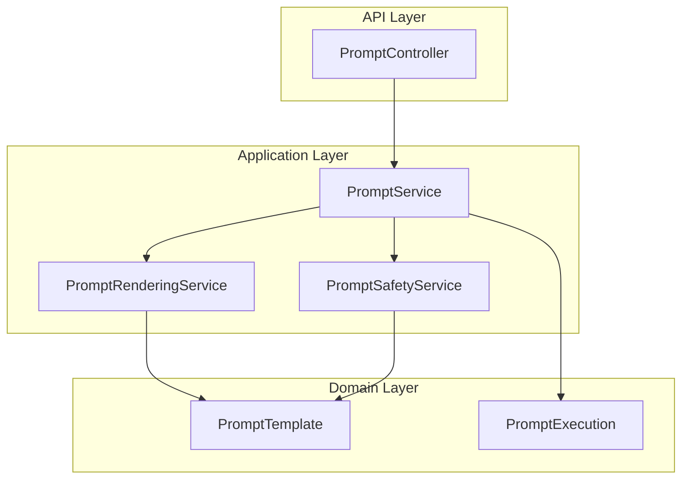
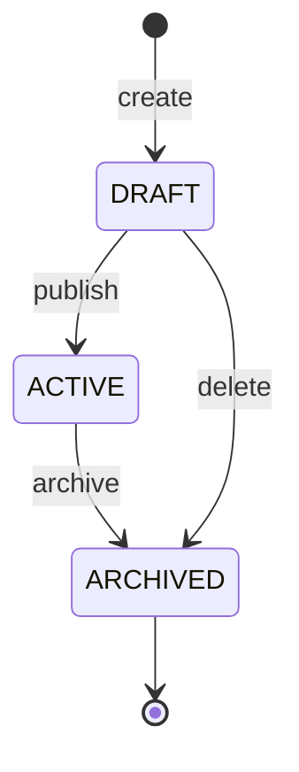

# Prompt Engineering Platform

> **Module:** `prompt-module`
> **Last Updated:** 2026-05-18

## Overview

The prompt engineering platform manages prompt templates with lifecycle management, versioning, variable substitution, rendering, and safety governance.

## Architecture



## Template Model

```java
public record PromptTemplate(
    String id,
    String tenantId,
    String name,
    String description,
    String content,
    List<String> variables,
    int version,
    String status,
    String createdBy,
    Instant createdAt,
    Instant updatedAt
) {}
```

## Variable Substitution

Templates use `{{variable}}` syntax:

```
Create a {{duration}} second video about {{topic}} in {{style}} style.
```

## Template Lifecycle



## Safety Governance

| Check | Description |
|-------|-------------|
| Content safety | Scans for harmful content |
| Variable validation | Ensures all variables are declared |
| Output validation | Validates rendered output |
| Risk level | Assigns risk level to execution |

## REST API

| Method | Path | Description |
|--------|------|-------------|
| GET | `/api/v1/prompts` | List templates |
| POST | `/api/v1/prompts` | Create template |
| GET | `/api/v1/prompts/{id}` | Get template |
| PUT | `/api/v1/prompts/{id}` | Update template |
| DELETE | `/api/v1/prompts/{id}` | Delete template |
| POST | `/api/v1/prompts/{id}/render` | Render template |
| POST | `/api/v1/prompts/{id}/execute` | Execute template |

## 🔧 In-Memory Storage

Prompt templates are stored in `ConcurrentHashMap`. Data is lost on restart. Database persistence is planned (V11 migration adds tables).
