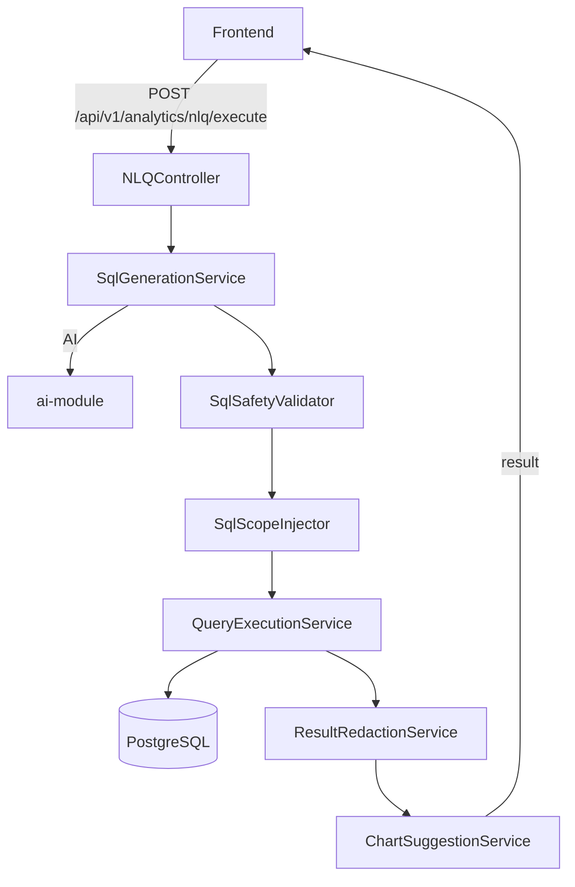

# Natural Language Query (NLQ) Assistant

> **Module:** `federation-query-module`
> **Last Updated:** 2026-05-18

## Overview

The NLQ Assistant enables users to query platform analytics data using natural language questions. The system converts questions to SQL, validates safety, enforces scope isolation, executes read-only queries, and returns results with chart suggestions.

## Architecture

## REST API

### NLQ Endpoints

| Method | Path | Description |
|--------|------|-------------|
| POST | `/api/v1/analytics/nlq/preview` | Generate SQL preview |
| POST | `/api/v1/analytics/nlq/execute` | Execute query |
| POST | `/api/v1/analytics/nlq/explain` | Explain SQL |
| POST | `/api/v1/analytics/nlq/chart-suggestions` | Chart suggestions |
| GET | `/api/v1/analytics/nlq/datasets` | List datasets |
| GET | `/api/v1/analytics/nlq/datasets/{key}` | Dataset details |

### Report Endpoints

| Method | Path | Description |
|--------|------|-------------|
| POST | `/api/v1/analytics/reports` | Create report |
| GET | `/api/v1/analytics/reports` | List reports |
| GET | `/api/v1/analytics/reports/{id}` | Get report |
| PUT | `/api/v1/analytics/reports/{id}` | Update report |
| POST | `/api/v1/analytics/reports/{id}/execute` | Execute report |
| POST | `/api/v1/analytics/reports/{id}/archive` | Archive report |

## SQL Safety Rules

1. Must start with `SELECT` or `WITH`
2. No DDL (CREATE, DROP, ALTER, TRUNCATE)
3. No DML (INSERT, UPDATE, DELETE, MERGE)
4. No multi-statement queries
5. No `SELECT *`
6. Must include `LIMIT`
7. No `CROSS JOIN`
8. Time-series must include time range
9. No sensitive field access
10. Only registered datasets

## Scope Isolation

| Scope | Condition | Applied To |
|-------|-----------|------------|
| Tenant | `tenant_id = :tenant_id` | All queries |
| Workspace | `workspace_id = :workspace_id` | All queries |
| User | `created_by = :user_id` | Non-admin users |
| Admin bypass | Skip injection | `analytics.global.query` permission |

## Redaction Strategies

| Strategy | Fields | Example |
|----------|--------|---------|
| `email_mask` | email | `u***r@example.com` |
| `phone_mask` | phone | `****1234` |
| `user_id_hash` | user_id | `h_A1B2C3D4` |
| `ip_mask` | ip_address | `192.168.1.*` |
| `full_redact` | password, token | `***REDACTED***` |
| `partial_redact` | name, address | `J***n` |

## Intent Classification

| Intent | Keywords | Default Chart |
|--------|----------|---------------|
| AGGREGATION | total, sum, count | metric_card, pie_chart |
| TREND | trend, over time | line_chart, area_chart |
| COMPARISON | compare, versus | bar_chart |
| RANKING | top, bottom | bar_chart |
| DISTRIBUTION | breakdown, by | pie_chart |
| DETAIL | (default) | table |

## Error Codes

| Code | HTTP | Description |
|------|------|-------------|
| NLQ-400-001 | 400 | NLQ feature disabled |
| NLQ-400-002 | 400 | SQL failed safety validation |
| NLQ-400-003 | 400 | SQL operation not allowed |
| NLQ-400-004 | 400 | Missing scope conditions |
| NLQ-400-005 | 400 | LIMIT clause required |
| NLQ-400-006 | 400 | Query too complex |
| NLQ-402-001 | 402 | Query cost exceeds threshold |
| NLQ-403-001 | 403 | Dataset access denied |
| NLQ-404-001 | 404 | Report not found |
| NLQ-408-001 | 408 | Query timeout |
| NLQ-503-001 | 503 | AI provider unavailable |
