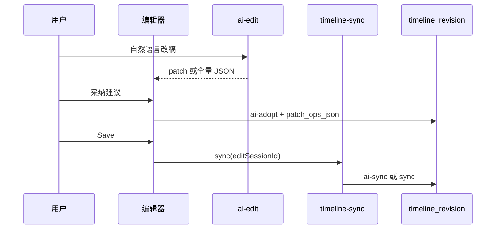

# AI 时间线编辑（Internal Timeline 1.0）

> **最后更新:** 2026-05-20  
> **相关:** [timeline-version-control.md](timeline-version-control.md)、[Internal Timeline Schema 1.0](../media-rendering/13-internal-timeline-schema-v1.md)、[AI 网关架构](ai-gateway-architecture.md)

---

## 1. 能力概览

| 能力 | 说明 |
|------|------|
| 自然语言改稿 | `POST .../timeline/ai-edit`，返回 Internal JSON 或 RFC6902 patch |
| Human-in-the-loop | 建议存于 `platformExtensions.aiProposals`，Export 面板采纳/拒绝 |
| 增量渲染 | `baseJobId` + Internal `revision` 字段 |
| 领域版控 | 采纳与 Save 写入 `timeline_revision`（含 `edit_session_id`、`patch_ops_json`） |

---

## 2. API

### 2.1 AI 编辑

```
POST /api/v1/tenants/{tenantId}/projects/{projectId}/timeline/ai-edit
```

请求体要点：`instruction`、`baseTimelineJson` 或 `baseJobId`、`editSessionId`、`humanInTheLoop`。

### 2.2 建议采纳

```
POST .../timeline/ai-proposals/{proposalId}/adopt
```

Body：`timelineJson`、`editSessionId`（可选）、`persistRevision`（默认 true）。  
服务端写入修订 `source=ai-adopt` 并保存 patch 操作列表。

### 2.3 预览 Internal

```
POST .../timeline/preview-internal
```

编辑器/遗留 JSON → Internal 1.0 预览。

---

## 3. 与版控、同步的关系



| 步骤 | 修订 source | 说明 |
|------|-------------|------|
| 采纳 AI 建议 | `ai-adopt` | 带 `editSessionId` 时归入同一会话分支 |
| 编辑器 Save | `ai-sync` / `sync` | Export 面板会话 ID 同步到 `timelineSyncMeta` |
| 冲突解决后 | `conflict-*` | 见 [timeline-version-control.md §5](timeline-version-control.md#5-离线冲突与修订链) |

完整 API 与 History UI 见 **[timeline-version-control.md](timeline-version-control.md)**（含 L9：`facets` 筛选项、修订 `labels`、冲突自动对比）。

---

## 4. 编辑器集成

### 4.1 Export 面板

- `AiTimelineEditPanel`：`editSessionId`（v-model）传入 AI 请求。
- `AiProposalsPanel`：采纳时传 `editSessionId`、`persistRevision: true`。
- 有未解决 **同步冲突** 时 Export 禁用（须先处理冲突）。

### 4.2 从我的导出跳转增量改稿

`/me/exports` → 编辑器 `/?export=incremental&projectId=...&baseJobId=...`，自动打开导出侧栏并预选基准作业。

### 4.3 离线草稿、冲突与版控

| 机制 | 说明 |
|------|------|
| 离线草稿 | debounce 写入 `localStorage`（`timeline-offline-draft:{projectId}`） |
| 恢复 | 打开项目先恢复草稿，再 `pull` |
| 快进到服务端 | 本地 clip 未改、仅服务端变 → 自动覆盖 |
| 冲突 | `TimelineConflictDialog` + **自动打开 History** + 横幅 |
| 对比 | **对比基准与 HEAD**（需上次 sync 留有 `baselineRevisionId`） |
| 高亮 | 受影响片段琥珀描边；**高亮导航器** 上一条/下一条 |
| 策略 | 保留本地 / 使用服务端 / 智能合并 → 对应 `conflict-*` 修订 |

Save 调用 `POST /render/timeline-sync/sync`，更新 baseline 与 `headRevisionId`。

### 4.4 History 侧栏

- 修订列表、AI 会话筛选、**对比**（选两条）、**恢复**。
- 含 patch 的修订：**预览**、**分步**（拉取 `GET .../revisions/{id}/snapshot` 解析数字 path）。

---

## 5. 配置

`app.ai.routing.timeline-edit` 默认 `stubChatProvider`；生产使用 `litellm` profile 时指向 `openAiChatProvider`（见 `application-litellm.yml`）。

---

## 6. 与网关的关系

LiteLLM/OpenRouter **不保存**时间线或成片；会话与产物由平台 `metadata` + `render_job` + 对象存储完成（见 [ai-gateway-architecture.md](ai-gateway-architecture.md)）。
