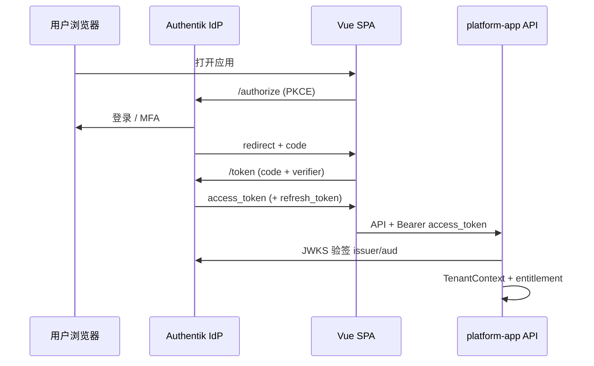

# Authentik 自托管与 OIDC Resource Server 技术选型

> **最后更新:** 2026-05-20  
> **适用:** 自托管 [Authentik](https://goauthentik.io/) + 媒体平台 **OAuth2 Resource Server**（浏览器 Authorization Code + PKCE）  
> **相关:** [部署清单](deployment.md)、[09-安全与可观测](platform-guide/09-security-ops.md)、[08-部署与数据](platform-guide/08-deployment.md)、[密钥管理](secrets-management.md)

本文约定生产身份架构：**Authentik 作为 IdP（身份权威）**，平台 API 作为 **Resource Server** 校验 Access Token；**MCP / 服务账号** 继续使用 **API Key**（与浏览器登录链分离）。

> **实现状态（2026-05-21）：**
>
> | 层级 | 状态 |
> |------|------|
> | 后端 OIDC Resource Server | ✅ `OAuth2ResourceServerSecurityConfiguration` |
> | 后端遗留 HMAC JWT | ✅ `legacy-hmac-jwt-enabled` 或 `JwtAuthFilter` |
> | JIT 用户 / RBAC | ✅ `OidcIdentityProvisioningService` |
> | 租户头防提权 | ✅ `trust-jwt-tenant-only` + `TenantHeaderGuardFilter` |
> | 前端 OIDC（PKCE） | ✅ `oidc-client-ts` + 路由登录守卫 |
> | Authentik 本地栈 | ✅ `platform/docker-compose.authentik.yml` + profile **`oidc`** |
>
> 本地无 Authentik 时行为不变（`dev` profile，`app.security.enabled=false`）。

---

## 1. 技术选型：Resource Server vs BFF 换票

### 1.1 决策结论

| 项 | 选定方案 |
|----|----------|
| **浏览器登录** | Authentik OIDC，Authorization Code + **PKCE**（Public Client） |
| **API 鉴权** | **纯 Resource Server**：SPA 携带 `Authorization: Bearer <access_token>`，平台用 **JWKS** 验签 |
| **未采用** | BFF 换票（HttpOnly 会话 Cookie 藏 refresh） |
| **自动化 / MCP** | 继续 **API Key** + `X-Tenant-ID`，不走用户 OIDC 登录 |

### 1.2 决策依据（摘要）

| 维度 | Resource Server | BFF 换票 | 对本平台的权重 |
|------|-----------------|----------|----------------|
| OAuth 角色边界 | IdP 发证 → API 验 JWT，API **无会话** | 浏览器只认 BFF 会话，token 藏在 BFF | 高：倾向清晰边界 |
| 多客户端一致性 | Web / 未来移动端 / CLI 可共用 Bearer 语义 | Web 多为 Cookie，App 常另建 Bearer 体系 | 高：媒体平台必有 MCP、Worker、API |
| 水平扩展 | 无状态 API，仅 JWKS 缓存 | BFF 会话存储、粘性、吊销集中在 BFF | 高 |
| 浏览器 XSS 与 token | access/refresh 可能被 JS 读取 | HttpOnly Cookie，JS 不可读 refresh | 中：用短 access + PKCE + CSP 缓解 |
| 运维组件数 | IdP + API | IdP + BFF + API + 会话集群 | 中：倾向更少 |
| 全局登出 / 吊销 | 依赖短 access + IdP session | 服务端删 session 更直观 | 中 |

**未选 BFF 的核心理由：**

1. 产品形态是 **开放平台**（REST + MCP API Key + 未来多端），不是单一浏览器控制台；Resource Server 与现有 `ApiKeyAuthFilter` / `JwtAuthFilter` 演进路径一致。  
2. **业务鉴权**（租户、`entitlement-module`、导航 `NavigationDecisionService`）无论哪种模式都要在平台内映射；BFF 不减少这部分复杂度，只移动 token 存放位置。  
3. BFF 引入 **CSRF、会话单点、有状态扩缩容**；在尚未有独立 API Gateway 会话层时，不宜把会话塞进 `platform-app`。

**Resource Server 下仍需做的安全基线（非 BFF 替代）：**

- Access Token **短寿命**（如 5–15 分钟）；Refresh 仅用于换票，**禁止**长期放在 `localStorage`（优先 memory + 静默刷新或 Authentik 会话）。  
- 前端 **CSP**、依赖审计；生产禁用裸 `X-Tenant-ID` 覆盖 JWT 租户。  
- 可选后续：API Gateway 做 Token Handler（边缘换票），仍保持业务服务为 Resource Server。

### 1.3 架构示意



```text
                    ┌─────────────────┐
                    │    Authentik    │  身份、MFA、SSO、组/属性
                    │  (自托管 IdP)   │
                    └────────┬────────┘
                             │ OIDC (HTTPS)
              ┌──────────────┼──────────────┐
              ▼              ▼              ▼
        ┌──────────┐   ┌──────────┐   ┌──────────┐
        │ Vue SPA  │   │ 未来 App │   │  MCP     │
        │ PKCE     │   │ Bearer   │   │ API Key  │
        └────┬─────┘   └────┬─────┘   └────┬─────┘
             │ Bearer       │ Bearer       │ X-API-Key
             └──────────────┼──────────────┘
                            ▼
                    ┌───────────────┐
                    │ platform-app  │  Resource Server (JWKS)
                    │ identity +    │  业务授权 / 租户 / 导航
                    │ entitlement   │
                    └───────────────┘
```

---

## 2. 命名与环境维度

与 [Vault、RustFS 与 Temporal 部署配置](vault-and-rustfs-setup.md) §1 对齐：

| 环境 | Authentik 对外主机名（示例） | OIDC Application slug | 平台 `issuer-uri` 路径段 |
|------|------------------------------|-------------------------|---------------------------|
| 开发 | `auth.dev.example.com` | `media-platform-dev` | `/application/o/media-platform-dev/` |
| 预发 | `auth.staging.example.com` | `media-platform-staging` | 同上 pattern |
| 生产 | `auth.example.com` | `media-platform-prod` | 同上 pattern |

**Issuer 完整形式（Authentik 默认）：**

```text
https://<authentik-host>/application/o/<application-slug>/
```

末尾斜杠与 Spring `issuer-uri` 一致，避免 JWKS 校验失败。

---

## 3. Authentik 自托管：基础设施清单

### 3.1 运行时依赖

| 组件 | 用途 | 建议 |
|------|------|------|
| **PostgreSQL** | Authentik 主库 | 独立实例或与平台分库；生产开启备份 |
| **Redis** | 缓存 / 任务（按官方 compose 版本要求） | 持久化按 Authentik 文档 |
| **反向代理** | TLS 终止 | Caddy / Traefik / Nginx；**OIDC 必须 HTTPS** |
| **SMTP**（可选） | 邀请、重置密码、MFA 邮件 | 生产建议配置 |
| **持久卷** | 媒体、证书、GeoIP 等 | 按官方 Helm/Compose 挂载 |

### 3.2 密钥与启动（Compose 示例摘录）

```bash
# 生成 secret（仅示例，生产用 K8s Secret / Vault）
openssl rand -base64 60 > authentik-secret.key
export AUTHENTIK_SECRET_KEY="$(cat authentik-secret.key)"
export AUTHENTIK_POSTGRESQL__HOST=postgres
export AUTHENTIK_POSTGRESQL__USER=authentik
export AUTHENTIK_POSTGRESQL__PASSWORD=<from-secret>
export AUTHENTIK_POSTGRESQL__NAME=authentik
export AUTHENTIK_REDIS__HOST=redis
```

| 变量 / 配置 | 说明 |
|-------------|------|
| `AUTHENTIK_SECRET_KEY` | **必填**，丢失会导致会话与加密数据不可恢复 |
| `AUTHENTIK_ERROR_REPORTING__ENABLED` | 生产建议 `false` 或企业策略 |
| 对外 URL | `AUTHENTIK_HOST` / 代理头 `X-Forwarded-*` 与公网域名一致 |

官方参考：[Authentik Docker Compose](https://docs.goauthentik.io/install-config/install/docker-compose/)、[Kubernetes](https://docs.goauthentik.io/install-config/install/kubernetes/)。

### 3.3 网络与 DNS

| 项 | 要求 |
|----|------|
| 公网域名 | `auth.<domain>` → Authentik 反代 |
| TLS | 有效证书（Let’s Encrypt 或企业 CA） |
| 平台 API | `api.<domain>` 与 Authentik **不同源** 时，CORS 需显式允许前端源 |
| 前端 | `app.<domain>`；Redirect URI 与此一致 |
| 出网 | `platform-app` 启动与运行时能访问 `https://auth.<domain>/.well-known/openid-configuration` |

### 3.4 备份与升级

- [ ] PostgreSQL 定时备份（含 Authentik 库）  
- [ ] 升级前阅读 Authentik Release Notes（大版本可能迁移 schema）  
- [ ] `AUTHENTIK_SECRET_KEY` 纳入 [密钥管理](secrets-management.md)（禁止进 Git）

---

## 4. Authentik 控制台配置（OIDC）

### 4.1 Provider（OAuth2/OpenID）

在 **Applications → Providers** 创建 **OAuth2/OpenID Provider**：

| 字段 | 建议值 |
|------|--------|
| Name | `media-platform-<env>` |
| Client type | **Public**（SPA，无 client secret） |
| Redirect URIs | `https://app.<domain>/oauth/callback`（dev：`http://localhost:3000/oauth/callback`） |
| Signing Key | 默认或专用证书 |
| Scopes | `openid` `profile` `email`；若用 groups claim 加 `ak` / 自定义 scope（按映射方式） |

**高级（建议）：**

- Access Token 有效期：**≤ 15 分钟**（生产）  
- Refresh Token：启用 rotation（若 Authentik 版本支持）  
- 禁止 Implicit Flow  

### 4.2 Application

| 字段 | 建议值 |
|------|--------|
| Name | Media Platform `<env>` |
| Slug | `media-platform-<env>`（决定 issuer 路径） |
| Provider | 上节 Provider |
| Launch URL | `https://app.<domain>/` |

记录：

- **Client ID** → 前端 `VITE_OIDC_CLIENT_ID`  
- **Issuer** → 后端 `SPRING_SECURITY_OAUTH2_RESOURCESERVER_JWT_ISSUER_URI`

### 4.3 组、角色与 Claim 映射

平台 Resource Server / JIT 期望 JWT 中含：

| Claim | 用途 | Authentik 来源建议 |
|-------|------|-------------------|
| `sub` | Authentik 用户 UUID | 默认 |
| `platform_user_id` | 平台用户 ID（**迁移 `user-1` 用**） | 用户属性 + Scope Mapping |
| `email` | JIT 用户邮箱 | `profile` / `email` scope |
| `tenantId` | `TenantContext` | 用户/组属性 `tenant_id` + Mapping |
| `roles` | `ADMIN`/`EDITOR`/`VIEWER` | 组名或 Mapping 数组 |

**逐步配置（复制即用）：** [authentik-property-mapping-and-migration.md](authentik-property-mapping-and-migration.md)  
**Blueprint：** [platform/docs/authentik/blueprint-media-platform-claims.yaml](../../platform/docs/authentik/blueprint-media-platform-claims.yaml)

**禁止：** 生产环境用 `X-Tenant-ID` 覆盖 JWT 内 `tenantId`（`trust-jwt-tenant-only=true`）。

### 4.4 Flows（可选强化）

| Flow | 用途 |
|------|------|
| 默认认证 | 用户名密码 / 社交 IdP |
| MFA | TOTP / WebAuthn（企业推荐） |
| 注册 / 邀请 | B2B 租户开通 |

---

## 5. 平台侧部署配置（Resource Server）

### 5.0 启用方式（已实现）

```bash
# 可选：本地 Authentik
cd platform && docker compose -f docker-compose.authentik.yml up -d

# 后端：Authentik 联调（需可访问的 issuer-uri）
export SPRING_SECURITY_OAUTH2_RESOURCESERVER_JWT_ISSUER_URI=http://localhost:9000/application/o/media-platform-dev/
./gradlew :platform-app:bootRun --args='--spring.profiles.active=oidc'

# 前端：复制 platform/frontend/.env.oidc.example → .env.local 后
cd platform/frontend && npm run dev
```

`oidc` profile 会自动创建默认租户（`default-tenant-id`，默认 `tenant-1`）并启用 JIT 用户开通。

| Profile | `app.security` | `oauth2.enabled` | 说明 |
|---------|----------------|------------------|------|
| `dev`（默认 bootRun） | `enabled=false` | — | 无 token，`X-Tenant-ID` |
| 默认 `application.yml` | `enabled=true` | `false` | 自签 JWT + `JwtAuthFilter` |
| `oidc` | `enabled=true` | `true` | Authentik JWKS + 可选 legacy HMAC |

### 5.1 后端环境变量

| 变量 | 含义 |
|------|------|
| `APP_SECURITY_ENABLED` | `true`（生产） |
| `SPRING_SECURITY_OAUTH2_RESOURCESERVER_JWT_ISSUER_URI` | Authentik issuer（见 §2） |
| `APP_SECURITY_OAUTH2_AUDIENCE` | （可选）校验 `aud`，设为 Application Client ID 或自定义 |
| `APP_SECURITY_JWT_TENANT_CLAIM` | 默认 `tenantId` |
| `APP_SECURITY_JWT_ROLES_CLAIM` | 默认 `roles` |
| `APP_IDENTITY_API_KEY_AUTH_ENABLED` | MCP 路径 `true` |
| `APP_JWT_SECRET` | **OIDC 全量切换后** 仅 dev 自签或关闭 `DevAuthController` |

`application.yml` 目标片段（接入实现时）：

```yaml
app:
  security:
    enabled: true
    dev-auth-endpoint: false
    oauth2:
      issuer-uri: ${SPRING_SECURITY_OAUTH2_RESOURCESERVER_JWT_ISSUER_URI}
      audience: ${APP_SECURITY_OAUTH2_AUDIENCE:}
spring:
  security:
    oauth2:
      resourceserver:
        jwt:
          issuer-uri: ${SPRING_SECURITY_OAUTH2_RESOURCESERVER_JWT_ISSUER_URI}
```

**与现网共存（迁移期）：** 可短期保留 `JwtAuthFilter` 仅 dev profile；生产仅 JWKS 校验 Authentik token。

### 5.2 前端环境变量（目标）

| 变量 | 含义 |
|------|------|
| `VITE_OIDC_ISSUER` | 与后端 issuer 相同 |
| `VITE_OIDC_CLIENT_ID` | Application Client ID |
| `VITE_OIDC_REDIRECT_URI` | 与 Authentik Redirect URIs 完全一致 |
| `VITE_OIDC_SCOPE` | `openid profile email`（+ 自定义 scope） |

开发：

- `app.security.enabled=false` 时仍可 `X-Tenant-ID` + `/api/v1/dev/auth/token`（仅本地）。  
- 联调 Authentik 时前端指向 dev Application，issuer 用 `https://auth.dev...` 或内网隧道 HTTPS。

### 5.3 反向代理 / CORS

| 位置 | 配置 |
|------|------|
| API Gateway / `platform-app` | 允许 `Origin: https://app.<domain>`，`Authorization` 头 |
| Authentik | 仅用户浏览器访问；不对公网开放管理口（或 VPN + MFA） |
| Cookie | Resource Server 模式 **API 通常无 Cookie**；若同域嵌入 SPA（8080 单包），注意静态资源与 API 同源的 CORS 可简化 |

### 5.4 MCP 路径（不变）

| 路径 | 认证 |
|------|------|
| `/api/v1/mcp/**` | `X-API-Key` + `X-Tenant-ID` |
| `/api/v1/**`（Web） | Bearer Authentik JWT |

在 Authentik 为 **服务账号** 单独发 **API Key**（平台 `identity-access-module`），**不要** 用用户 refresh token 调 MCP。

---

## 6. 部署检查清单（Authentik + OIDC）

复制到 [deployment.md](deployment.md) 勾选用。

### Authentik 实例

- [ ] PostgreSQL + Redis（按官方版本）已部署且健康  
- [ ] `AUTHENTIK_SECRET_KEY` 已入库（Vault / K8s Secret）  
- [ ] `https://auth.<domain>` TLS 有效，OpenID 发现文档可访问  
- [ ] SMTP / MFA / 备份策略已按企业要求配置  

### OIDC Application

- [ ] Provider 为 **Public + PKCE**  
- [ ] Redirect URI 覆盖 `app.<domain>` 与本地 dev（若需要）  
- [ ] Issuer URL 已写入运维台账（与 Spring `issuer-uri` 一致）  
- [ ] `tenantId` / `roles` Claim 映射已验证（解码 jwt.io 或 Authentik 测试页）  

### 平台

- [ ] `APP_SECURITY_ENABLED=true`（生产）  
- [ ] `SPRING_SECURITY_OAUTH2_RESOURCESERVER_JWT_ISSUER_URI` 已配置  
- [ ] 生产关闭 `dev-auth-endpoint`；禁用裸 `X-Tenant-ID` 提权  
- [ ] MCP `APP_IDENTITY_API_KEY_AUTH_ENABLED=true`  
- [ ] `GET /api/v1/me`（或等价）在 Bearer token 下返回正确租户与 entitlement  

### 前端

- [ ] `VITE_OIDC_*` 与 Authentik Application 一致  
- [ ] 登录回调路由 `/oauth/callback` 已部署  
- [ ] 401 时引导重新登录，而非仅 dev token  

### 安全审计

- [ ] Authentik 管理后台不对公网或未加 IP 限制  
- [ ] 日志不打印完整 access_token（见 OpenReplay/Sentry 脱敏规则）  
- [ ] [secrets-management.md](secrets-management.md)：`SECRETS_INLINE_CREDENTIALS_ENABLED=false`  

---

## 7. 验收与排错

| 现象 | 排查 |
|------|------|
| 401 Invalid token | issuer 末尾斜杠、时钟偏差、是否用了 dev 自签 token 打生产 |
| 403 有 token 无权限 | 平台 DB 用户/角色未 JIT；entitlement tier；导航策略 |
| CORS 错误 | API `Access-Control-Allow-Origin` 未含前端源 |
| JWKS 拉取失败 | API 出网、防火墙、Authentik 证书链 |
| 租户错乱 | Claim `tenantId` 映射错误；或仍发送 `X-Tenant-ID` 覆盖 |

**冒烟：**

```bash
# 1. 发现文档
curl -sS "https://auth.example.com/application/o/media-platform-prod/.well-known/openid-configuration" | jq .issuer

# 2. 用真实 access_token 调 API（从登录后浏览器或 Authentik 测试）
curl -sS -H "Authorization: Bearer <access_token>" \
  "https://api.example.com/api/v1/me"
```

---

## 8. 何时重新评估 BFF

若出现以下 **≥2 条** 且短期无法用 PKCE + 短 token 满足合规，再立项 Gateway/BFF：

- 合规明确要求 refresh token **不得** 进入浏览器 JS 可达存储  
- 仅 Web、无 MCP/移动端，且会话吊销为硬性 SLA  
- 已有统一 Ingress 愿承担 Token Handler，而不扩大 `platform-app` 会话状态  

届时优先 **独立 BFF / Gateway**，而非在业务模块内嵌会话。

---

## 9. 文档维护

| 变更 | 更新 |
|------|------|
| Authentik 版本 / issuer 路径变更 | 本文 §2–§4 |
| Spring 接入 OAuth2 Resource Server | 本文 §5 + `07-configuration.md` |
| 部署勾选项 | [deployment.md](deployment.md) §Authentik |
| 路线图 JWT/OAuth 完成 | [10-roadmap.md](platform-guide/10-roadmap.md) 勾选 |
