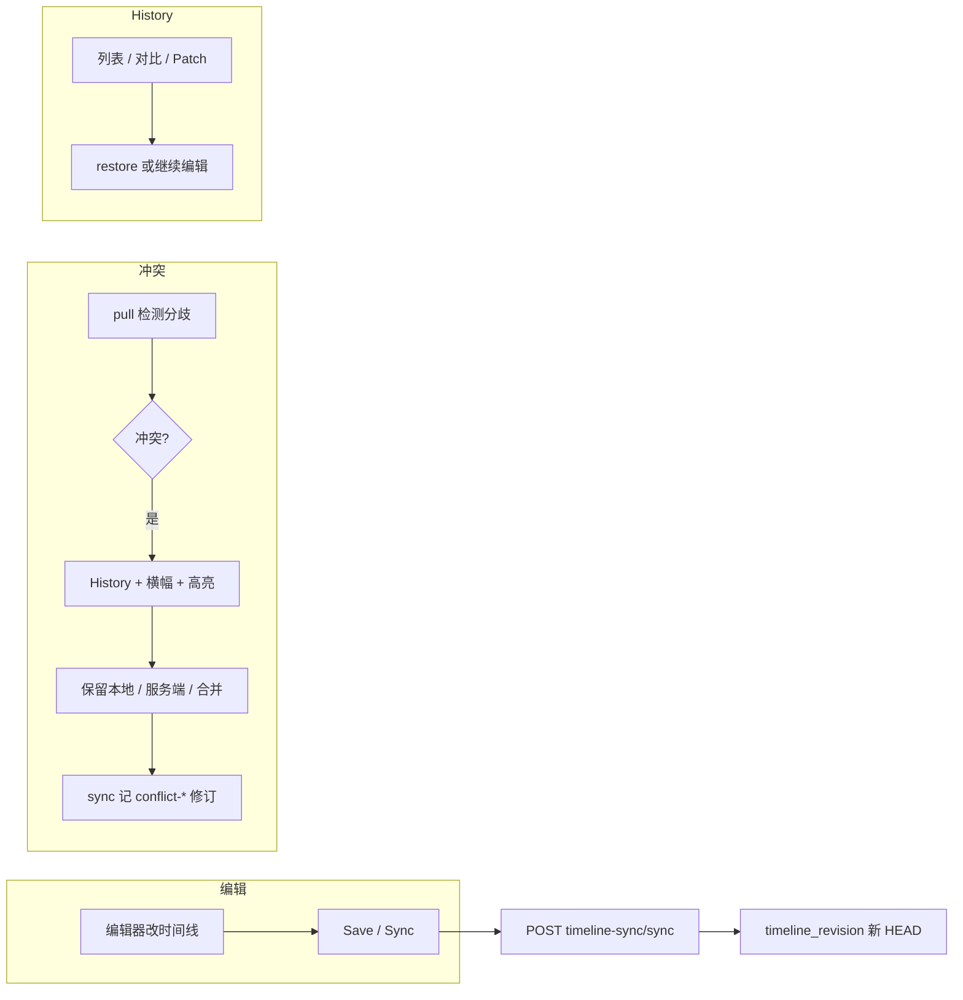

# 时间线领域版控（Timeline Revision）

> **最后更新:** 2026-05-20  
> **相关:** [Internal Timeline Schema 1.0](../media-rendering/13-internal-timeline-schema-v1.md)、[AI 时间线编辑](ai-timeline-editing.md)、[生产验收清单](production-acceptance-checklist.md)

本文档描述平台**项目级时间线修订链**（非 Git 整库版控）：服务端权威历史、编辑器 History、离线冲突与 patch 可视化。

---

## 1. 设计原则

| 原则 | 说明 |
|------|------|
| 领域版控 | 用表 `timeline_revision` 记录修订链，不用 Git 管理整份 JSON |
| 内容真源 | Internal Timeline 1.0 规范化 JSON；`timeline_snapshot` 存 blob |
| 实体级 diff | 轨道/片段/资产按稳定 `id` 对比（与 Schema patch 一致） |
| 回滚 = 新修订 | `restore` 复制历史快照为新 HEAD，**不删除**历史（类似 revert 新 commit） |
| 去重 | 与 HEAD 相同 `content_hash` 时跳过重复修订 |

---

## 2. 数据模型

### 2.1 `timeline_revision`（Flyway V20+）

| 列 | 说明 |
|----|------|
| `id` | `trev_*` |
| `project_id` | 项目 |
| `parent_revision_id` | 父修订（首条为 null） |
| `revision_number` | 项目内单调递增 |
| `snapshot_id` | 关联 `timeline_snapshot.id` |
| `internal_revision` | Internal JSON 内 `revision` 字段 |
| `content_hash` | 规范化后 SHA-256 |
| `source` | 见 §4.2 |
| `author_user_id` | 可选操作者 |
| `edit_session_id` | AI 改稿会话分支（V20） |
| `message` | 人类可读说明 |
| `change_summary_json` | 相对父修订的实体级摘要 |
| `patch_ops_json` | 持久化 RFC6902 操作列表（V21） |
| `labels_json` | 修订标签 JSON 数组（V22，可选） |

### 2.2 `timeline_snapshot` 增强

可选列：`content_hash`、`revision_number`（V20，逐步填充）。

---

## 3. 用户流程速查

| 场景 | 用户操作 | 系统行为 |
|------|----------|----------|
| 日常保存 | 编辑器 **Save** | `sync` → 新修订 `source=sync` 或 `ai-sync`（带 `editSessionId`） |
| 查看历史 | 右侧 **History** | 列表、按来源/作者/AI 会话筛选、编辑备注、对比、恢复 |
| 离线冲突 | 打开项目或联网 pull | 自动切 History；横幅 + 片段琥珀色高亮；可选对比基准→HEAD |
| AI 采纳 | Export 面板采纳建议 | `ai-adopt` 修订 + `patch_ops_json` |
| 导出前 | 有未解决冲突 | Export 禁用，须先处理冲突 |
| 存量项目 | 首次 pull 无 HEAD | `source=backfill` 从最新快照补首条修订 |

---

## 4. API 参考

基础路径：`/api/v1/render/projects/{projectId}/timeline/revisions`  
同步路径：`/api/v1/render/timeline-sync/*`

### 4.1 修订查询与操作

| 方法 | 路径 | 说明 |
|------|------|------|
| GET | `.../revisions` | 历史列表；`?editSessionId=`、`?source=`、`?authorUserId=`、`?limit=` |
| GET | `.../revisions/facets` | 项目内 distinct `source` 与作者统计（动态筛选项） |
| PATCH | `.../revisions/{id}/annotation` | 更新 `message` 与 `labels`（JSON 数组，最多 8×32 字） |
| GET | `.../revisions/head` | 当前 HEAD |
| GET | `.../revisions/edit-sessions` | AI 改稿会话列表 |
| GET | `.../revisions/compare?from=&to=` | 两修订对比：摘要、`entityChanges`、`patchPaths` |
| GET | `.../revisions/{id}` | 修订详情 + 变更摘要 |
| GET | `.../revisions/{id}/snapshot` | 该修订快照的 **Internal JSON**（patch 索引解析） |
| GET | `.../revisions/{id}/patch-preview` | 对父快照 dry-run 全部 patch |
| GET | `.../revisions/{id}/patch-steps` | 分步 dry-run 每条 patch |
| POST | `.../revisions/{id}/restore` | 回滚为新 HEAD（不删历史） |

### 4.2 `source` 取值

| source | 触发方式 |
|--------|----------|
| `sync` | 编辑器 `POST /timeline-sync/sync` |
| `ai-sync` | sync 且请求体带 `editSessionId` |
| `push` | `POST /timeline-sync/push` + `persistSnapshot` |
| `snapshot` | `POST /timeline-snapshots`（`ensureInternal`） |
| `ai-adopt` | AI 建议采纳 |
| `rollback` | History **恢复** |
| `conflict-keep-local` | 冲突对话框「保留本地」后 sync |
| `conflict-merge` | 冲突「智能合并」后 sync |
| `backfill` | 无 HEAD 时 pull 从最新快照补链 |

### 4.3 同步 API（写入修订）

| 方法 | 路径 | 说明 |
|------|------|------|
| POST | `/render/timeline-sync/sync` | 编辑器 canonical → Internal + 快照 + 修订；body 可含 `editSessionId`、`source`、`message` |
| GET | `/render/timeline-sync/latest?projectId=` | pull HEAD（含 `headRevisionId`、`headRevisionNumber`） |
| POST | `/render/timeline-sync/pull` | 按 `projectId` 或 `snapshotId` 拉取 |

---

## 5. 离线冲突与修订链

| 机制 | 存储 / 服务 | 作用 |
|------|-------------|------|
| 修订链 | `timeline_revision` | pull 优先 HEAD；冲突对比用 `baselineRevisionId` → `headRevisionId` |
| 客户端 baseline | `timelineSyncMeta` + `localStorage` | 上次 sync 的 hash、`headRevisionId`、离线草稿 |
| 冲突 UI | `TimelineConflictDialog` | 保留本地 / 使用服务端 / 智能合并 |
| 冲突写回 | sync `source=conflict-*` | 解决后写入新修订，闭环 |

冲突检测逻辑见 `platform/frontend/src/utils/timelineConflictMerge.ts`。  
解决「保留本地」「合并」后会 **sync** 并记修订；「使用服务端」对齐 HEAD 并更新 baseline。

---

## 6. 前端组件地图

| 模块 | 路径 | 职责 |
|------|------|------|
| API | `api/timelineRevision.ts`、`api/timelineSync.ts` | 修订与同步 HTTP |
| History | `components/timeline/TimelineHistoryPanel.vue` | 列表、来源/作者/会话筛选、备注编辑、对比、恢复、Patch/分步 |
| 冲突 | `TimelineConflictDialog.vue`、`TimelineConflictBanner.vue` | 解决策略 + 对比 HEAD |
| 高亮导航 | `TimelineHighlightNavigator.vue` | 多片段 ‹ › 跳转；快捷键 `[` `]` / `←` `→` |
| 对比 / 分步 | `TimelineRevisionCompareDialog.vue`、`TimelinePatchStepsDialog.vue` | diff、patch 预览、**导出 JSON** |
| 高亮逻辑 | `utils/timelinePatchHighlight.ts` | 实体 id / Internal 索引 path → 轨道片段 |
| 状态 | `stores/timelineSyncMeta.ts`、`stores/timeline.ts` | baseline、冲突、patch 高亮与滚动 |

编辑器入口：`EditorPage.vue` → 右侧 **History** 标签；冲突时自动打开 History。

---

## 7. Patch 与高亮说明

1. **持久化**：AI 采纳时将 proposal 的 `operations` 写入 `patch_ops_json`。
2. **预览**：`patch-preview` 在**父修订快照**上一次性 apply；`patch-steps` 逐步 apply。
3. **路径解析**（客户端）：
   - 命名 id：`/composition/tracks/.../clips/{clipId}/...`
   - 数字索引：需该修订的 Internal JSON（`GET .../snapshot` 或冲突时的 `serverInternalTimelineJson`）
4. **视觉**：轨道片段 **琥珀色描边**；工具栏显示「N 处高亮」；`TimelineHighlightNavigator` 支持逐条定位。

---

## 8. 数据库迁移

| 版本 | 内容 |
|------|------|
| V20 | 表 `timeline_revision`；`timeline_snapshot` 可选 hash/rev |
| V21 | `patch_ops_json`；`(project_id, edit_session_id, created_at)` 索引 |
| V22 | `labels_json`；`(project_id, source)` 索引 |

---

## 9. 实现阶段索引（L1–L9）

| 阶段 | 要点 |
|------|------|
| **L1** | 修订链、History、restore、sync 写修订 |
| **L2** | `edit_session_id`、patch 持久化、compare API、导出冲突拦截、backfill |
| **L3** | 冲突解决写修订、patch-preview、compare `patchPaths` |
| **L4** | 冲突对比基准→HEAD、patch-steps、baseline 修订 id |
| **L5** | 冲突自动 History、修订/片段高亮 |
| **L6** | Internal 索引 path、冲突横幅、定位首个片段 |
| **L7** | `GET .../snapshot`、高亮导航器（上一条/下一条）、History patch 拉 Internal |
| **L8** | 列表按 `source`/`authorUserId` 筛选、`PATCH .../annotation` 备注、对比导出 JSON、高亮键盘导航、sync 写入 `authorUserId` |
| **L9** | `labels_json` 标签、`GET .../facets`、History 导出列表、冲突自动对比（可关闭）、sync 缺省作者取 JWT `sub` |

---

## 10. 运维与验收建议

1. 执行 Flyway **V20–V22** 后启动 `platform-app`。
2. 打开项目 → **Save** → History 应出现 `#1` 修订。
3. 双端编辑制造冲突 → 见横幅、History 高亮、片段导航。
4. 对 `ai-adopt` 修订执行 **预览 / 分步**，确认 patch 路径与琥珀高亮一致。
5. **Export** 在 `pendingConflict` 时应禁用。
6. History 筛选 `ai-adopt`、编辑备注后刷新仍保留；修订对比对话框 **导出 JSON** 可下载。
7. 多片段高亮时用 `[` / `]` 在轨道上切换定位。
8. 为修订添加标签 `review`；`GET facets` 与 History **导出** 列表 JSON；冲突对话框默认弹出基准→HEAD 对比（可勾选关闭）。

更全平台验收见 [production-acceptance-checklist.md](production-acceptance-checklist.md)。

---

## 11. 相关代码（后端）

- `TimelineRevisionService`、`TimelineRevisionController`（platform-app）
- `TimelineEditorSyncService`（sync / pull / backfill）
- `TimelineRevisionDiffService`、`TimelinePatchOpsJson`
- `RenderController`（AI adopt → `recordAiAdoptRevision`）
