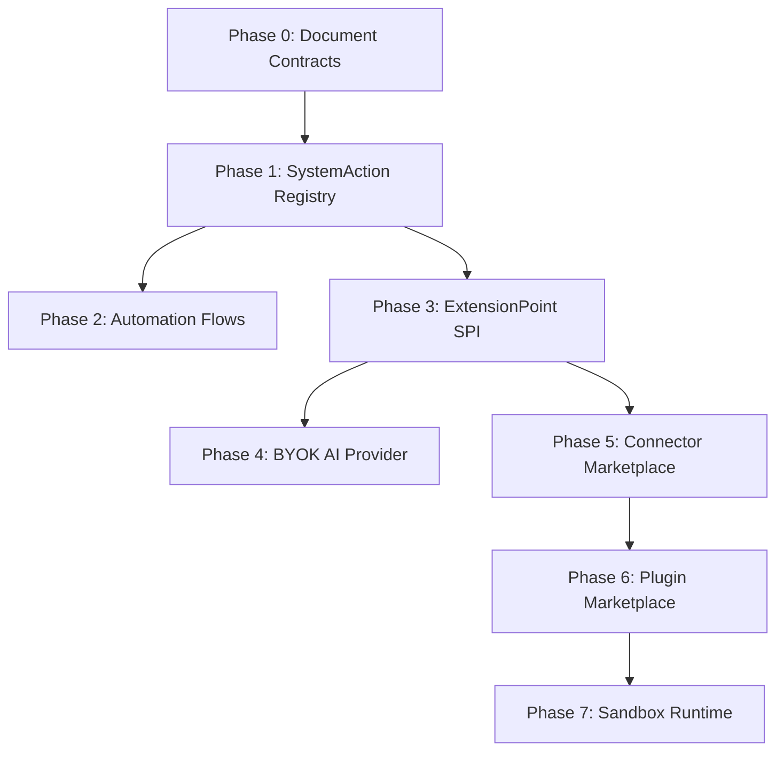

# Capability Opening Roadmap

> **This is a roadmap document.** It describes planned phases for progressive system capability opening. No phases are implemented unless explicitly verified.

---

## Overview

This roadmap defines the phased approach to opening platform capabilities through controlled extension points and system actions.

See [Capability Opening Blueprint](../architecture/blueprint/capability-opening-blueprint.md) for the target architecture.

---

## Phase 0 - Document Contracts

**Status:** ✅ Implemented (Contract skeleton exists in shared-kernel)

### Scope
- Define SystemAction interface contracts
- Define ExtensionPoint interface contracts
- Define AutomationFlow configuration schema
- Define ConnectorManifest schema
- Define PluginManifest schema

### Deliverables
- [x] SystemAction interface specification
- [x] ExtensionPoint interface specification
- [x] AutomationFlow configuration schema
- [ ] ConnectorManifest schema
- [ ] PluginManifest schema
- [ ] Contract versioning policy

### Non-Goals
- ❌ Implement any runtime behavior
- ❌ Implement any marketplace infrastructure
- ❌ Modify application code

### Validation
- All contracts reviewed and approved
- Contracts documented in architecture docs
- Versioning policy defined

### Implementation

Contract skeleton exists in `shared-kernel/src/main/java/com/example/platform/shared/capability/`:

| Contract | Type | Status |
|----------|------|--------|
| `SystemAction` | Interface | ✅ Defined |
| `ExtensionPoint` | Interface | ✅ Defined |
| `ExtensionProvider` | Interface | ✅ Defined |
| `ProviderCapabilities` | Record | ✅ Defined |
| `AutomationFlow` | Record | ✅ Defined |
| `AutomationTrigger` | Record | ✅ Defined |
| `AutomationExecution` | Record | ✅ Defined |
| `CredentialRef` | Record | ✅ Defined |
| `ArtifactRef` | Record | ✅ Defined |
| `InvocationContext` | Record | ✅ Defined |
| `InvocationResult` | Record | ✅ Defined |
| `CapabilityStability` | Enum | ✅ Defined |
| `InvocationStatus` | Enum | ✅ Defined |
| `ProviderRuntimeType` | Enum | ✅ Defined |
| `FlowStatus` | Enum | ✅ Defined |
| `CapabilityErrorCode` | Enum | ✅ Defined |

---

## Phase 1 - Internal SystemAction Registry

**Status:** ⚠️ Skeleton Only (Registry exists, runtime execution not implemented)

### Scope
- Formalize existing services as SystemActions
- Create SystemAction registry
- Add audit logging for action execution
- Add idempotency key support

### Deliverables
- [x] SystemAction registry implementation
- [ ] Audit logging for action execution
- [ ] Idempotency key support
- [ ] Action execution metrics

### Non-Goals
- ❌ External invocation of actions
- ❌ Marketplace exposure
- ❌ Automation flow execution

### Validation
- All existing services registered as SystemActions
- Audit logs captured for all action executions

### Implementation

Registry skeleton exists in `shared-kernel/src/main/java/com/example/platform/shared/capability/registry/`:

| Component | Status | Notes |
|-----------|--------|-------|
| `SystemActionRegistry` interface | ✅ Defined | Registration, lookup, list, contains |
| `InMemorySystemActionRegistry` | ✅ Implemented | In-memory implementation |
| Runtime execution | ❌ Not implemented | Registry only |
| Audit logging | ❌ Not implemented | Not yet |
| Idempotency key support | ❌ Not implemented | Not yet |
- Idempotency keys working correctly
- Metrics available in observability

---

## Phase 2 - Internal Automation Flow Execution

**Status:** Planned

### Scope
- Implement automation flow engine
- Support config-only workflows (YAML/DB)
- Support internal triggers (event, schedule, manual)
- Chain SystemActions in flows

### Deliverables
- [ ] Automation flow engine
- [ ] Flow configuration schema (YAML/DB)
- [ ] Internal trigger support (event, schedule, manual)
- [ ] Flow execution logging
- [ ] Flow error handling and retry

### Non-Goals
- ❌ User code execution
- ❌ External marketplace
- ❌ Arbitrary workflow definitions by tenants

### Validation
- Config-only flows execute correctly
- Internal triggers fire correctly
- SystemActions chain correctly
- Error handling works as expected

---

## Phase 3 - ExtensionPoint / Provider SPI

**Status:** ⚠️ Skeleton Only (Registry exists, runtime execution not implemented)

### Scope
- Implement ExtensionPoint registry
- Implement ExtensionProvider interface
- Support built-in providers
- Support HTTP connector providers
- Add provider health checks

### Deliverables
- [x] ExtensionPoint registry
- [x] ExtensionProvider interface
- [ ] Built-in provider implementations
- [ ] HTTP connector provider support
- [ ] Provider health checks
- [ ] Provider configuration management

### Non-Goals
- ❌ Marketplace infrastructure
- ❌ Plugin sandboxing
- ❌ Arbitrary code execution

### Validation
- ExtensionPoints registered correctly
- Providers implement ExtensionPoints correctly
- HTTP connectors work correctly
- Health checks report accurate status

### Implementation

Registry skeleton exists in `shared-kernel/src/main/java/com/example/platform/shared/capability/registry/`:

| Component | Status | Notes |
|-----------|--------|-------|
| `ExtensionPointRegistry` interface | ✅ Defined | Registration, lookup, list, contains |
| `InMemoryExtensionPointRegistry` | ✅ Implemented | In-memory implementation |
| `ExtensionProviderRegistry` interface | ✅ Defined | Registration, lookup, list, findSupporting |
| `InMemoryExtensionProviderRegistry` | ✅ Implemented | In-memory implementation |
| Runtime execution | ❌ Not implemented | Registry only |
| Provider invocation | ❌ Not implemented | Registry only |
| Health checks | ❌ Not implemented | Not yet |

---

## Phase 4 - BYOK/Custom AI Provider Connector

**Status:** Planned

### Scope
- Support BYOK (Bring Your Own Key) for AI providers
- Support custom HTTP AI endpoints
- Support OpenAI-compatible endpoints
- Add credential management for BYOK

### Deliverables
- [ ] BYOK AI provider support
- [ ] Custom HTTP AI endpoint connector
- [ ] OpenAI-compatible connector
- [ ] Credential management for BYOK
- [ ] Provider configuration UI

### Non-Goals
- ❌ Marketplace infrastructure
- ❌ Plugin sandboxing
- ❌ Arbitrary code execution

### Validation
- BYOK providers work with user-provided API keys
- Custom HTTP endpoints work correctly
- OpenAI-compatible endpoints work correctly
- Credentials managed securely

---

## Phase 5 - Connector Marketplace

**Status:** Deferred

### Scope
- Implement connector marketplace infrastructure
- Support reviewed connectors
- Support connector manifests
- Support tenant installation
- Support credential requirements

### Deliverables
- [ ] Connector marketplace infrastructure
- [ ] Connector review process
- [ ] Connector manifest schema
- [ ] Tenant installation flow
- [ ] Credential management
- [ ] Version compatibility matrix
- [ ] Enable/disable per tenant
- [ ] Audit trail

### Non-Goals
- ❌ Arbitrary code execution
- ❌ Unreviewed connectors
- ❌ Plugin sandboxing

### Validation
- Connectors reviewed and approved
- Manifests validated correctly
- Tenant installation works correctly
- Credentials managed securely
- Audit trail complete

---

## Phase 6 - Reviewed Plugin Marketplace

**Status:** Deferred

### Scope
- Implement plugin marketplace infrastructure
- Support reviewed plugin packages
- Support plugin manifests
- Support scoped permissions
- Support install/uninstall lifecycle

### Deliverables
- [ ] Plugin marketplace infrastructure
- [ ] Plugin review process
- [ ] Plugin manifest schema
- [ ] Scoped permissions model
- [ ] Install/uninstall lifecycle
- [ ] Kill switch per plugin
- [ ] Compatibility matrix

### Non-Goals
- ❌ Unreviewed plugins
- ❌ Arbitrary code execution without sandbox
- ❌ Direct database access

### Validation
- Plugins reviewed and approved
- Manifests validated correctly
- Permissions scoped correctly
- Lifecycle works correctly
- Kill switch works correctly

---

## Phase 7 - Sandbox / Container Runtime

**Status:** Deferred / Future

### Scope
- Implement sandbox runtime (Wasm, container)
- Support sandboxed functions
- Support container plugins
- Add resource quotas
- Add network egress policy

### Deliverables
- [ ] Sandbox runtime (Wasm)
- [ ] Container runtime (Docker, Firecracker)
- [ ] Resource quotas (CPU, memory, storage, network)
- [ ] Network egress policy (allowlist)
- [ ] Timeout enforcement
- [ ] Logging and observability
- [ ] Secret isolation (vault integration)
- [ ] Security review process

### Non-Goals
- ❌ Arbitrary unsandboxed code
- ❌ Production secret exposure
- ❌ Unlimited resource access

### Validation
- Sandboxed functions execute correctly
- Container plugins execute correctly
- Resource quotas enforced
- Network egress policy enforced
- Timeouts enforced
- Secrets isolated

---

## Phase Dependencies

---

## Timeline Estimates

| Phase | Status | Estimated Timeline |
|-------|--------|-------------------|
| Phase 0 | ✅ Implemented | Q3 2026 |
| Phase 1 | ⚠️ Skeleton Only | Q3-Q4 2026 |
| Phase 2 | Planned | Q4 2026 |
| Phase 3 | ⚠️ Skeleton Only | Q4 2026 - Q1 2027 |
| Phase 4 | Planned | Q1 2027 |
| Phase 5 | Deferred | TBD |
| Phase 6 | Deferred | TBD |
| Phase 7 | Deferred | TBD |

---

## Event and Hook Phases

### Event Contracts

**Status:** ✅ Implemented (Contract skeleton exists in shared-kernel)

| Contract | Type | Status |
|----------|------|--------|
| `DomainEvent` | Record | ✅ Defined |
| `EventEnvelope` | Record | ✅ Defined |
| `EventSubscription` | Record | ✅ Defined |

**Location:** `shared-kernel/src/main/java/com/example/platform/shared/capability/event/`

### Hook Contracts

**Status:** ✅ Implemented (Contract skeleton exists in shared-kernel)

| Contract | Type | Status |
|----------|------|--------|
| `HookPoint` | Record | ✅ Defined |
| `HookHandler` | Interface | ✅ Defined |
| `HookInvocation` | Record | ✅ Defined |
| `HookResult` | Record | ✅ Defined |
| `HookPhase` | Enum | ✅ Defined |
| `HookDecision` | Enum | ✅ Defined |
| `HookFailurePolicy` | Enum | ✅ Defined |
| `HookHandlerCapabilities` | Record | ✅ Defined |

**Location:** `shared-kernel/src/main/java/com/example/platform/shared/capability/hook/`

### Event Type Registry

**Status:** ✅ Implemented (Registry skeleton exists in shared-kernel)

| Contract | Type | Status |
|----------|------|--------|
| `EventTypeDescriptor` | Record | ✅ Defined |
| `EventTypeRegistry` | Interface | ✅ Defined |
| `InMemoryEventTypeRegistry` | Class | ✅ Implemented |

**Capabilities:**
- Register event type descriptors
- Find by eventType and eventVersion
- List all event types
- Reject duplicate eventType/version
- Reject blank eventType/version
- Expose immutable list

**Location:** `shared-kernel/src/main/java/com/example/platform/shared/capability/registry/`

### Hook Point Registry

**Status:** ✅ Implemented (Registry skeleton exists in shared-kernel)

| Contract | Type | Status |
|----------|------|--------|
| `HookPointRegistry` | Interface | ✅ Defined |
| `InMemoryHookPointRegistry` | Class | ✅ Implemented |

**Capabilities:**
- Register hook points
- Find by hook key and phase
- List all hook points
- Reject duplicate hook key/phase
- Reject blank hook key
- Expose immutable list
- Preserve HookFailurePolicy

**Location:** `shared-kernel/src/main/java/com/example/platform/shared/capability/registry/`

### Flow Validation Skeleton

**Status:** ✅ Implemented (Validation skeleton exists in shared-kernel)

| Contract | Type | Status |
|----------|------|--------|
| `AutomationFlowValidator` | Class | ✅ Implemented |
| `AutomationFlowValidationResult` | Record | ✅ Implemented |
| `AutomationFlowValidationIssue` | Record | ✅ Implemented |
| `AutomationFlowValidationSeverity` | Enum | ✅ Implemented |
| `AutomationFlowValidationCode` | Enum | ✅ Implemented |

**Validation rules:**
- Flow ID and tenant ID must exist
- Trigger must exist
- At least one node must exist
- Edge endpoints must reference known nodes
- Action nodes must reference registered SystemAction
- Extension point nodes must reference registered ExtensionPoint
- Hook nodes must reference registered HookPoint
- Event triggers must reference registered EventType
- Cycle detection for DAG validation
- Disconnected node warning

**Location:** `shared-kernel/src/main/java/com/example/platform/shared/capability/validation/`

### Built-in SystemAction Metadata Catalog

**Status:** ✅ Implemented (Metadata catalog exists in shared-kernel)

| Contract | Type | Status |
|----------|------|--------|
| `MetadataSystemAction` | Record | ✅ Implemented |
| `BuiltInSystemActions` | Class | ✅ Implemented |
| `SystemActionCategory` | Enum | ✅ Implemented |

**Built-in actions (12 total):**

| Category | Actions |
|----------|--------|
| RENDER | `render.create_job`, `render.generate_hls_preview` |
| MEDIA | `media.generate_proxy`, `media.generate_thumbnail`, `media.transcribe`, `media.extract_audio` |
| ARTIFACT | `artifact.export`, `artifact.tag` |
| REVIEW | `review.create_link`, `review.request_approval` |
| NOTIFICATION | `notification.send` |
| WEBHOOK | `webhook.send` |

**Important notes:**
- All actions are metadata-only (no execution logic)
- Actions can be registered into SystemActionRegistry
- NOTIFICATION/WEBHOOK flow node types map to SystemAction metadata
- HOOK node type is contract-level and not exposed to ordinary users

**Location:** `shared-kernel/src/main/java/com/example/platform/shared/capability/action/`

### System Action Execution Skeleton

**Status:** ✅ Implemented (Execution skeleton exists in shared-kernel)

| Contract | Type | Status |
|----------|------|--------|
| `SystemActionExecutor` | Interface | ✅ Implemented |
| `SystemActionExecutionContext` | Record | ✅ Implemented |
| `SystemActionExecutionRequest` | Record | ✅ Implemented |
| `SystemActionExecutionResult` | Record | ✅ Implemented |
| `SystemActionExecutionStatus` | Enum | ✅ Implemented |
| `ValidatingSystemActionExecutor` | Class | ✅ Implemented |

**Execution capabilities:**
- Validate action exists in registry
- Validate request shape (basic)
- Support dry-run mode
- Return NOT_IMPLEMENTED for real execution
- No side effects

**Important stability note:**
STABLE means the metadata key/contract is stable. It does NOT mean runtime execution is implemented.

**Location:** `shared-kernel/src/main/java/com/example/platform/shared/capability/execution/`

### AutomationFlow Dry-Run Executor

**Status:** ✅ Implemented (Dry-run executor exists in shared-kernel)

| Contract | Type | Status |
|----------|------|--------|
| `AutomationFlowDryRunExecutor` | Class | ✅ Implemented |
| `AutomationFlowDryRunRequest` | Record | ✅ Implemented |
| `AutomationFlowDryRunResult` | Record | ✅ Implemented |
| `AutomationNodeDryRunResult` | Record | ✅ Implemented |
| `AutomationFlowDryRunStatus` | Enum | ✅ Implemented |
| `AutomationNodeDryRunStatus` | Enum | ✅ Implemented |

**Dry-run capabilities:**
- Validate flow first
- Process ACTION nodes through ValidatingSystemActionExecutor with dryRun=true
- Mark EXTENSION_POINT/HOOK nodes as NOT_IMPLEMENTED
- Map NOTIFICATION/WEBHOOK nodes to SystemAction metadata if registered
- Mark CONDITION/APPROVAL/DELAY nodes as SKIPPED
- Produce deterministic node result order
- No side effects

**Important notes:**
- Dry-run is validation/explain-plan only
- Real runtime still not implemented
- No events/hooks/providers are invoked
- No webhooks/notifications/render jobs are created
- Temporal/LiteFlow integration not implemented

**Location:** `shared-kernel/src/main/java/com/example/platform/shared/capability/flow/`

### Execution Trace Model

**Status:** ✅ Implemented (Execution trace model exists in shared-kernel)

| Contract | Type | Status |
|----------|------|--------|
| `AutomationExecutionTrace` | Record | ✅ Implemented |
| `AutomationNodeExecutionTrace` | Record | ✅ Implemented |
| `AutomationNodeExecutionAttempt` | Record | ✅ Implemented |
| `AutomationExecutionTraceStatus` | Enum | ✅ Implemented |
| `AutomationNodeExecutionTraceStatus` | Enum | ✅ Implemented |
| `AutomationDryRunTraceMapper` | Class | ✅ Implemented |

**Trace capabilities:**
- Represent dry-run results as explain-plan traces
- Preserve node order
- Preserve validation issues
- Support retry metadata (attempts)
- Include correlation/causation/idempotency ids
- Calculate execution duration

**Explain Plan concept:**
- Dry-run result / execution trace can be used by future UI to show what a flow would do before execution
- This does not execute real actions
- Supports progressive capability opening model

**Important notes:**
- Persistence still not implemented
- Real runtime still not implemented
- Temporal/LiteFlow integration not implemented

**Location:** `shared-kernel/src/main/java/com/example/platform/shared/capability/trace/`

### Event-Backed Automation

**Status:** Planned

**Scope:**
- Events trigger automation flows
- Events delivered to webhooks
- Events delivered to notifications
- Events published via outbox

### Internal Hooks

**Status:** Planned

**Scope:**
- Internal hook points for render, asset, review
- Before/after hooks for validation and audit
- Failure hooks for error handling

### External/Reviewed Hooks

**Status:** Deferred

**Scope:**
- External hook handlers
- Reviewed hook marketplace
- Tenant-installed hooks

---

## References

- [Capability Opening Blueprint](../architecture/blueprint/capability-opening-blueprint.md)
- [Automation Plugin Blueprint](../architecture/blueprint/module-blueprint-automation-plugin.md)
- [AI Provider Blueprint](../architecture/blueprint/module-blueprint-ai-provider.md)
- [Automation Plugin Roadmap](automation-plugin-platform-roadmap.md)
- [AI Provider Roadmap](ai-provider-ecosystem-roadmap.md)
- [Current Module Status](../architecture/current/current-module-status.md)
